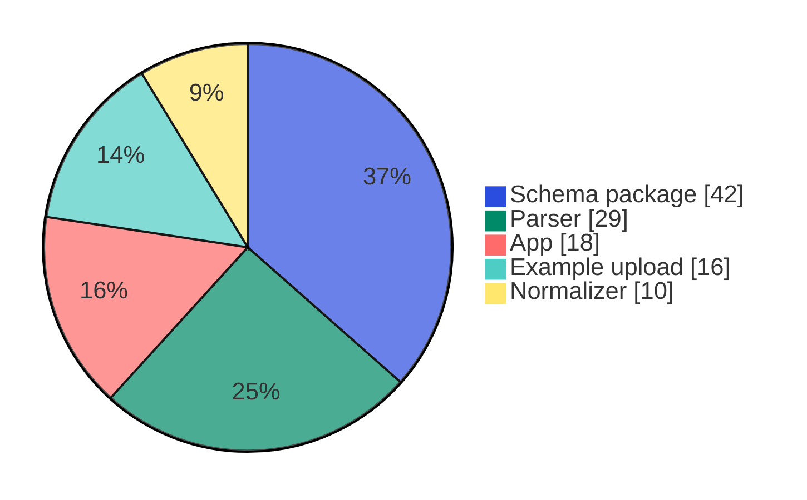

# NOMAD Plugin Registry

This page is automatically generated from the NOMAD API and updated monthly. The data includes all plugins owned by the FAIRmat-NFDI, nomad-coe GitHub organizations.

**Last Updated:** 2025-11-28 14:47 UTC

[Browse All Plugins in NOMAD](https://nomad-lab.eu/prod/v1/oasis/gui/search/plugins){ .md-button .nomad-button }

## Statistics

### Overview

- **Total Plugins:** 63
- **Available on PyPI:** 34
- **Deployed on NOMAD Central:** 0
- **Deployed on Example Oasis:** 0
- **Total Stars:** ⭐ 164

### Plugin Type Distribution

## Plugin Overview

Quick reference table of all available plugins:

| Plugin | Description | Type(s) | PyPI | Central Deployment | Example Oasis | Repository | Stars |
|--------|-------------|---------|------|--------------------| --------------|------------|-------|
| **nomad-aitoolkit** | Schema and app for AI Toolkit notebooks. | App, Schema package | — | — | — | [FAIRmat-NFDI/nomad-aitoolkit](https://github.com/FAIRmat-NFDI/nomad-aitoolkit) | 0 |
| **nomad-analysis** | A NOMAD plugin for analysis of FAIR data. | Schema package | ✓ | — | — | [FAIRmat-NFDI/nomad-analysis](https://github.com/FAIRmat-NFDI/nomad-analysis) | 2 |
| **nomad-auto-xrd** | A NOMAD plugin containing schemas for automatic XRD analysis. | App, Example upload, Schema package | — | — | — | [FAIRmat-NFDI/nomad-auto-xrd](https://github.com/FAIRmat-NFDI/nomad-auto-xrd) | 1 |
| **nomad-battery-database** | app for battery database | App, Parser, Schema package | ✓ | — | — | [FAIRmat-NFDI/nomad-battery-database](https://github.com/FAIRmat-NFDI/nomad-battery-database) | 0 |
| **nomad-bayesian-optimization** | NOMAD plugin for driving experiments/simulations using bayesian optimization | App, Example upload, Schema package | — | — | — | [FAIRmat-NFDI/nomad-bayesian-optimization](https://github.com/FAIRmat-NFDI/nomad-bayesian-optimization) | 1 |
| **nomad-camels-plugin** | Parser for HDF5 files coming from NOMAD CAMELS. | App, Parser, Schema package | — | — | — | [FAIRmat-NFDI/nomad-camels-plugin](https://github.com/FAIRmat-NFDI/nomad-camels-plugin) | 0 |
| **nomad-catalysis** | A NOMAD plugin for heterogeneous catalysis data. | App, Example upload, Parser, Schema package | ✓ | — | — | [FAIRmat-NFDI/nomad-catalysis-plugin](https://github.com/FAIRmat-NFDI/nomad-catalysis-plugin) | 4 |
| **nomad-crystallm** | A NOMAD plugin for running CrystaLLM inference in NOMAD installations. | Schema package | — | — | — | [FAIRmat-NFDI/nomad-crystallm](https://github.com/FAIRmat-NFDI/nomad-crystallm) | 1 |
| **nomad-eos-workflows** | A NOMAD plugin containing the section definitions of a standard Equation of Stat... | Schema package | — | — | — | [FAIRmat-NFDI/nomad-schema-plugin-eos-workflows](https://github.com/FAIRmat-NFDI/nomad-schema-plugin-eos-workflows) | 0 |
| **nomad-external-eln-integrations** | 3rd Party Integration packages | Example upload, Parser, Schema package | — | — | — | [FAIRmat-NFDI/nomad-external-eln-integrations](https://github.com/FAIRmat-NFDI/nomad-external-eln-integrations) | 0 |
| **nomad-gallery** | A mkdocs-based GitHub Pages site for showcasing NOMAD features, examples, and us... | Schema package | — | — | — | [FAIRmat-NFDI/nomad-gallery](https://github.com/FAIRmat-NFDI/nomad-gallery) | 1 |
| **nomad-material-processing** | A plugin for NOMAD containing base sections for material processing. | Schema package | ✓ | — | — | [FAIRmat-NFDI/nomad-material-processing](https://github.com/FAIRmat-NFDI/nomad-material-processing) | 11 |
| **nomad-material-processing-example** | An example plugin to demonstrate the use of schemas from the nomad-material-proc... | App, Example upload, Parser, Schema package | — | — | — | [FAIRmat-NFDI/nomad-material-processing-example](https://github.com/FAIRmat-NFDI/nomad-material-processing-example) | 2 |
| **nomad-measurements** | A plugin for NOMAD containing base sections for measurements. | Parser, Schema package | ✓ | — | — | [FAIRmat-NFDI/nomad-measurements](https://github.com/FAIRmat-NFDI/nomad-measurements) | 14 |
| **nomad-neb-workflows** | A NOMAD plugin containing the section definitions of a standard Nudged Elastic B... | Schema package | ✓ | — | — | [FAIRmat-NFDI/nomad-neb-workflows](https://github.com/FAIRmat-NFDI/nomad-neb-workflows) | 3 |
| **nomad-nmr-schema** | Schema plugin containing shared classes for NMR metadata | Schema package | — | — | — | [FAIRmat-NFDI/nomad-schema-plugin-nmr](https://github.com/FAIRmat-NFDI/nomad-schema-plugin-nmr) | 0 |
| **nomad-normalizer-plugin-bandstructure** | Band structure normalizer plugin for NOMAD. | Normalizer | ✓ | — | — | [nomad-coe/nomad-normalizer-plugin-bandstructure](https://github.com/nomad-coe/nomad-normalizer-plugin-bandstructure) | 1 |
| **nomad-normalizer-plugin-dos** | DOS normalizer plugin for NOMAD. | Normalizer | ✓ | — | — | [nomad-coe/nomad-normalizer-plugin-dos](https://github.com/nomad-coe/nomad-normalizer-plugin-dos) | 0 |
| **nomad-normalizer-plugin-simulation-workflow** | Simulation workflow nomad plugin for NOMAD. | Normalizer | ✓ | — | — | [nomad-coe/nomad-normalizer-plugin-simulation-workflow](https://github.com/nomad-coe/nomad-normalizer-plugin-simulation-workflow) | 0 |
| **nomad-normalizer-plugin-soap** | SOAP nomad plugin for NOMAD. | Normalizer | ✓ | — | — | [nomad-coe/nomad-normalizer-plugin-soap](https://github.com/nomad-coe/nomad-normalizer-plugin-soap) | 0 |
| **nomad-normalizer-plugin-spectra** | Spectra normalizer plugin for NOMAD. | Normalizer | ✓ | — | — | [nomad-coe/nomad-normalizer-plugin-spectra](https://github.com/nomad-coe/nomad-normalizer-plugin-spectra) | 0 |
| **nomad-normalizer-plugin-system** | System normalizer plugin for NOMAD. | Normalizer | ✓ | — | — | [nomad-coe/nomad-normalizer-plugin-system](https://github.com/nomad-coe/nomad-normalizer-plugin-system) | 0 |
| **nomad-parser-edmft** | Nomad example template | Parser, Schema package | — | — | — | [FAIRmat-NFDI/nomad-parser-edmft](https://github.com/FAIRmat-NFDI/nomad-parser-edmft) | 0 |
| **nomad-parser-fhiaims** | Standalone NOMAD plugin for parsing FHI-aims calculation files | Parser, Schema package | — | — | — | [FAIRmat-NFDI/nomad-parser-fhiaims](https://github.com/FAIRmat-NFDI/nomad-parser-fhiaims) | 2 |
| **nomad-parser-gsd** | Parser for trajectory files in GSD format (https://gsd.readthedocs.io/en/v3.3.1/... | Parser, Schema package | — | — | — | [FAIRmat-NFDI/nomad-parser-gsd](https://github.com/FAIRmat-NFDI/nomad-parser-gsd) | 1 |
| **nomad-parser-h5md** | NOMAD parser plugin for h5md-based simulation files. | Parser, Schema package | — | — | — | [FAIRmat-NFDI/nomad-parser-h5md](https://github.com/FAIRmat-NFDI/nomad-parser-h5md) | 1 |
| **nomad-parser-molpro** | Nomad example template | Parser, Schema package | — | — | — | [FAIRmat-NFDI/nomad-parser-molpro](https://github.com/FAIRmat-NFDI/nomad-parser-molpro) | 0 |
| **nomad-parser-orca** | Nomad plugin for ORCA calculations | Parser, Schema package | — | — | — | [FAIRmat-NFDI/nomad-parser-orca](https://github.com/FAIRmat-NFDI/nomad-parser-orca) | 2 |
| **nomad-parser-plugin-boss** | Plugin for parsing and displaying BOSS PES arftifacts | Parser | — | — | — | [FAIRmat-NFDI/nomad-parser-plugin-boss](https://github.com/FAIRmat-NFDI/nomad-parser-plugin-boss) | 1 |
| **nomad-parser-plugins-atomistic** | Collection of NOMAD parsers for atomistic codes. | Parser | ✓ | — | — | [nomad-coe/atomistic-parsers](https://github.com/nomad-coe/atomistic-parsers) | 7 |
| **nomad-parser-plugins-electronic** | Collection of NOMAD parsers for electronic structure codes. | Parser | ✓ | — | — | [nomad-coe/electronic-parsers](https://github.com/nomad-coe/electronic-parsers) | 23 |
| **nomad-parser-plugins-workflow** | Collection of NOMAD parsers for workflow engines. | Parser | ✓ | — | — | [nomad-coe/workflow-parsers](https://github.com/nomad-coe/workflow-parsers) | 5 |
| **nomad-parser-pwd** | A parser and schema for the Python workflow definition. | Parser, Schema package | — | — | — | [FAIRmat-NFDI/nomad-parser-python-workflow-definition](https://github.com/FAIRmat-NFDI/nomad-parser-python-workflow-definition) | 0 |
| **nomad-parser-ro-crate** | A parser for ro-crate schema plus. | Parser, Schema package | — | — | — | [FAIRmat-NFDI/nomad-parser-ro-crate](https://github.com/FAIRmat-NFDI/nomad-parser-ro-crate) | 0 |
| **nomad-parser-w2dynamics** | NOMAD parser plugin for w2dynamics input/output files. | Parser, Schema package | — | — | — | [FAIRmat-NFDI/nomad-parser-w2dynamics](https://github.com/FAIRmat-NFDI/nomad-parser-w2dynamics) | 1 |
| **nomad-parser-wannier90** | A NOMAD parser plugin for Wannier90 input/output files. | Parser, Schema package | ✓ | — | — | [FAIRmat-NFDI/nomad-parser-wannier90](https://github.com/FAIRmat-NFDI/nomad-parser-wannier90) | 2 |
| **nomad-parser-yambo** | A NOMAD parser plugin for YAMBO input/outputs files. | Parser, Schema package | — | — | — | [FAIRmat-NFDI/nomad-parser-yambo](https://github.com/FAIRmat-NFDI/nomad-parser-yambo) | 1 |
| **nomad-plugins** | A plugin for discovering other plugins. | App, Schema package | ✓ | — | — | [FAIRmat-NFDI/nomad-plugins](https://github.com/FAIRmat-NFDI/nomad-plugins) | 1 |
| **nomad-polymerization-reactions** | A NOMAD plugin for polymerization reactions. | App, Schema package | — | — | — | [FAIRmat-NFDI/nomad-polymerization-reactions](https://github.com/FAIRmat-NFDI/nomad-polymerization-reactions) | 0 |
| **nomad-porous-materials** | NOMAD plugin for porous materials | App, Normalizer | — | — | — | [FAIRmat-NFDI/nomad-porous-materials](https://github.com/FAIRmat-NFDI/nomad-porous-materials) | 0 |
| **nomad-schema-plugin-run** | Run schema plugin for NOMAD. | Schema package | ✓ | — | — | [nomad-coe/nomad-schema-plugin-run](https://github.com/nomad-coe/nomad-schema-plugin-run) | 1 |
| **nomad-schema-plugin-simulation-workflow** | Simulation workflow schema plugin for NOMAD. | Schema package | ✓ | — | — | [nomad-coe/nomad-schema-plugin-simulation-workflow](https://github.com/nomad-coe/nomad-schema-plugin-simulation-workflow) | 2 |
| **nomad-simulation-apps** | A repository for housing NOMAD's collection of simulation app plugins. | App | ✓ | — | — | [FAIRmat-NFDI/nomad-app-plugins-simulation](https://github.com/FAIRmat-NFDI/nomad-app-plugins-simulation) | 2 |
| **nomad-simulation-parsers** | A repository for housing NOMAD's collection of simulation parser plugins. | Parser, Schema package | — | — | — | [FAIRmat-NFDI/nomad-parser-plugins-simulation](https://github.com/FAIRmat-NFDI/nomad-parser-plugins-simulation) | 1 |
| **nomad-simulation-workflow** | Schema defintions and normalizer for NOMAD simulation workflows | Normalizer, Schema package | — | — | — | [FAIRmat-NFDI/nomad-simulation-workflow](https://github.com/FAIRmat-NFDI/nomad-simulation-workflow) | 0 |
| **nomad-simulations** | A NOMAD plugin for FAIR schemas for simulation data. | Schema package | ✓ | — | — | [nomad-coe/nomad-simulations](https://github.com/nomad-coe/nomad-simulations) | 7 |
| **nomad-tadf-molecules** | NOMAD plugin for thermally activated delayed fluorescent molecules | App, Example upload, Parser, Schema package | — | — | — | [FAIRmat-NFDI/nomad-tadf-molecules](https://github.com/FAIRmat-NFDI/nomad-tadf-molecules) | 2 |
| **nomad-unisyscat** | A example plugin for a demonstration for UniSysCat. | App, Parser, Schema package | — | — | — | [FAIRmat-NFDI/nomad-unisyscat-plugin](https://github.com/FAIRmat-NFDI/nomad-unisyscat-plugin) | 1 |
| **nomad-utility-workflows** | A module with utilities for interacting with NOMAD via, e.g., a workflow manager... | App, Example upload, Normalizer, Parser, Schema package | ✓ | — | — | [FAIRmat-NFDI/nomad-utility-workflows](https://github.com/FAIRmat-NFDI/nomad-utility-workflows) | 4 |
| **nomad_topology_normalizer** | Topology Normalizer | Normalizer, Schema package | — | — | — | [FAIRmat-NFDI/nomad-topology-normalizer](https://github.com/FAIRmat-NFDI/nomad-topology-normalizer) | 0 |
| **perovskite-solar-cell-database** | Perovskite solar cell data schema plugin for NOMAD. | App, Parser, Schema package | ✓ | — | — | [FAIRmat-NFDI/nomad-perovskite-solar-cells-database](https://github.com/FAIRmat-NFDI/nomad-perovskite-solar-cells-database) | 8 |
| **pynxtools** | Extend NeXus for experiments and characterization in Materials Science and Mater... | App, Example upload, Parser, Schema package | ✓ | — | — | [FAIRmat-NFDI/pynxtools](https://github.com/FAIRmat-NFDI/pynxtools) | 19 |
| **pynxtools-apm** | A reader for transferring APM from vendor formats to NeXus and NOMAD. | Example upload | ✓ | — | — | [FAIRmat-NFDI/pynxtools-apm](https://github.com/FAIRmat-NFDI/pynxtools-apm) | 0 |
| **pynxtools-ellips** | A reader for transferring ellipsometry data from vendor formats to NeXus and NOM... | Example upload | ✓ | — | — | [FAIRmat-NFDI/pynxtools-ellips](https://github.com/FAIRmat-NFDI/pynxtools-ellips) | 0 |
| **pynxtools-em** | A reader for transferring EM from vendor formats to NeXus and NOMAD. | Example upload | ✓ | — | — | [FAIRmat-NFDI/pynxtools-em](https://github.com/FAIRmat-NFDI/pynxtools-em) | 3 |
| **pynxtools-igor** | pynxtools plugin for reading igor pro waves and packed experiments | Example upload | ✓ | — | — | [FAIRmat-NFDI/pynxtools-igor](https://github.com/FAIRmat-NFDI/pynxtools-igor) | 0 |
| **pynxtools-mpes** |  | App, Example upload | ✓ | — | — | [FAIRmat-NFDI/pynxtools-mpes](https://github.com/FAIRmat-NFDI/pynxtools-mpes) | 0 |
| **pynxtools-raman** | A reader for transferring Raman data from vendor formats to NeXus and NOMAD. | App | ✓ | — | — | [FAIRmat-NFDI/pynxtools-raman](https://github.com/FAIRmat-NFDI/pynxtools-raman) | 0 |
| **pynxtools-spm** | pynxtools-spm: A pynxtools plugin for SPM (Scanning Probe Microscopy) data reade... | Example upload | ✓ | — | — | [FAIRmat-NFDI/pynxtools-spm](https://github.com/FAIRmat-NFDI/pynxtools-spm) | 0 |
| **pynxtools-stm** | A plugin for pynxtools to convert sts and stm files | Example upload | ✓ | — | — | [FAIRmat-NFDI/pynxtools-stm](https://github.com/FAIRmat-NFDI/pynxtools-stm) | 0 |
| **pynxtools-xps** | pynxtools-xps is a pynxtools reader plugin for X-ray photoelectron spectroscopy ... | Example upload | ✓ | — | — | [FAIRmat-NFDI/pynxtools-xps](https://github.com/FAIRmat-NFDI/pynxtools-xps) | 4 |
| **rtg-sims** | A plugin for RTG SIMS. | Parser, Schema package | — | — | — | [FAIRmat-NFDI/AreaA-data_modeling_and_schemas](https://github.com/FAIRmat-NFDI/AreaA-data_modeling_and_schemas) | 11 |
| **transmission** | A plugin for NOMAD containing base sections for transmission spectrophotometry. | Parser, Schema package | ✓ | — | — | [FAIRmat-NFDI/AreaA-data_modeling_and_schemas](https://github.com/FAIRmat-NFDI/AreaA-data_modeling_and_schemas) | 11 |

## Detailed Plugin Information

### nomad-aitoolkit

Schema and app for AI Toolkit notebooks.

**Repository:** [https://github.com/FAIRmat-NFDI/nomad-aitoolkit](https://github.com/FAIRmat-NFDI/nomad-aitoolkit)
**Owner:** FAIRmat-NFDI
**Stars:** ⭐ 0
**Created:** 2024-05-24
**Last Updated:** 2025-01-23

**Plugin Types:** App, Schema package

**Entry Points:**
- `aitookitschema`
- `aitookitapp`

**Authors:** Adam Fekete

**Maintainers:** Adam Fekete

---

### nomad-analysis

A NOMAD plugin for analysis of FAIR data.

**Repository:** [https://github.com/FAIRmat-NFDI/nomad-analysis](https://github.com/FAIRmat-NFDI/nomad-analysis)
**Owner:** FAIRmat-NFDI
**Stars:** ⭐ 2
**Created:** 2024-02-26
**Last Updated:** 2025-11-04

**Available on:** PyPI

**Plugin Types:** Schema package

**Entry Points:**
- `general_analysis_schema`
- `jupyter_analysis_schema`

**Authors:** Sarthak Kapoor, Jose M. Pizarro, Andrea Albino, Hampus Näsström, Sebastian Brückner

**Maintainers:** FAIRmat

---

### nomad-auto-xrd

A NOMAD plugin containing schemas for automatic XRD analysis.

**Repository:** [https://github.com/FAIRmat-NFDI/nomad-auto-xrd](https://github.com/FAIRmat-NFDI/nomad-auto-xrd)
**Owner:** FAIRmat-NFDI
**Stars:** ⭐ 1
**Created:** 2024-09-13
**Last Updated:** 2025-11-14

**Plugin Types:** App, Example upload, Schema package

**Entry Points:**
- `schema`
- `models_app`
- `example_upload`
- `auto_xrd_training_action`
- `auto_xrd_training_wandb_action`
- `auto_xrd_analysis_action`

**Authors:** Pepe Márquez, Sarthak Kapoor

**Maintainers:** FAIRmat

**Plugin Dependencies:**
- nomad-analysis
- nomad-measurements
- nomad-schema-plugin-run
- nomad-schema-plugin-simulation-workflow

---

### nomad-battery-database

app for battery database

**Repository:** [https://github.com/FAIRmat-NFDI/nomad-battery-database](https://github.com/FAIRmat-NFDI/nomad-battery-database)
**Owner:** FAIRmat-NFDI
**Stars:** ⭐ 0
**Created:** 2025-02-16
**Last Updated:** 2025-10-30

**Available on:** PyPI

**Plugin Types:** App, Parser, Schema package

**Entry Points:**
- `parser_entry_point`
- `schema_package_entry_point`
- `app_entry_point`

**Authors:** Uday Gajera

**Maintainers:** Uday Gajera

---

### nomad-bayesian-optimization

NOMAD plugin for driving experiments/simulations using bayesian optimization

**Repository:** [https://github.com/FAIRmat-NFDI/nomad-bayesian-optimization](https://github.com/FAIRmat-NFDI/nomad-bayesian-optimization)
**Owner:** FAIRmat-NFDI
**Stars:** ⭐ 1
**Created:** 2024-06-17
**Last Updated:** 2025-05-07

**Plugin Types:** App, Example upload, Schema package

**Entry Points:**
- `nomad_bayesian_optimization.apps:bayesian_optimization_tasks`
- `nomad_bayesian_optimization.schema_packages:experiments`
- `nomad_bayesian_optimization.schema_packages:bayesian_optimization`
- `nomad_bayesian_optimization.example_uploads:getting_started`
- `nomad_bayesian_optimization.example_uploads:optimization_tasks`

**Authors:** Lauri Himanen

**Maintainers:** Lauri Himanen

---

### nomad-camels-plugin

Parser for HDF5 files coming from NOMAD CAMELS.

**Repository:** [https://github.com/FAIRmat-NFDI/nomad-camels-plugin](https://github.com/FAIRmat-NFDI/nomad-camels-plugin)
**Owner:** FAIRmat-NFDI
**Stars:** ⭐ 0
**Created:** 2024-11-05
**Last Updated:** 2025-10-31

**Plugin Types:** App, Parser, Schema package

**Entry Points:**
- `camels_schema_package`
- `camels_parser`
- `camelsDiode_parser`
- `camels_app`

**Authors:** Alexander Fuchs

**Maintainers:** Alexander Fuchs

---

### nomad-catalysis

A NOMAD plugin for heterogeneous catalysis data.

**Repository:** [https://github.com/FAIRmat-NFDI/nomad-catalysis-plugin](https://github.com/FAIRmat-NFDI/nomad-catalysis-plugin)
**Owner:** FAIRmat-NFDI
**Stars:** ⭐ 4
**Created:** 2024-07-15
**Last Updated:** 2025-11-13

**Available on:** PyPI

**Plugin Types:** App, Example upload, Parser, Schema package

**Entry Points:**
- `catalysis`
- `catalysis_app`
- `catalysis_parser`
- `catalysis_collection`
- `example_catalysis`

**Authors:** Julia Schumann, Hampus Näsström, Michael Götte

**Maintainers:** Julia Schumann, FAIRmat

---

### nomad-crystallm

A NOMAD plugin for running CrystaLLM inference in NOMAD installations.

**Repository:** [https://github.com/FAIRmat-NFDI/nomad-crystallm](https://github.com/FAIRmat-NFDI/nomad-crystallm)
**Owner:** FAIRmat-NFDI
**Stars:** ⭐ 1
**Created:** 2025-06-10
**Last Updated:** 2025-10-28

**Plugin Types:** Schema package

**Entry Points:**
- `crystallm_inference`
- `crystallm_schemas`

**Authors:** Ahmed Ilyas, Sarthak Kapoor

**Maintainers:** FAIRmat

**Plugin Dependencies:**
- nomad-schema-plugin-run
- nomad-schema-plugin-simulation-workflow

---

### nomad-eos-workflows

A NOMAD plugin containing the section definitions of a standard Equation of State (EoS) workflow.

**Repository:** [https://github.com/FAIRmat-NFDI/nomad-schema-plugin-eos-workflows](https://github.com/FAIRmat-NFDI/nomad-schema-plugin-eos-workflows)
**Owner:** FAIRmat-NFDI
**Stars:** ⭐ 0
**Created:** 2025-04-01
**Last Updated:** 2025-04-01

**Plugin Types:** Schema package

**Entry Points:**
- `schema_package_entry_point`

**Authors:** Joseph Rudzinski

**Maintainers:** Joseph Rudzinski

---

### nomad-external-eln-integrations

3rd Party Integration packages

**Repository:** [https://github.com/FAIRmat-NFDI/nomad-external-eln-integrations](https://github.com/FAIRmat-NFDI/nomad-external-eln-integrations)
**Owner:** FAIRmat-NFDI
**Stars:** ⭐ 0
**Created:** 2024-10-01
**Last Updated:** 2025-10-28

**Plugin Types:** Example upload, Parser, Schema package

**Entry Points:**
- `elabftwparser`
- `chemotionparser`
- `labfolderschema`
- `elabftwschema`
- `openbisschema`
- `elabftwexample`

**Authors:** Amir Golparvar

**Maintainers:** Amir Golparvar

---

### nomad-gallery

A mkdocs-based GitHub Pages site for showcasing NOMAD features, examples, and use cases.

**Repository:** [https://github.com/FAIRmat-NFDI/nomad-gallery](https://github.com/FAIRmat-NFDI/nomad-gallery)
**Owner:** FAIRmat-NFDI
**Stars:** ⭐ 1
**Created:** 2025-02-17
**Last Updated:** 2025-03-03

**Plugin Types:** Schema package

**Entry Points:**
- `schema_package_entry_point`

**Authors:** Joseph Rudzinski

**Maintainers:** Joseph Rudzinski

---

### nomad-material-processing

A plugin for NOMAD containing base sections for material processing.

**Repository:** [https://github.com/FAIRmat-NFDI/nomad-material-processing](https://github.com/FAIRmat-NFDI/nomad-material-processing)
**Owner:** FAIRmat-NFDI
**Stars:** ⭐ 11
**Created:** 2023-08-15
**Last Updated:** 2025-08-11

**Available on:** PyPI

**Plugin Types:** Schema package

**Entry Points:**
- `general_schema`
- `solution_schema`
- `vd_schema`
- `cvd_schema`
- `movpe_schema`
- `pvd_schema`
- `mbe_schema`
- `pld_schema`
- `sputtering_schema`
- `thermal_schema`

**Authors:** Andrea Albino, Sebastian Brückner, Michael Götte, Ahmed Ilyas, Sarthak Kapoor, José A. Márquez, Hampus Näsström, Markus Scheidgen

**Maintainers:** FAIRmat

---

### nomad-material-processing-example

An example plugin to demonstrate the use of schemas from the nomad-material-processing plugin.

**Repository:** [https://github.com/FAIRmat-NFDI/nomad-material-processing-example](https://github.com/FAIRmat-NFDI/nomad-material-processing-example)
**Owner:** FAIRmat-NFDI
**Stars:** ⭐ 2
**Created:** 2025-02-18
**Last Updated:** 2025-08-06

**Plugin Types:** App, Example upload, Parser, Schema package

**Entry Points:**
- `parser_entry_point`
- `schema_package_entry_point`
- `app_entry_point`
- `example_upload_entry_point`

**Authors:** Sarthak Kapoor

**Maintainers:** Sarthak Kapoor

---

### nomad-measurements

A plugin for NOMAD containing base sections for measurements.

**Repository:** [https://github.com/FAIRmat-NFDI/nomad-measurements](https://github.com/FAIRmat-NFDI/nomad-measurements)
**Owner:** FAIRmat-NFDI
**Stars:** ⭐ 14
**Created:** 2023-09-06
**Last Updated:** 2025-11-03

**Available on:** PyPI

**Plugin Types:** Parser, Schema package

**Entry Points:**
- `general_schema`
- `xrd_schema`
- `xrd_parser`
- `qd_eto_schema`
- `qd_act_schema`
- `qd_acms_schema`
- `qd_mpms_schema`
- `qd_resisitivity_schema`
- `qd_eto_parser`
- `qd_act_parser`
- `qd_acms_parser`
- `qd_mpms_parser`
- `qd_resistivity_parser`
- `qd_sequence_parser`
- `transmission_schema`
- `transmission_parser`
- `mapping_schema`

**Authors:** Andrea Albino, Sebastian Brückner, Sarthak Kapoor, José A. Márquez, Rubel Mozumder, Hampus Näsström

**Maintainers:** FAIRmat

**Plugin Dependencies:**
- pynxtools

---

### nomad-neb-workflows

A NOMAD plugin containing the section definitions of a standard Nudged Elastic Band (NEB) workflow.

**Repository:** [https://github.com/FAIRmat-NFDI/nomad-neb-workflows](https://github.com/FAIRmat-NFDI/nomad-neb-workflows)
**Owner:** FAIRmat-NFDI
**Stars:** ⭐ 3
**Created:** 2024-06-21
**Last Updated:** 2025-11-05

**Available on:** PyPI

**Plugin Types:** Schema package

**Entry Points:**
- `nomad_neb_workflows_plugin`

**Authors:** Julia Schumann, Uday Gajera, Jose M. Pizarro, Hampus Näsström

**Maintainers:** Julia Schumann, Uday Gajera, Hampus Näsström

**Plugin Dependencies:**
- nomad-normalizer-plugin-bandstructure
- nomad-normalizer-plugin-spectra
- nomad-normalizer-plugin-soap
- nomad-normalizer-plugin-system
- nomad-schema-plugin-run
- nomad-normalizer-plugin-dos
- nomad-schema-plugin-simulation-workflow
- nomad-parser-plugins-workflow
- nomad-parser-plugins-electronic
- nomad-parser-plugins-atomistic
- nomad-simulations
- nomad-parser-plugins-database
- nomad-normalizer-plugin-simulation-workflow

---

### nomad-nmr-schema

Schema plugin containing shared classes for NMR metadata

**Repository:** [https://github.com/FAIRmat-NFDI/nomad-schema-plugin-nmr](https://github.com/FAIRmat-NFDI/nomad-schema-plugin-nmr)
**Owner:** FAIRmat-NFDI
**Stars:** ⭐ 0
**Created:** 2025-03-25
**Last Updated:** 2025-10-28

**Plugin Types:** Schema package

**Entry Points:**
- `nmr_schema`

**Authors:** Andrea Albino

**Maintainers:** Andrea Albino

**Plugin Dependencies:**
- nomad-simulations

---

### nomad-normalizer-plugin-bandstructure

Band structure normalizer plugin for NOMAD.

**Repository:** [https://github.com/nomad-coe/nomad-normalizer-plugin-bandstructure](https://github.com/nomad-coe/nomad-normalizer-plugin-bandstructure)
**Owner:** nomad-coe
**Stars:** ⭐ 1
**Created:** 2023-12-23
**Last Updated:** 2025-10-30

**Available on:** PyPI

**Plugin Types:** Normalizer

**Entry Points:**
- `bandstructurenormalizer`

**Authors:** The NOMAD Authors

**Plugin Dependencies:**
- nomad-normalizer-plugin-system
- nomad-schema-plugin-run
- nomad-schema-plugin-simulation-workflow

---

### nomad-normalizer-plugin-dos

DOS normalizer plugin for NOMAD.

**Repository:** [https://github.com/nomad-coe/nomad-normalizer-plugin-dos](https://github.com/nomad-coe/nomad-normalizer-plugin-dos)
**Owner:** nomad-coe
**Stars:** ⭐ 0
**Created:** 2023-12-20
**Last Updated:** 2025-10-30

**Available on:** PyPI

**Plugin Types:** Normalizer

**Entry Points:**
- `dosnormalizer`

**Authors:** The NOMAD Authors

**Plugin Dependencies:**
- nomad-normalizer-plugin-system
- nomad-schema-plugin-run
- nomad-schema-plugin-simulation-workflow

---

### nomad-normalizer-plugin-simulation-workflow

Simulation workflow nomad plugin for NOMAD.

**Repository:** [https://github.com/nomad-coe/nomad-normalizer-plugin-simulation-workflow](https://github.com/nomad-coe/nomad-normalizer-plugin-simulation-workflow)
**Owner:** nomad-coe
**Stars:** ⭐ 0
**Created:** 2023-12-01
**Last Updated:** 2025-10-30

**Available on:** PyPI

**Plugin Types:** Normalizer

**Entry Points:**
- `simulationworkflownormalizer`

**Authors:** The NOMAD Authors

**Plugin Dependencies:**
- nomad-schema-plugin-simulation-workflow

---

### nomad-normalizer-plugin-soap

SOAP nomad plugin for NOMAD.

**Repository:** [https://github.com/nomad-coe/nomad-normalizer-plugin-soap](https://github.com/nomad-coe/nomad-normalizer-plugin-soap)
**Owner:** nomad-coe
**Stars:** ⭐ 0
**Created:** 2024-01-15
**Last Updated:** 2025-10-30

**Available on:** PyPI

**Plugin Types:** Normalizer

**Entry Points:**
- `soapnormalizer`

**Authors:** The NOMAD Authors

**Plugin Dependencies:**
- nomad-schema-plugin-run
- nomad-schema-plugin-simulation-workflow

---

### nomad-normalizer-plugin-spectra

Spectra normalizer plugin for NOMAD.

**Repository:** [https://github.com/nomad-coe/nomad-normalizer-plugin-spectra](https://github.com/nomad-coe/nomad-normalizer-plugin-spectra)
**Owner:** nomad-coe
**Stars:** ⭐ 0
**Created:** 2024-01-15
**Last Updated:** 2025-10-30

**Available on:** PyPI

**Plugin Types:** Normalizer

**Entry Points:**
- `spectranormalizer`

**Authors:** The NOMAD Authors

---

### nomad-normalizer-plugin-system

System normalizer plugin for NOMAD.

**Repository:** [https://github.com/nomad-coe/nomad-normalizer-plugin-system](https://github.com/nomad-coe/nomad-normalizer-plugin-system)
**Owner:** nomad-coe
**Stars:** ⭐ 0
**Created:** 2023-12-29
**Last Updated:** 2025-10-30

**Available on:** PyPI

**Plugin Types:** Normalizer

**Entry Points:**
- `systemnormalizer`

**Authors:** The NOMAD Authors

**Plugin Dependencies:**
- nomad-schema-plugin-run
- nomad-schema-plugin-simulation-workflow

---

### nomad-parser-edmft

Nomad example template

**Repository:** [https://github.com/FAIRmat-NFDI/nomad-parser-edmft](https://github.com/FAIRmat-NFDI/nomad-parser-edmft)
**Owner:** FAIRmat-NFDI
**Stars:** ⭐ 0
**Created:** 2024-09-05
**Last Updated:** 2024-11-04

**Plugin Types:** Parser, Schema package

**Entry Points:**
- `parser_entry_point`
- `schema_package_entry_point`

**Authors:** Jose Pizarro

**Maintainers:** Jose Pizarro

**Plugin Dependencies:**
- nomad-simulations
- nomad-schema-plugin-simulation-workflow

---

### nomad-parser-fhiaims

Standalone NOMAD plugin for parsing FHI-aims calculation files

**Repository:** [https://github.com/FAIRmat-NFDI/nomad-parser-fhiaims](https://github.com/FAIRmat-NFDI/nomad-parser-fhiaims)
**Owner:** FAIRmat-NFDI
**Stars:** ⭐ 2
**Created:** 2024-06-24
**Last Updated:** 2025-01-09

**Plugin Types:** Parser, Schema package

**Entry Points:**
- `fhiaimsparser`
- `fhiaimsschemapackage`

**Authors:** Nathan Daelman

**Maintainers:** Nathan Daelman

---

### nomad-parser-gsd

Parser for trajectory files in GSD format (https://gsd.readthedocs.io/en/v3.3.1/).

**Repository:** [https://github.com/FAIRmat-NFDI/nomad-parser-gsd](https://github.com/FAIRmat-NFDI/nomad-parser-gsd)
**Owner:** FAIRmat-NFDI
**Stars:** ⭐ 1
**Created:** 2024-08-28
**Last Updated:** 2024-12-12

**Plugin Types:** Parser, Schema package

**Entry Points:**
- `parser_entry_point`
- `schema_package_entry_point`

**Authors:** Bernadette Mohr

**Maintainers:** Bernadette Mohr

**Plugin Dependencies:**
- nomad-simulations

---

### nomad-parser-h5md

NOMAD parser plugin for h5md-based simulation files.

**Repository:** [https://github.com/FAIRmat-NFDI/nomad-parser-h5md](https://github.com/FAIRmat-NFDI/nomad-parser-h5md)
**Owner:** FAIRmat-NFDI
**Stars:** ⭐ 1
**Created:** 2024-09-10
**Last Updated:** 2025-04-09

**Plugin Types:** Parser, Schema package

**Entry Points:**
- `h5md_parser_entry_point`
- `h5md_schema_package_entry_point`

**Authors:** Joseph Rudzinski

**Maintainers:** Joseph Rudzinski

**Plugin Dependencies:**
- nomad-schema-plugin-simulation-workflow
- nomad-simulations

---

### nomad-parser-molpro

Nomad example template

**Repository:** [https://github.com/FAIRmat-NFDI/nomad-parser-molpro](https://github.com/FAIRmat-NFDI/nomad-parser-molpro)
**Owner:** FAIRmat-NFDI
**Stars:** ⭐ 0
**Created:** 2024-10-10
**Last Updated:** 2024-10-10

**Plugin Types:** Parser, Schema package

**Entry Points:**
- `parser_entry_point`
- `schema_package_entry_point`

**Authors:** Esma Boydas

**Maintainers:** Esma Boydas

---

### nomad-parser-orca

Nomad plugin for ORCA calculations

**Repository:** [https://github.com/FAIRmat-NFDI/nomad-parser-orca](https://github.com/FAIRmat-NFDI/nomad-parser-orca)
**Owner:** FAIRmat-NFDI
**Stars:** ⭐ 2
**Created:** 2024-09-09
**Last Updated:** 2025-01-17

**Plugin Types:** Parser, Schema package

**Entry Points:**
- `parser_entry_point`
- `schema_package_entry_point`

**Authors:** Esma Boydas

**Maintainers:** Esma Boydas

**Plugin Dependencies:**
- nomad-simulations

---

### nomad-parser-plugin-boss

Plugin for parsing and displaying BOSS PES arftifacts

**Repository:** [https://github.com/FAIRmat-NFDI/nomad-parser-plugin-boss](https://github.com/FAIRmat-NFDI/nomad-parser-plugin-boss)
**Owner:** FAIRmat-NFDI
**Stars:** ⭐ 1
**Created:** 2024-11-19
**Last Updated:** 2025-11-20

**Plugin Types:** Parser

**Entry Points:**
- `parser_entry_point`

**Authors:** Nathan Daelman

**Maintainers:** Nathan Daelman

---

### nomad-parser-plugins-atomistic

Collection of NOMAD parsers for atomistic codes.

**Repository:** [https://github.com/nomad-coe/atomistic-parsers](https://github.com/nomad-coe/atomistic-parsers)
**Owner:** nomad-coe
**Stars:** ⭐ 7
**Created:** 2022-02-19
**Last Updated:** 2025-11-04

**Available on:** PyPI

**Plugin Types:** Parser

**Entry Points:**
- `amberparser`
- `asapparser`
- `aseparser`
- `bopfoxparser`
- `dftbplusparser`
- `dlpolyparser`
- `gromacsparser`
- `gromosparser`
- `gulpparser`
- `h5mdparser`
- `lammpsparser`
- `libatomsparser`
- `namdparser`
- `tinkerparser`
- `xtbparser`

**Authors:** The NOMAD Authors

**Plugin Dependencies:**
- nomad-schema-plugin-run
- nomad-schema-plugin-simulation-workflow

---

### nomad-parser-plugins-electronic

Collection of NOMAD parsers for electronic structure codes.

**Repository:** [https://github.com/nomad-coe/electronic-parsers](https://github.com/nomad-coe/electronic-parsers)
**Owner:** nomad-coe
**Stars:** ⭐ 23
**Created:** 2022-02-19
**Last Updated:** 2025-11-03

**Available on:** PyPI

**Plugin Types:** Parser

**Entry Points:**
- `abacusparser`
- `abinitparser`
- `amsparser`
- `atkparser`
- `bigdftparser`
- `castepparser`
- `charmmparser`
- `cp2kparser`
- `cpmdparser`
- `crystalparser`
- `dmol3parser`
- `edmftparser`
- `elkparser`
- `excitingparser`
- `fhiaimsparser`
- `fleurparser`
- `fploparser`
- `gamessparser`
- `gaussianparser`
- `gpawparser`
- `magresparser`
- `molcasparser`
- `mopacparser`
- `nwchemparser`
- `oceanparser`
- `octopusparser`
- `onetepparser`
- `openmxparser`
- `orcaparser`
- `psi4parser`
- `qballparser`
- `qboxparser`
- `quantumespressoparser`
- `siestaparser`
- `soliddmftparser`
- `tbstudioparser`
- `turbomoleparser`
- `vaspparser`
- `w2dynamicsparser`
- `wannier90parser`
- `wien2kparser`
- `yamboparser`

**Authors:** The NOMAD Authors

**Plugin Dependencies:**
- nomad-schema-plugin-run
- nomad-schema-plugin-simulation-workflow

---

### nomad-parser-plugins-workflow

Collection of NOMAD parsers for workflow engines.

**Repository:** [https://github.com/nomad-coe/workflow-parsers](https://github.com/nomad-coe/workflow-parsers)
**Owner:** nomad-coe
**Stars:** ⭐ 5
**Created:** 2022-02-19
**Last Updated:** 2025-10-31

**Available on:** PyPI

**Plugin Types:** Parser

**Entry Points:**
- `aflowparser`
- `asrparser`
- `atomateparser`
- `elasticparser`
- `fhivibesparser`
- `lobsterparser`
- `phonopyparser`
- `quantum_espresso_epwparser`
- `quantum_espresso_phononparser`
- `quantum_espresso_xspectraparser`

**Authors:** The NOMAD Authors

**Plugin Dependencies:**
- nomad-schema-plugin-run
- nomad-schema-plugin-simulation-workflow

---

### nomad-parser-pwd

A parser and schema for the Python workflow definition.

**Repository:** [https://github.com/FAIRmat-NFDI/nomad-parser-python-workflow-definition](https://github.com/FAIRmat-NFDI/nomad-parser-python-workflow-definition)
**Owner:** FAIRmat-NFDI
**Stars:** ⭐ 0
**Created:** 2025-10-21
**Last Updated:** 2025-10-21

**Plugin Types:** Parser, Schema package

**Entry Points:**
- `parser_entry_point`
- `schema_package_entry_point`

**Authors:** Joseph Rudzinski

**Maintainers:** Joseph Rudzinski

---

### nomad-parser-ro-crate

A parser for ro-crate schema plus.

**Repository:** [https://github.com/FAIRmat-NFDI/nomad-parser-ro-crate](https://github.com/FAIRmat-NFDI/nomad-parser-ro-crate)
**Owner:** FAIRmat-NFDI
**Stars:** ⭐ 0
**Created:** 2025-10-23
**Last Updated:** 2025-10-23

**Plugin Types:** Parser, Schema package

**Entry Points:**
- `parser_entry_point`
- `schema_package_entry_point`

**Authors:** Joseph Rudzinski

**Maintainers:** Joseph Rudzinski

---

### nomad-parser-w2dynamics

NOMAD parser plugin for w2dynamics input/output files.

**Repository:** [https://github.com/FAIRmat-NFDI/nomad-parser-w2dynamics](https://github.com/FAIRmat-NFDI/nomad-parser-w2dynamics)
**Owner:** FAIRmat-NFDI
**Stars:** ⭐ 1
**Created:** 2024-08-27
**Last Updated:** 2024-08-27

**Plugin Types:** Parser, Schema package

**Entry Points:**
- `parser_entry_point`
- `schema_package_entry_point`

**Authors:** Jose Pizarro

**Maintainers:** Jose Pizarro

**Plugin Dependencies:**
- nomad-simulations

---

### nomad-parser-wannier90

A NOMAD parser plugin for Wannier90 input/output files.

**Repository:** [https://github.com/FAIRmat-NFDI/nomad-parser-wannier90](https://github.com/FAIRmat-NFDI/nomad-parser-wannier90)
**Owner:** FAIRmat-NFDI
**Stars:** ⭐ 2
**Created:** 2024-07-04
**Last Updated:** 2024-08-15

**Available on:** PyPI

**Plugin Types:** Parser, Schema package

**Entry Points:**
- `nomad_parser_wannier90_plugin`
- `nomad_parser_wannier90_schema`

**Authors:** Jose M. Pizarro

**Maintainers:** Jose M. Pizarro

**Plugin Dependencies:**
- nomad-simulations

---

### nomad-parser-yambo

A NOMAD parser plugin for YAMBO input/outputs files.

**Repository:** [https://github.com/FAIRmat-NFDI/nomad-parser-yambo](https://github.com/FAIRmat-NFDI/nomad-parser-yambo)
**Owner:** FAIRmat-NFDI
**Stars:** ⭐ 1
**Created:** 2024-07-02
**Last Updated:** 2024-07-04

**Plugin Types:** Parser, Schema package

**Entry Points:**
- `nomad_parser_yambo_plugin`
- `nomad_parser_yambo_schema`

**Authors:** Jose M. Pizarro

**Maintainers:** Jose M. Pizarro

**Plugin Dependencies:**
- nomad-simulations
- nomad-schema-plugin-run
- nomad-schema-plugin-simulation-workflow

---

### nomad-plugins

A plugin for discovering other plugins.

**Repository:** [https://github.com/FAIRmat-NFDI/nomad-plugins](https://github.com/FAIRmat-NFDI/nomad-plugins)
**Owner:** FAIRmat-NFDI
**Stars:** ⭐ 1
**Created:** 2024-12-06
**Last Updated:** 2025-11-03

**Available on:** PyPI

**Plugin Types:** App, Schema package

**Entry Points:**
- `schema_package_entry_point`
- `plugin_app_entry_point`

**Authors:** Hampus Näsström

**Maintainers:** Hampus Näsström

---

### nomad-polymerization-reactions

A NOMAD plugin for polymerization reactions.

**Repository:** [https://github.com/FAIRmat-NFDI/nomad-polymerization-reactions](https://github.com/FAIRmat-NFDI/nomad-polymerization-reactions)
**Owner:** FAIRmat-NFDI
**Stars:** ⭐ 0
**Created:** 2024-08-07
**Last Updated:** 2024-08-16

**Plugin Types:** App, Schema package

**Entry Points:**
- `polymerization_schema`
- `polymerization_app`

**Authors:** Pepe Márquez, Sarthak Kapoor

**Maintainers:** Pepe Márquez, Sarthak Kapoor

---

### nomad-porous-materials

NOMAD plugin for porous materials

**Repository:** [https://github.com/FAIRmat-NFDI/nomad-porous-materials](https://github.com/FAIRmat-NFDI/nomad-porous-materials)
**Owner:** FAIRmat-NFDI
**Stars:** ⭐ 0
**Created:** 2024-05-09
**Last Updated:** 2025-04-29

**Plugin Types:** App, Normalizer

**Entry Points:**
- `porositynormalizer`
- `mofapp`

**Authors:** Lauri Himanen

**Maintainers:** Lauri Himanen

---

### nomad-schema-plugin-run

Run schema plugin for NOMAD.

**Repository:** [https://github.com/nomad-coe/nomad-schema-plugin-run](https://github.com/nomad-coe/nomad-schema-plugin-run)
**Owner:** nomad-coe
**Stars:** ⭐ 1
**Created:** 2023-12-05
**Last Updated:** 2025-10-30

**Available on:** PyPI

**Plugin Types:** Schema package

**Entry Points:**
- `runschema`

**Authors:** The NOMAD Authors

---

### nomad-schema-plugin-simulation-workflow

Simulation workflow schema plugin for NOMAD.

**Repository:** [https://github.com/nomad-coe/nomad-schema-plugin-simulation-workflow](https://github.com/nomad-coe/nomad-schema-plugin-simulation-workflow)
**Owner:** nomad-coe
**Stars:** ⭐ 2
**Created:** 2023-11-28
**Last Updated:** 2025-10-30

**Available on:** PyPI

**Plugin Types:** Schema package

**Entry Points:**
- `simulationworkflowschema`

**Authors:** The NOMAD Authors

**Plugin Dependencies:**
- nomad-schema-plugin-run

---

### nomad-simulation-apps

A repository for housing NOMAD's collection of simulation app plugins.

**Repository:** [https://github.com/FAIRmat-NFDI/nomad-app-plugins-simulation](https://github.com/FAIRmat-NFDI/nomad-app-plugins-simulation)
**Owner:** FAIRmat-NFDI
**Stars:** ⭐ 2
**Created:** 2025-02-24
**Last Updated:** 2025-10-28

**Available on:** PyPI

**Plugin Types:** App

**Entry Points:**
- `alexandria_app`

**Authors:** Martin Kuban

**Maintainers:** Martin Kuban

---

### nomad-simulation-parsers

A repository for housing NOMAD's collection of simulation parser plugins.

**Repository:** [https://github.com/FAIRmat-NFDI/nomad-parser-plugins-simulation](https://github.com/FAIRmat-NFDI/nomad-parser-plugins-simulation)
**Owner:** FAIRmat-NFDI
**Stars:** ⭐ 1
**Created:** 2025-01-16
**Last Updated:** 2025-11-20

**Plugin Types:** Parser, Schema package

**Entry Points:**
- `abinit_parser`
- `abinit_schema_package`
- `ams_parser`
- `ams_schema_package`
- `crystal_parser`
- `crystal_schema_package`
- `exciting_parser`
- `exciting_schema_package`
- `fhiaims_parser`
- `fhiaims_schema_package`
- `gpaw_parser`
- `gpaw_schema_package`
- `h5md_parser`
- `h5md_schema_package`
- `lammps_parser`
- `octopus_parser`
- `octopus_schema_package`
- `phonopy_parser`
- `phonopy_schema_package`
- `quantumespresso_parser`
- `quantumespresso_schema_package`
- `vasp_parser`
- `vasp_schema_package`
- `wannier90_parser`
- `wannier90_schema_package`

**Authors:** Esma B. Boydas, Nathan Daelman, Alvin N. Ladines, Bernadette Mohr, Joseph F. Rudzinski

**Maintainers:** Nathan Daelman, Alvin N. Ladines, Joseph F. Rudzinski

**Plugin Dependencies:**
- nomad-simulations

---

### nomad-simulation-workflow

Schema defintions and normalizer for NOMAD simulation workflows

**Repository:** [https://github.com/FAIRmat-NFDI/nomad-simulation-workflow](https://github.com/FAIRmat-NFDI/nomad-simulation-workflow)
**Owner:** FAIRmat-NFDI
**Stars:** ⭐ 0
**Created:** 2024-05-29
**Last Updated:** 2024-05-29

**Plugin Types:** Normalizer, Schema package

**Entry Points:**
- `mypackage`
- `mynormalizer`

**Authors:** Alvin Noe Ladines

**Maintainers:** Alvin Noe Ladines

---

### nomad-simulations

A NOMAD plugin for FAIR schemas for simulation data.

**Repository:** [https://github.com/nomad-coe/nomad-simulations](https://github.com/nomad-coe/nomad-simulations)
**Owner:** nomad-coe
**Stars:** ⭐ 7
**Created:** 2024-01-17
**Last Updated:** 2025-11-20

**Available on:** PyPI

**Plugin Types:** Schema package

**Entry Points:**
- `nomad_simulations_plugin`

**Authors:** Jose M. Pizarro, Nathan Daelman, Bernadette Mohr, Joseph F. Rudzinski

**Maintainers:** Jose M. Pizarro, Joseph F. Rudzinski

---

### nomad-tadf-molecules

NOMAD plugin for thermally activated delayed fluorescent molecules

**Repository:** [https://github.com/FAIRmat-NFDI/nomad-tadf-molecules](https://github.com/FAIRmat-NFDI/nomad-tadf-molecules)
**Owner:** FAIRmat-NFDI
**Stars:** ⭐ 2
**Created:** 2024-06-05
**Last Updated:** 2025-08-06

**Plugin Types:** App, Example upload, Parser, Schema package

**Entry Points:**
- `parser`
- `package`
- `app`
- `example_upload`

**Authors:** Lauri Himanen

**Maintainers:** Lauri Himanen

---

### nomad-unisyscat

A example plugin for a demonstration for UniSysCat.

**Repository:** [https://github.com/FAIRmat-NFDI/nomad-unisyscat-plugin](https://github.com/FAIRmat-NFDI/nomad-unisyscat-plugin)
**Owner:** FAIRmat-NFDI
**Stars:** ⭐ 1
**Created:** 2024-05-27
**Last Updated:** 2024-07-02

**Plugin Types:** App, Parser, Schema package

**Entry Points:**
- `myparser`
- `mypackage`
- `myapp`

**Authors:** Julia Schumann, Pepe Marquez, Ahmed Mansour

**Maintainers:** Julia Schumann, Pepe Marquez

---

### nomad-utility-workflows

A module with utilities for interacting with NOMAD via, e.g., a workflow manager.

**Repository:** [https://github.com/FAIRmat-NFDI/nomad-utility-workflows](https://github.com/FAIRmat-NFDI/nomad-utility-workflows)
**Owner:** FAIRmat-NFDI
**Stars:** ⭐ 4
**Created:** 2024-10-14
**Last Updated:** 2025-11-17

**Available on:** PyPI

**Plugin Types:** App, Example upload, Normalizer, Parser, Schema package

**Entry Points:**
- `parser_entry_point`
- `schema_package_entry_point`
- `normalizer_entry_point`
- `app_entry_point`
- `example_upload_entry_point`

**Authors:** Joseph F. Rudzinski

**Maintainers:** Joseph F. Rudzinski

---

### nomad_topology_normalizer

Topology Normalizer

**Repository:** [https://github.com/FAIRmat-NFDI/nomad-topology-normalizer](https://github.com/FAIRmat-NFDI/nomad-topology-normalizer)
**Owner:** FAIRmat-NFDI
**Stars:** ⭐ 0
**Created:** 2025-04-14
**Last Updated:** 2025-10-28

**Plugin Types:** Normalizer, Schema package

**Entry Points:**
- `schema_package_entry_point`
- `topology_normalizer_plugin`

**Authors:** Amir Golparvar

**Maintainers:** Amir Golparvar

---

### perovskite-solar-cell-database

Perovskite solar cell data schema plugin for NOMAD.

**Repository:** [https://github.com/FAIRmat-NFDI/nomad-perovskite-solar-cells-database](https://github.com/FAIRmat-NFDI/nomad-perovskite-solar-cells-database)
**Owner:** FAIRmat-NFDI
**Stars:** ⭐ 8
**Created:** 2023-12-05
**Last Updated:** 2025-11-14

**Available on:** PyPI

**Plugin Types:** App, Parser, Schema package

**Entry Points:**
- `perovskite_solar_cell`
- `perovskite_solar_cell_database_app`
- `perovskite_composition`
- `ion_parser`
- `perovskite_ions_app`
- `perovskite_tandem_cell`
- `perovskite_tandem_json_parser`
- `solar_cell_app`
- `tandem_app`
- `llm_extraction_schema`
- `llm_extractor_schema`
- `llm_extracted_solar_cells`

**Authors:** Jose Marquez, Yaru Wang, Hampus Näsström

**Maintainers:** Jose Marquez, Hampus Näsström

**Plugin Dependencies:**
- nomad-schema-plugin-run
- nomad-schema-plugin-simulation-workflow

---

### pynxtools

Extend NeXus for experiments and characterization in Materials Science and Materials Engineering and serve as a NOMAD parser implementation for NeXus.

**Repository:** [https://github.com/FAIRmat-NFDI/pynxtools](https://github.com/FAIRmat-NFDI/pynxtools)
**Owner:** FAIRmat-NFDI
**Stars:** ⭐ 19
**Created:** 2021-10-22
**Last Updated:** 2025-11-13

**Available on:** PyPI

**Plugin Types:** App, Example upload, Parser, Schema package

**Entry Points:**
- `nexus_parser`
- `nexus_schema`
- `nexus_data_converter`
- `nexus_app`
- `simple_nexus_example`

**Authors:** The NOMAD Authors

**Plugin Dependencies:**
- pynxtools-ellips
- pynxtools-igor
- pynxtools-raman
- pynxtools-apm
- pynxtools-mpes
- pynxtools-spm
- pynxtools-xps
- pynxtools-em

---

### pynxtools-apm

A reader for transferring APM from vendor formats to NeXus and NOMAD.

**Repository:** [https://github.com/FAIRmat-NFDI/pynxtools-apm](https://github.com/FAIRmat-NFDI/pynxtools-apm)
**Owner:** FAIRmat-NFDI
**Stars:** ⭐ 0
**Created:** 2024-03-14
**Last Updated:** 2025-10-17

**Available on:** PyPI

**Plugin Types:** Example upload

**Entry Points:**
- `apm_example`

**Authors:** The NOMAD Authors

**Plugin Dependencies:**
- pynxtools

---

### pynxtools-ellips

A reader for transferring ellipsometry data from vendor formats to NeXus and NOMAD.

**Repository:** [https://github.com/FAIRmat-NFDI/pynxtools-ellips](https://github.com/FAIRmat-NFDI/pynxtools-ellips)
**Owner:** FAIRmat-NFDI
**Stars:** ⭐ 0
**Created:** 2024-05-03
**Last Updated:** 2025-10-17

**Available on:** PyPI

**Plugin Types:** Example upload

**Entry Points:**
- `ellips_example`

**Authors:** The NOMAD Authors

**Plugin Dependencies:**
- pynxtools

---

### pynxtools-em

A reader for transferring EM from vendor formats to NeXus and NOMAD.

**Repository:** [https://github.com/FAIRmat-NFDI/pynxtools-em](https://github.com/FAIRmat-NFDI/pynxtools-em)
**Owner:** FAIRmat-NFDI
**Stars:** ⭐ 3
**Created:** 2024-03-18
**Last Updated:** 2025-10-17

**Available on:** PyPI

**Plugin Types:** Example upload

**Entry Points:**
- `em_example`

**Authors:** The NOMAD Authors

**Plugin Dependencies:**
- pynxtools

---

### pynxtools-igor

pynxtools plugin for reading igor pro waves and packed experiments

**Repository:** [https://github.com/FAIRmat-NFDI/pynxtools-igor](https://github.com/FAIRmat-NFDI/pynxtools-igor)
**Owner:** FAIRmat-NFDI
**Stars:** ⭐ 0
**Created:** 2024-12-05
**Last Updated:** 2025-10-17

**Available on:** PyPI

**Plugin Types:** Example upload

**Entry Points:**
- `igor_example`

**Authors:** The NOMAD Authors

**Plugin Dependencies:**
- pynxtools

---

### pynxtools-mpes

**Repository:** [https://github.com/FAIRmat-NFDI/pynxtools-mpes](https://github.com/FAIRmat-NFDI/pynxtools-mpes)
**Owner:** FAIRmat-NFDI
**Stars:** ⭐ 0
**Created:** 2024-02-20
**Last Updated:** 2025-10-17

**Available on:** PyPI

**Plugin Types:** App, Example upload

**Entry Points:**
- `mpes_example`
- `mpes_app`

**Authors:** The NOMAD Authors

**Plugin Dependencies:**
- pynxtools

---

### pynxtools-raman

A reader for transferring Raman data from vendor formats to NeXus and NOMAD.

**Repository:** [https://github.com/FAIRmat-NFDI/pynxtools-raman](https://github.com/FAIRmat-NFDI/pynxtools-raman)
**Owner:** FAIRmat-NFDI
**Stars:** ⭐ 0
**Created:** 2024-06-27
**Last Updated:** 2025-11-12

**Available on:** PyPI

**Plugin Types:** App

**Entry Points:**
- `raman_app`

**Authors:** The NOMAD Authors

**Plugin Dependencies:**
- pynxtools

---

### pynxtools-spm

pynxtools-spm: A pynxtools plugin for SPM (Scanning Probe Microscopy) data readers

**Repository:** [https://github.com/FAIRmat-NFDI/pynxtools-spm](https://github.com/FAIRmat-NFDI/pynxtools-spm)
**Owner:** FAIRmat-NFDI
**Stars:** ⭐ 0
**Created:** 2024-11-19
**Last Updated:** 2025-11-18

**Available on:** PyPI

**Plugin Types:** Example upload

**Entry Points:**
- `sts_example`
- `stm_example`
- `afm_example`

**Authors:** The NOMAD Authors

**Plugin Dependencies:**
- pynxtools

---

### pynxtools-stm

A plugin for pynxtools to convert sts and stm files

**Repository:** [https://github.com/FAIRmat-NFDI/pynxtools-stm](https://github.com/FAIRmat-NFDI/pynxtools-stm)
**Owner:** FAIRmat-NFDI
**Stars:** ⭐ 0
**Created:** 2023-11-28
**Last Updated:** 2025-10-19

**Available on:** PyPI

**Plugin Types:** Example upload

**Entry Points:**
- `sts_example`
- `stm_example`

**Authors:** The NOMAD Authors

**Plugin Dependencies:**
- pynxtools

---

### pynxtools-xps

pynxtools-xps is a pynxtools reader plugin for X-ray photoelectron spectroscopy (XPS) data.

**Repository:** [https://github.com/FAIRmat-NFDI/pynxtools-xps](https://github.com/FAIRmat-NFDI/pynxtools-xps)
**Owner:** FAIRmat-NFDI
**Stars:** ⭐ 4
**Created:** 2024-02-19
**Last Updated:** 2025-11-13

**Available on:** PyPI

**Plugin Types:** Example upload

**Entry Points:**
- `xps_example_upload_entry_point`

**Authors:** The NOMAD authors

**Plugin Dependencies:**
- pynxtools

---

### rtg-sims

A plugin for RTG SIMS.

**Repository:** [https://github.com/FAIRmat-NFDI/AreaA-data_modeling_and_schemas](https://github.com/FAIRmat-NFDI/AreaA-data_modeling_and_schemas)
**Owner:** FAIRmat-NFDI
**Stars:** ⭐ 11
**Created:** 2022-11-04
**Last Updated:** 2025-08-05

**Plugin Types:** Parser, Schema package

**Entry Points:**
- `schema`
- `parser`

**Authors:** Andrea Albino, Sebastian Brückner, Sarthak Kapoor, Hampus Näsström

**Plugin Dependencies:**
- nomad-measurements
- nomad-material-processing

---

### transmission

A plugin for NOMAD containing base sections for transmission spectrophotometry.

**Repository:** [https://github.com/FAIRmat-NFDI/AreaA-data_modeling_and_schemas](https://github.com/FAIRmat-NFDI/AreaA-data_modeling_and_schemas)
**Owner:** FAIRmat-NFDI
**Stars:** ⭐ 11
**Created:** 2022-11-04
**Last Updated:** 2025-08-05

**Available on:** PyPI

**Plugin Types:** Parser, Schema package

**Entry Points:**
- `transmission_schema`
- `transmission_parser`

**Plugin Dependencies:**
- nomad-material-processing

---
