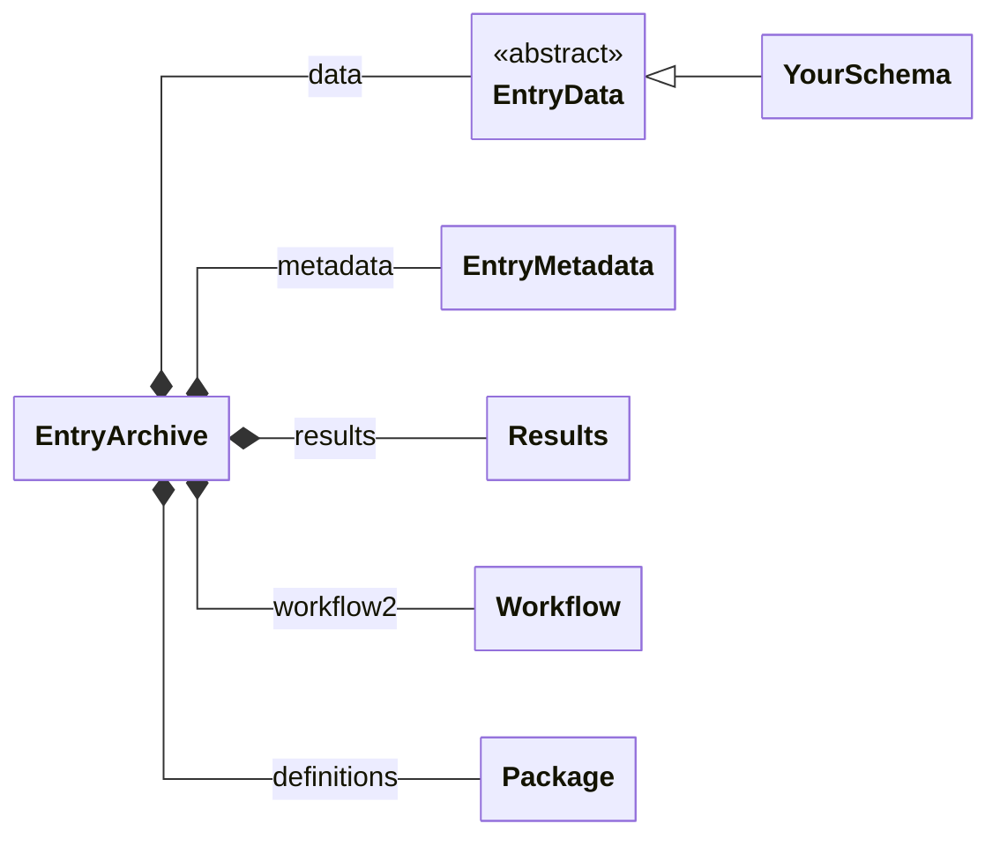
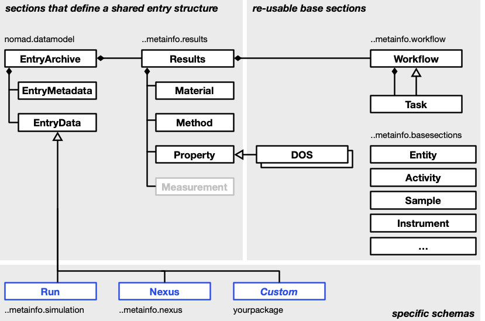
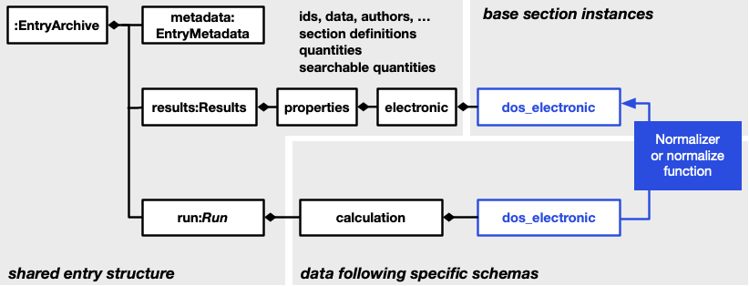
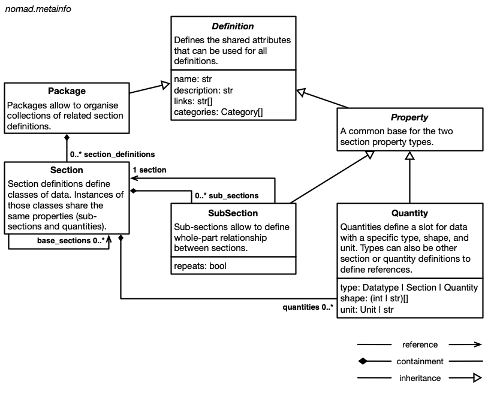

# Data structure

NOMAD organizes data into *sections* and *quantities*. Quantities hold the actual values, while sections group quantities together and can contain other sections, called *subsections*. This hierarchy lets you browse complex data much like files and directories on your computer. Beyond the hierarchy, every section and quantity has a defined name and description, and quantities also have a type and, where applicable, a shape and unit.

Together, these definitions form a *schema* that all data follows. A schema helps people explore the data, and it also makes the data machine-readable, keeps it consistent and interoperable, and enables search, APIs, visualization, and analysis.

Three concepts build on this foundation: the **archive** that holds the concrete data of an entry, the **schemas** that this data follows, and the **schema language** in which those schemas are written. This page introduces them in that order.

## Archives

Each entry in NOMAD has an *archive* which stores its final concrete data. Every archive is an instance of the root section `EntryArchive`, so all entries share the same top-level structure, no matter what kind of data they contain. Both [schemas](#schemas) and processed data are stored as the same kind of *archive file*, either `.archive.json` or `.archive.yaml`.

<figure markdown style="width: 100%">

<figcaption>The top-level subsections that every entry archive shares, and the one where custom schemas attach</figcaption>
</figure>

Of these subsections, `data` carries the entry's actual content, while the others describe, summarize, or relate it:

- `data` (`EntryData`) holds the entry-specific content and is where custom schemas plug in. See [The data section](#the-data-section).
- `metadata` (`EntryMetadata`) is added by NOMAD during processing. It contains ids, timestamps, authors, datasets, references, and an index of all the sections and quantities used in the entry, which search relies on. Users and plugins cannot extend it.
- `results` (`Results`) is a summary of the entry that follows a fixed structure, independent of the data type, with the subsections `material`, `method`, `properties`, and `eln`. Parsers or uploaded archive files can populate it directly, but it is usually populated during normalization. Its structure is controlled by NOMAD, and some of the search is built on it.
- `workflow2` (`Workflow`) describes the entry as a [workflow](./workflows.md) of tasks with inputs and outputs.
- `definitions` (`Package`) is only filled for schema entries and contains the definitions they provide.

!!! note
    There are currently two versions of the workflow schema, stored in two top-level `EntryArchive` subsections, `workflow` and `workflow2`. New schemas should use `workflow2`.

### The data section

`data` is the subsection that carries the entry's actual content. The others describe the entry around it: `metadata` identifies it, `results` summarizes it, and `workflow2` relates it to other entries. For most entries, `data` is where the interesting information lives.

It is also the only part of the shared entry structure that is meant to be extended. `EntryData`, the type of the `data` subsection, defines no quantities of its own. It is a marker: any section that inherits it declares that it can be the root of an entry, and because the subsection is typed by that marker, NOMAD accepts any such section as the content of `data`. Every entry has exactly one `data` section, but the definition behind it differs from entry to entry, and comes from the parser, the plugin schema, or the ELN schema that produced the entry. These definitions should re-use [base sections](#base-sections) as much as possible.

Inheriting `EntryData` does more than place a section in the archive:

- NOMAD offers the section in the dialog for creating a new entry in the GUI.
- The entry type used in search is taken from the name of the section.
- Because `EntryData` builds on `ArchiveSection`, the section can define a `normalize` function that NOMAD runs during processing.

For how to write such a section, see [How-to guides > ... > Define a schema](../howto/schemas/define.md#choose-the-right-base-section). For how to deliver it, either as a plugin or as an uploaded file, see [How-to guides > ... > Start working with schemas](../howto/schemas/schemas.md#get-your-schema-into-nomad).

### Serialized forms

The structure above is abstract: it is independent of how the data is represented in computer memory, in a file, or in a database. The same archive therefore has several serialized forms:

- You can write `.archive.json` or `.archive.yaml` files yourself.
- NOMAD internally stores all processed data in [message pack](https://msgpack.org/){:target="_blank" rel="noopener"}.
- Some of the data is stored in MongoDB or Elasticsearch.
- When you request processed data via the API, you receive it in JSON.
- When you use the [ArchiveQuery](../howto/manage/program/archive_query.md), all data is represented as Python objects (see also the [example in the Python schema documentation](../howto/schemas/define.md#populate-data)).

Whatever the representation, you can rely on the structure, names, types, shapes, and units defined in the schema to interpret the data.

## Schemas

NOMAD represents many different types of data, so we cannot speak of just *the one* schema. Instead, NOMAD's definitions fall into three categories:

- A **shared entry structure**, independent of the type of data and of the processed file type. It makes the generic parts of an entry findable without any deeper understanding of the specific data. This is the `EntryArchive` structure described under [Archives](#archives).
- **Re-usable base sections** for shared common concepts and their properties. Specific schemas can use and extend them, and because they define a fixed interface, tools such as search, visualizations, and analysis can be built around them.
- **Specific schemas**, which re-use base sections and complement the shared entry structure to represent one particular type of data.

<figure markdown>
  
  <figcaption>
    The three different categories of NOMAD schema definitions
  </figcaption>
</figure>

### Base sections

Base section is a very loose category: in principle, every section definition can be inherited from or re-used in a different context. There are some dedicated, and even abstract, base section definitions, mostly in the `nomad.datamodel.metainfo` package and its sub-packages, but schema authors should not strictly limit themselves to these. The goal is to re-use as much as possible instead of re-inventing the same sections over and over again, and the tools built around a base section are what makes re-using it worthwhile.

For the model behind NOMAD's built-in base sections, see [Base sections](./base_sections.md), which also points to instructions on inheriting from them and to the generated per-class listing.

The [workflow package](./workflows.md) is one example of a re-usable base section. It gives every entry a common way to describe workflows, places them in the shared entry structure, and lets the UI provide [a card with workflow visualization and navigation](../howto/manage/gui/workflows.md) for all entries that have a workflow inside.

### Specific schemas

Specific schemas are the definitions that go under an entry's [`data`](#the-data-section) section. They allow users and plugin developers to describe their data in all detail. However, users and machines that are not familiar with the specifics will struggle to interpret this kind of data. It is therefore important to also translate at least some of the data into a more generic and standardized form.

<figure markdown>
  
  <figcaption>
    From specific data to more general interoperable data.
  </figcaption>
</figure>

The [`results`](#archives) section provides such a shared structure, designed around base section definitions. It lets you put at least some of your data where it is easy to find, and in a form that is easy to interpret. In other words, your highly detailed but non-interoperable data is transformed into an interoperable, but potentially limited, form.

Typically, a parser populates the specific schema, while the interoperable parts such as `results` are populated during [normalization](./processing.md#normalizing). Separating the two conversions in this way also makes normalization routines easier to re-use. How much normalization is needed depends on how far the specific schema deviates from the base sections:

- The parser, or an uploaded archive file, populates `results` directly.
- The specific schema re-uses the base sections that `results` is built on, and normalization can be automated.
- The specific schema represents the same information differently, and a translating normalization algorithm needs to be implemented.

## Schema language

Schemas are written in a **schema language**. Ours is called the **NOMAD Metainfo** language, a name that is evocative of the rich **metadata information** that should be associated with research data and made available in a machine-readable format. It provides the means to define sections, to organize definitions into **packages**, and to define section properties, namely **subsections** and **quantities**. The entirety of NOMAD's schema definitions is called the *NOMAD Metainfo*.

<figure markdown>
  
  <figcaption>The NOMAD Metainfo schema language for structured data definitions</figcaption>
</figure>

Packages contain section definitions, and section definitions contain definitions for subsections and quantities. Sections can inherit the properties of other sections. Subsections define containment hierarchies for sections, while quantities can use section definitions, or other quantity definitions, as a type to define references.

If you are familiar with other schema languages and means of defining structured data (JSON schema, XML schema, pydantic, database schemas, ORM, etc.), you might recognize these concepts under different names. Sections are similar to *classes*, *concepts*, *entities*, or *tables*. Quantities are related to *properties*, *attributes*, *slots*, or *columns*. Subsections might be called *containment* or *composition*. Subsections and quantities with a section type also define *relationships*, *links*, or *references*.

Our guide on [how to define a schema](../howto/schemas/define.md) explains these concepts with an example.
