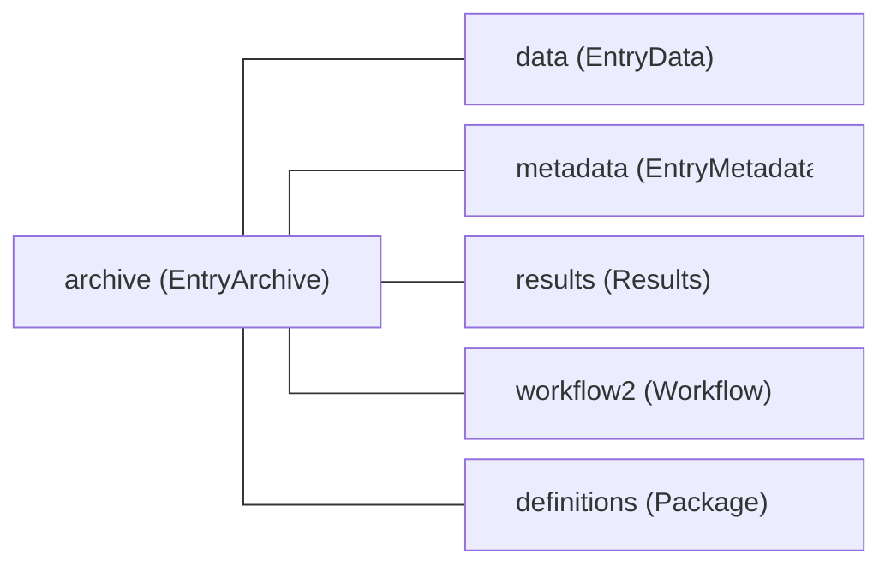

# Data structure

This page explains how data is structured in NOMAD. It is background reading: it describes the ideas that the rest of the documentation builds on, rather than the steps to follow. If you are looking for those steps, the how-to guides on [schemas](../howto/schemas/schemas.md) are the place to start.

Three concepts carry the structure, and this page introduces them in this order:

- The **archive**, the concrete data of a single entry.
- The **schemas**, the definitions that this data follows.
- The **schema language**, in which those schemas are written.

## Archives

Each entry in NOMAD has an *archive* associated with it which stores all of the data related to that entry. Every archive is an instance of an `EntryArchive` which has the following structure:

<figure markdown style="width: 100%">

<figcaption>The top-level subsections that every entry archive shares</figcaption>
</figure>

Of these subsections, `data` carries the entry's actual content, while the others describe, summarize, or relate it:

- `data`: Holds the entry-specific content and is where custom schemas plug in. A subclass of `EntryData`. See [The data section](#the-data-section).
- `metadata`: Added by NOMAD during processing. It contains ids, timestamps, authors, datasets, references, and an index of all the sections and quantities used in the entry, which search relies on. Users and plugins cannot extend it. Instance of `EntryMetadata`.
- `results`: A summary of the entry that follows a fixed structure, independent of the data type, with the subsections `material`, `method`, `properties`, and `eln`. Parsers or uploaded archive files can populate it directly, but it is usually populated during normalization. Its structure is controlled by NOMAD, and some of the search is built on it. Instance of `Results`.
- `workflow2`: Describes the entry as a [workflow](./workflows.md) of tasks with inputs and outputs. Instance of `Workflow`.
- `definitions`: is only filled for schema entries and contains the definitions they provide. Instance of `Package`.

!!! note
    There are currently two versions of the workflow schema, stored in two top-level `EntryArchive` subsections, `workflow` and `workflow2`. New schemas should use `workflow2`.

### The data section

`data` is the subsection that carries the entry's actual content. The others describe the entry around it: `metadata` identifies it, `results` summarizes it, and `workflow2` describes the logical steps on how the data was produced. For most entries, `data` is where the interesting information lives.

It is also the only part of the shared entry structure that is meant to be extended. `EntryData` itself defines no quantities of its own, but NOMAD accepts any section that inherits from it as the content of `data`. Every entry has exactly one `data` section, but the definition behind it differs from entry to entry, and comes from the parser, the plugin schema, or the ELN schema that produced the entry. These definitions should re-use [base sections](./base_sections.md) as much as possible.

Inheriting `EntryData` does more than place a section in the archive:

- NOMAD offers the section in the dialog for creating a new entry in the GUI.
- The entry type used in search is taken from the name of the section.
- Because `EntryData` builds on `ArchiveSection`, the section can define a `normalize` function that NOMAD runs during processing.

For how to write such a section, see [How-to guides > ... > Define a schema](../howto/schemas/define.md#choose-the-right-base-section). For how to deliver it, either as a plugin or as an uploaded file, see [How-to guides > ... > Start working with schemas](../howto/schemas/schemas.md#get-your-schema-into-nomad).

### Serialized forms

The structure above is abstract: it is independent of how the data is represented in computer memory, in a file, or in a database. The same archive therefore has several serialized forms:

- You can write `.archive.json` or `.archive.yaml` files yourself.
- NOMAD internally stores all processed data in [message pack](https://msgpack.org/){:target="_blank" rel="noopener"}.
- Some of the data is stored in MongoDB or Elasticsearch.
- When you request processed data via the API, you receive it in JSON.
- When you use the [ArchiveQuery](../howto/manage/program/archive_query.md), all data is represented as Python objects (see also the [example in the Python schema documentation](../howto/schemas/define.md#populate-data)).

Whatever the representation, you can rely on the structure, names, types, shapes, and units defined in the schema to interpret the data.

## Schemas

The previous section described the shape of an archive. A schema is what gives that shape meaning. A *schema* is a set of section and quantity definitions: each definition fixes a name, a description, a type and, where applicable, a shape and a unit, and each section definition also fixes which subsections and quantities it may contain. Definitions are not written one by one, they are grouped into a *package*, and the package is the unit in which a schema is written, delivered, and referred to. In Python a package is a `SchemaPackage`; in an archive file it is the content of the `definitions` section, which is why a schema and the data following it are the same kind of file.

There is no single NOMAD schema. The sections around `data` — `metadata`, `results`, and `workflow2` — are defined by NOMAD and are the same in every archive, but [`data`](#the-data-section) follows a different schema in every kind of entry. When you read an entry, the definition behind its `data` section is what tells you what the entry actually contains. When you have data of your own, writing a schema is how you tell NOMAD what it contains.

### Where schemas come from

A schema reaches NOMAD in one of three ways, and which one you use decides who can see it and what it can do.

- **Built into NOMAD.** The definitions that ship with the `nomad-lab` package itself: the root `EntryArchive` and `metadata` in `nomad.datamodel`, and the shared, domain-independent definitions in `nomad.datamodel.metainfo`, including the built-in base sections. They are present in every installation.
- **A Python schema package in a plugin.** A plugin declares a schema package entry point whose definitions are loaded at startup. Once the plugin is installed, the schema is available to every user of that installation, and it can carry `normalize` functions that NOMAD runs during processing.
- **An uploaded archive file.** Any user can upload a `.archive.yaml` or `.archive.json` file that fills the `definitions` section. NOMAD stores the package and makes it available within the upload it was uploaded to. No installation and no plugin development is needed, but the schema does not leave that upload, and it cannot carry `normalize` functions.

The two syntaxes describe the same thing, and there is a one-to-one translation between them. For the trade-off between them and for the mechanics of each route, see [How-to guides > ... > Start working with schemas](../howto/schemas/schemas.md#choose-python-or-yaml).

### Re-use and interoperability

Schemas are rarely written from scratch. A section definition can inherit from another one, and inheriting brings over not only its quantities and subsections but also the functionality attached to them.

Re-use is also where interoperability comes from. A schema of your own can describe your data in all the detail you want, and that is the point of it — but detail is not the same as interoperability, and users and machines that are not familiar with the specifics will struggle to interpret it. What makes data interpretable beyond the context it was created in is that different schemas describe the same concepts with the same definitions. Because a shared definition presents a fixed interface, search, visualizations, ELN forms, and analysis code can be written once and then work for every schema that inherits it. The goal is to re-use as much as possible instead of re-inventing the same sections over and over again, and the tools built around a definition are what makes re-using it worthwhile.

No central structure can do this work for you. NOMAD cannot anticipate what every method and every lab needs to record, so the definitions that describe your data well are ones you and your community share and maintain. Interoperability is built from the bottom up, by agreeing on definitions, rather than handed down from a common format.

The [workflow schema](./workflows.md) is one example. It gives every entry a common way to describe tasks with their inputs and outputs, and because all entries use the same definitions, the UI can offer [a card with workflow visualization and navigation](../howto/manage/gui/workflows.md) for every entry that has a workflow inside.

The definitions that schemas inherit from most often are NOMAD's built-in *base sections*. They are the subject of the next page: [Base sections](./base_sections.md).

!!! note
    A second and much thinner layer of interoperability is the [`results`](#archives) section, which FAIRmat maintains as part of NOMAD itself. Its structure is fixed and the same in every entry, whatever the entry contains, which is exactly what limits it: because it has to fit all of NOMAD at once, it can only ever capture a shallow common denominator, and it is not a substitute for schemas your data actually fits. Typically a parser populates the entry's own schema, while `results` is filled during [normalization](./processing.md#normalizing) — automatically when the schema inherits base sections that fill it in their own `normalize` functions, and otherwise by a translating normalization algorithm.

Built-in, plugin, and uploaded schemas differ in where they live and who can use them, but not in what they are made of. That common vocabulary — sections, quantities, subsections, and packages — is fixed by the schema language.

## Schema language

Schemas are written in a **schema language**. Ours is called the **NOMAD Metainfo**, a name that is evocative of the rich **metadata information** that should be associated with research data and made available in a machine-readable format. It provides the means to define sections, to organize definitions into **packages**, and to define section properties, namely **subsections** and **quantities**.

<figure markdown>
  
  <figcaption>The NOMAD Metainfo schema language for structured data definitions</figcaption>
</figure>

Packages contain section definitions, and section definitions contain definitions for subsections and quantities. Sections can inherit the properties of other sections. Subsections define containment hierarchies for sections, while quantities can use section definitions, or other quantity definitions, as a type to define references.

If you are familiar with other schema languages and means of defining structured data (JSON schema, XML schema, pydantic, database schemas, ORM, etc.), you might recognize these concepts under different names. Sections are similar to *classes*, *concepts*, *entities*, or *tables*. Quantities are related to *properties*, *attributes*, *slots*, or *columns*. Subsections might be called *containment* or *composition*. Subsections and quantities with a section type also define *relationships*, *links*, or *references*.

Our guide on [how to define a schema](../howto/schemas/define.md) explains these concepts with an example.

For the language itself — every attribute a definition can carry, the available quantity types, and the naming conventions — see [Reference > Schema language](../reference/metainfo.md).
