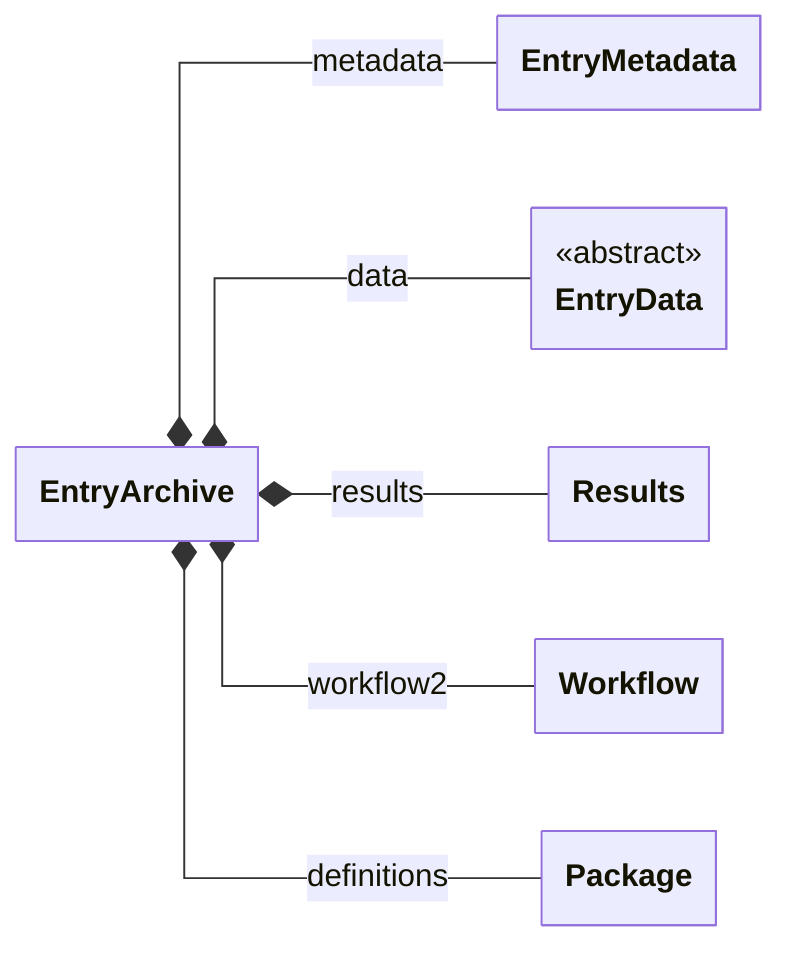

# Data structure

In order to understand and explore data in NOMAD, it is good to know three concepts: **archives**, **schemas** and the **schema language**. This page explores these concepts top-to-bottom and illustrates how these fit together to give a solid foundation for NOMAD.

## Archives

Each entry in NOMAD has an *archive* which stores the final concrete data. The archive itself is always an instance of the `EntryArchive` schema. 

Both [schemas](#schema) and [processed data](#data) are stored as the same kind of *archive file*, either `.archive.json` or `.archive.yaml`. Every archive is an instance of the root section `EntryArchive`, so all entries share the same top-level structure, no matter what kind of data they contain:

<figure markdown style="width: 100%">

</figure>

* `metadata` (`EntryMetadata`) is added by NOMAD during processing. It contains ids, timestamps, authors, datasets, references, and an index of all the sections and quantities used in the entry, which search relies on. Users and plugins cannot extend it.
* `data` (`EntryData`) contains the entry-specific data. `EntryData` is an empty base section, and the concrete definition comes from the parser, plugin schema, or ELN schema that produced the entry. These definitions should re-use [base sections](#base-sections) as much as possible.
* `results` (`Results`) is a summary of the entry that follows a fixed structure, independent of the data type, with the subsections `material`, `method`, `properties`, and `eln`. Parsers or uploaded archive files can populate it directly, but it is usually populated during normalization. Its structure is controlled by NOMAD, and some of the search is built on it.
* `workflow2` (`Workflow`) describes the entry as a workflow of tasks with inputs and outputs (see the [workflow note](#base-sections) above). There is also a legacy `workflow` subsection, which should no longer be used.
* `definitions` (`Package`) is only filled for schema entries and contains the definitions they provide.

!!! note
    There are currently two versions of the workflow schema, stored in two top-level `EntryArchive` subsections, `workflow` and `workflow2`. New schemas should use `workflow2`.

This provides an abstract structure for all data. However, it is independent of the actual representation of data in computer memory or how it might be stored in a file or database. The archives have many serialized forms. You can write `.archive.json` or `.archive.yaml` files yourself. NOMAD internally stores all processed data in [message pack](https://msgpack.org/){:target="_blank" rel="noopener"}. Some of the data is stored in MongoDB or Elasticsearch. When you request processed data via API, you receive it in JSON. When you use the [ArchiveQuery](../howto/manage/program/archive_query.md), all data is represented as Python objects (see also [example in the Python schema documentation](../howto/schemas/define.md#populate-data)).

## Schemas

NOMAD organizes data into **sections** and **quantities**. Quantities hold the actual values, while sections group quantities together and can contain other sections, called subsections. This hierarchy lets you browse complex data much like files and directories on your computer. Beyond the hierarchy, every section and quantity has a defined name and description, and quantities also have a type and, where applicable, a shape and unit. Together, these definitions form a **schema** that all data follows. The schema helps people explore the data, and it also makes the data machine-readable, keeps it consistent and interoperable, and enables search, APIs, visualization, and analysis.

NOMAD represents many different types of data. Therefore, we cannot speak of just *the one* schema. Definitions used in the NOMAD Metainfo fall into three different categories. First, we have sections that define a **shared entry structure**. Those are independent of the type of data (and processed file type). They allow to find all generic parts without any deeper understanding of the specific data. Second, we have definitions of **re-usable base sections** for shared common concepts and their properties. Specific schemas can use and extend these base sections. Base sections define a fixed interface or contract that can be used to build tools (e.g. search, visualizations, analysis) around them. Lastly, there are **specific schemas**. Those re-use base sections and complement the shared entry structure. They define specific data structures to represent specific types of data.

<figure markdown>
  
  <figcaption>
    The three different categories of NOMAD schema definitions
  </figcaption>
</figure>

### Base sections

Base section is a very loose category. In principle, every section definition can be
inherited from or can be re-used in different contexts. There are some dedicated (or even abstract)
base section definitions (mostly defined in the `nomad.datamodel.metainfo` package and sub-packages),
but schema authors should not strictly limit themselves to these definitions.
The goal is to re-use as much as possible and to not re-invent the same sections over
and over again. Tools build around certain base section, provide an incentive to
use them.

For the model behind NOMAD's built-in base sections, see [Base sections](./base_sections.md). For
instructions on inheriting from them, see
[How-to guides > Work with schemas > Define a schema](../howto/schemas/define.md#inherit-from-a-base-section), and for
the generated per-class listing, [Reference > Base sections](../reference/basesections.md).

One example for re-usable base section is the [workflow package](../howto/manage/gui/workflows.md).
These allow to define workflows in a common way. They allow to place workflows in
the shared entry structure, and the UI provides a card with workflow visualization and
navigation for all entries that have a workflow inside.

### Specific schemas

Specific schemas allow users and plugin developers to describe their data in all detail.
However, users (and machines) not familiar with the specifics, will struggle to interpret
these kinda of data. Therefore, it is important to also translate (at least some of) the data
into a more generic and standardized form.

<figure markdown>
  
  <figcaption>
    From specific data to more general interoperable data.
  </figcaption>
</figure>

The **results** section provides a shared structure designed around base section definitions.
This allows you to put (at least some of) your data where it is easy to find, and in a
form that is easy to interpret. Your non-interoperable, but highly
detailed data needs to be transformed into an interoperable (but potentially limited) form.

Typically, a parser will be responsible to populate the specific schema, and the
interoperable schema parts (e.g. section results) are populated during normalization.
This allows to separate certain aspects of conversions and potentially enables re-use
for normalization routines. The necessary effort for normalization depends on how much
the specific schema deviates from base-sections. There are three levels:

- the parser (or uploaded archive file) populates section results directly
- the specific schema re-uses the base sections used for the results and normalization
can be automated
- the specific schema represents the same information differently and a translating
normalization algorithm needs to be implemented.

## Schema language

The bases for structured data are schemas written in a **schema language**. Our
schema language is called the **NOMAD Metainfo** language. The name is evocative of the rich **metadata information** that should be associated with the research data and made available in a machine-readable format.
It defines the tools to define sections, organize definitions into **packages**, and define
section properties (**subsections** and **quantities**).

<figure markdown>
  
  <figcaption>The NOMAD Metainfo schema language for structured data definitions</figcaption>
</figure>

Packages contain section definitions, section definitions contain definitions for
subsections and quantities. Sections can inherit the properties of other sections. While
subsections allow to define containment hierarchies for sections, quantities can
use section definitions (or other quantity definitions) as a type to define references.

If you are familiar with other schema languages and means to defined structured data
(json schema, XML schema, pydantic, database schemas, ORM, etc.), you might recognize
these concept under different names. Sections are similar to *classes*, *concepts*, *entities*, or  *tables*.
Quantities are related to *properties*, *attributes*, *slots*, *columns*.
subsections might be called *containment* or *composition*. subsections and quantities
with a section type also define *relationships*, *links*, or *references*.

Our guide on [how to define a schema](../howto/schemas/define.md) explains these concepts with an example.

