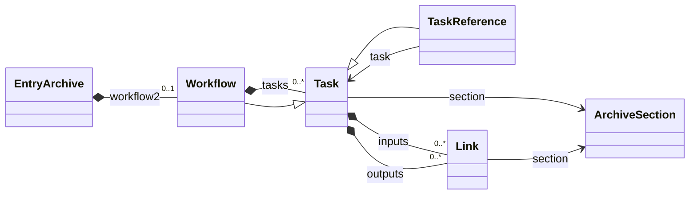
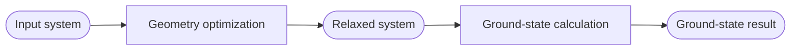

# Workflows

A workflow in NOMAD is a record of provenance: it describes how inputs were
used by tasks to produce outputs. It represents a process that has taken place
or is documented in stored data. It is not a workflow engine and does not
execute the tasks it describes.

The inputs, tasks, and outputs can refer to archive sections in one Entry or
across multiple Entries. A Project groups files and Entries for management,
access, and publication, whereas a workflow expresses relationships between
the data stored in those Entries.

## Related pages

- {{ nav_link("howto/manage/gui/workflows.md", breadcrumb=True) }}
- {{ nav_link("howto/schemas/define.md", breadcrumb=True) }}
- {{ nav_link("tutorial/eln/built_in_templates.md", breadcrumb=True) }}

## The built-in abstract workflow schema

NOMAD stores the current workflow representation in the top-level `workflow2`
section of an Entry archive. This section contains a `Workflow` instance from
`nomad.datamodel.metainfo.workflow`.

<figure markdown class="diagram-zoom" data-diagram-zoom
        aria-label="Enlarge the general workflow model diagram">

<figcaption>The classes and relationships in the general workflow model. Select the diagram to enlarge it.</figcaption>
</figure>

The model has four central components:

- A **link** represents one input or output. Its `section` points to the archive
  section containing the data, while its `name` provides a label for displays
  such as the workflow graph.
- A **task** represents an activity that used inputs to produce outputs. Its
  optional `section` can identify the archive section describing that activity.
- A **task reference** is a proxy for a task or workflow defined elsewhere,
  such as in another Entry. It can supply a local name, inputs, and outputs or
  obtain them from the referenced task.
- A **workflow** is a task that also contains other tasks. Because `Workflow`
  inherits from `Task`, a workflow can itself be used as a task in another
  workflow.

The model stores references rather than separate graph edges. When links on
different nodes point to the same archive section, NOMAD can represent the
shared data as a connection in the workflow graph. References can point to
sections in the same Entry or to Entries elsewhere on the same NOMAD
deployment.

!!! note
    Some older Entry archives use the legacy top-level `workflow` section. New
    workflow data and schemas should use `workflow2`.

### Example provenance graph

Consider a geometry optimization followed by a ground-state calculation:

The relaxed system is both the output of the geometry optimization and the
input of the ground-state calculation. Both links therefore reference the same
archive section. The tasks and referenced data may be stored together or in
separate Entries without changing this logical relationship.

### Nested workflows

A task can represent a process with its own inputs, tasks, and outputs. Because
a `Workflow` is also a `Task`, this sub-workflow can be contained directly in a
parent workflow. A `TaskReference` can instead link to a workflow stored
elsewhere. Both forms produce a hierarchical provenance graph while allowing
each referenced Entry to remain independently accessible.

## Custom and standardized workflows

The distinction between a custom and a standardized workflow concerns the
schema used to describe it, not whether a person or software created the
workflow Entry.

A **custom workflow** uses the general `Workflow`, `Task`, and `Link` model
directly. Its author selects the relevant archive sections and defines how they
are connected. This is flexible enough to document processes that do not yet
have a domain-specific workflow schema, while still enabling common graph and
navigation tools.

A **standardized workflow** uses a specialized `Workflow` subclass with a
defined scientific meaning and structure. Such a schema can add method and
result sections, workflow-specific quantities, references, and normalization
logic. Examples in NOMAD's simulation schema include `SinglePoint`,
`GeometryOptimization`, and `GW`. Plugins can provide additional specialized
workflow schemas for other domains.

Standardization allows tools to rely on more than the general provenance
graph. A shared schema can support consistent normalization, search,
validation, and domain-specific presentation. The general inputs, tasks, and
outputs remain available because the specialized schema inherits from
`Workflow`.

## How workflow data is created

The same workflow model can be populated through several routes:

- **Parsers and normalizers** can create a workflow while processing supported
  files. For example, simulation parsers installed on NOMAD Central can create
  specialized workflows for recognized calculations.
- **ELN and other schema normalizers** can translate structured records, such
  as experiment activities and steps, into the general workflow model.
- **Archive YAML files** can define a custom workflow explicitly or
  instantiate an accessible specialized workflow schema with `m_def`.
- **Plugins** can define specialized workflow schemas and the parsing or
  normalization logic that populates them.

These routes can produce either general or specialized workflows. Their
availability depends on the parsers, schemas, and plugins installed in a NOMAD
deployment.
