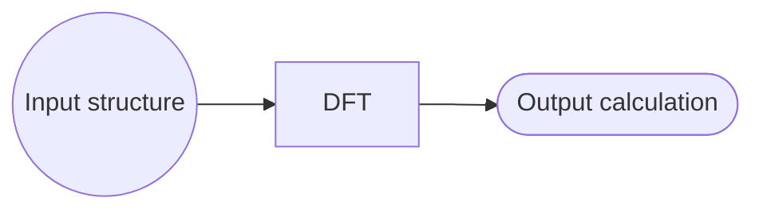
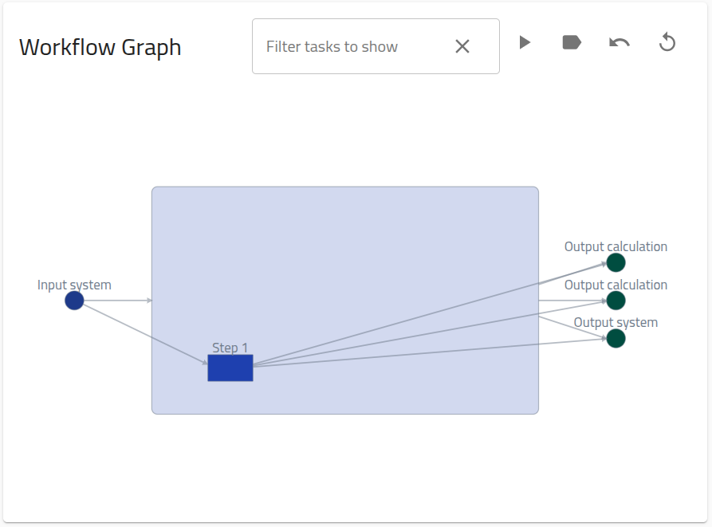
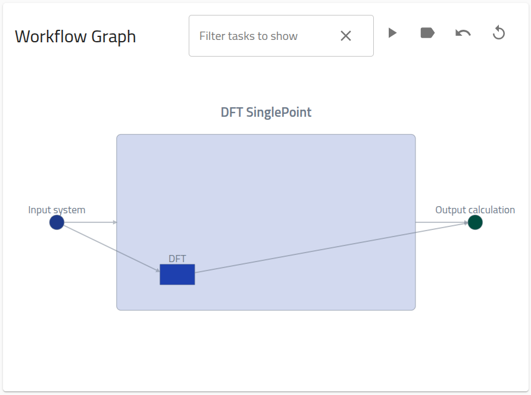
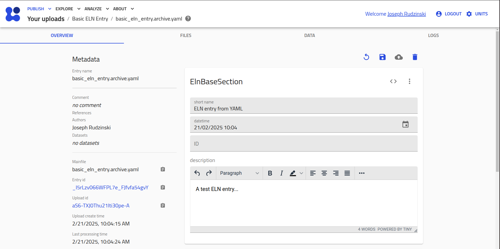
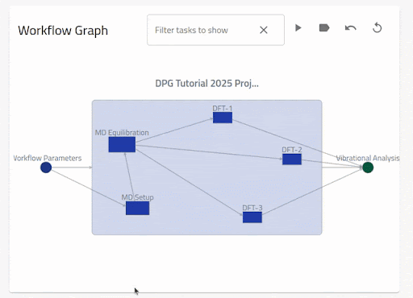

# How to define custom workflows

## What you will learn

- Connect NOMAD entries into a directed graph structure
- Create hierarchical workflow graphs
- Link task nodes to supported and custom entries (e.g., ELN entries)
- Link inputs and outputs to annotated files
- Navigate workflows using NOMAD's interactive workflow graphs

## Recommended preparation

- Basic knowledge of NOMAD Organization + MetaInfo

## Further resources

- [Tutorial > Managing workflows and projects](../../tutorial/workflows_projects.md)

## Overview

In NOMAD, [Workflows](../../explanation/workflows.md) are directed graphs with nodes (tasks) that connect multiple [Entries](../../reference/glossary.md#entry) together in a structured way, while specifying information passed between the nodes via inputs/outputs that link to particular sections of the relevant [Archive](../../reference/glossary.md#archive).

Workflows are sometimes created automatically by NOMAD via parser [Plugins](../../explanation/plugin_system.md), for certain supported uploads. Users can also create their own workflow entries by uploading an appropriately formatted workflow YAML. This How-to guide will cover the specifics of this process.

!!! Note
    In the following, various supported raw data files will be used to form concrete examples that can be reproduced. The nature of these files or their underlying methods of production is irrelevant for the purpose of this How-to.

## Simple workflows with supported tasks

We start with the simplest possible workflow structure&mdash;a single task with one input and one output:



The file associated with this task, `dft.xml`, is a standard DFT calculation that is supported by NOMAD's simulation parsers, i.e., upon upload it will be automatically recognized and parsed to create an entry. Actually, the parser for this file will automically create a "Single Point" workflow within the same entry, which specifies the standard input and outputs for simulation data in NOMAD:

{.screenshot}

Here, we will reproduce, and customize, this workflow graph in a separate entry, using the YAML-based approach.

To define the initial workflow, create a file `dft.workflow.archive.yaml` with the following content:

```yaml
workflow2:
  name: DFT SinglePoint
  inputs:
    - name: Input system
      section: '../upload/archive/mainfile/dft.xml#/run/0/system/-1'
  outputs:
    - name: Output calculation
      section: '../upload/archive/mainfile/dft.xml#/run/0/calculation/-1'
  tasks:
    - m_def: nomad.datamodel.metainfo.workflow.TaskReference
      task: '../upload/archive/mainfile/dft.xml#/workflow2'
      name: DFT
      inputs:
        - name: Input structure
          section: '../upload/archive/mainfile/dft.xml#/run/0/system/-1'
      outputs:
        - name: Output calculation
          section: '../upload/archive/mainfile/dft.xml#/run/0/calculation/-1'
```

!!! Warning "Important"
    For the creation of workflow entries using YAMLs, the file must have the extension `archive.yaml`.

This file is constructed according to NOMAD's [General Workflow Schema](../../explanation/workflows.md#the-built-in-abstract-workflow-schema). The `workflow2` section of the archive has 3 possible subsections: `inputs`, `outputs`, and `tasks`:

**`inputs`**: a list of references to the global inputs of the workflow, with `name` and `section` attributes. `section` corresponds to a path for linking to the relevant archive section. In this case, the relative section path is `run[0].system[-1]`, linked to the entry defined by the mainfile `dft.xml`. The prefix is discussed under "Considerations for archive path specification" below.

**`outputs`**: identical to the inputs list, representing the global outputs of the workflow, with the relative section path `run[0].calculation[-1]` in this case.

**`tasks`**: a list of references to the tasks/steps of the workflow. Each task contains `m_def`, `task`, `inputs`, and `outputs` attributes. `inputs`/`outputs` are task-specific versions of the lists defined above. `task` is the path for linking to the relevant archive section, analogous to the `section` attribute for `inputs`/`outputs`. `m_def` defines the type of task according to NOMAD's MetaInfo scehma, in this case a `TaskReference` to the archive `workflow2` section.  The use of `TaskReference` will be clarified in the
<!-- TODO add example section  -->
example below.

Considerations for archive path specification:

- In general, the archive path can be represented as `<prefix>/<entry identifier>/<relative archive path>`.

- The prefix for the archive path is given by: 1. `../upload/archive/mainfile` for entries that are contained within the same upload as the workflow YAML, or 2. `../uploads/<upload_id>/archive/` for entries contained in distinct uploads as the workflow YAML, where `<upload_id>` is a placeholders for the upload id, which can be obtained from the Overview page of any entry.

- The entry identifier is `<entry_id>#` (placeholder for the entry id, also found on the Overview page) for case 1, and `<path to mainfile>/<mainfile name>#` for case 2. `<path to mainfile>` is the path from the root of the original upload directory structure.

- The relative archive path is the relative path to the archive section to be linked. The archive structure can be investigated using NOMAD's [MetaInfo Browser](https://nomad-lab.eu/prod/v1/gui/analyze/metainfo/nomad.datamodel.datamodel.EntryArchive){:target="_blank"}.

With a basic understanding in hand, you can now download the example data and upload the obtained `.zip` file to NOMAD:

[Download simple_workflow.zip](data/simple_workflow.zip){ .md-button .nomad-button }

file structure of `simple_workflow.zip`:
```
.
├── dft.xml
├── dft.workflow.archive.yaml
```

Upon upload to NOMAD, the above zip will produce 2 entries:

1. A single point entry with mainfile `dft.xml`

2. a workflow entry with mainfile `dft.workflow.archive.yaml`. The workflow entry will contain the following workflow graph on the Overview page:

{.screenshot}


??? Tip "Adding more workflow metadata"

    You could extend the workflow metadata by adding the metholodogical input parameters. These are stored in the archive with path `run[0].method[-1]`. The new `single_point.archive.yaml` will then be:

    ```yaml
    workflow2:
      name: DFT SinglePoint
      inputs:
        - name: Input system
          section: '../upload/archive/mainfile/dft.xml#/run/0/system/-1'
        - name: Input methodology parameters
          section: '../upload/archive/mainfile/pressure1/dft_p1.xml#/run/0/method/-1'
      outputs:
        - name: Output calculation
          section: '../upload/archive/mainfile/dft.xml#/run/0/calculation/-1'
      tasks:
        - m_def: nomad.datamodel.metainfo.workflow.TaskReference
          task: '../upload/archive/mainfile/dft.xml#/workflow2'
          name: DFT
          inputs:
            - name: Input structure
              section: '../upload/archive/mainfile/dft.xml#/run/0/system/-1'
            - name: Input methodology parameters
              section: '../upload/archive/mainfile/dft.xml#/run/0/method/-1'
          outputs:
            - name: Output calculation
              section: '../upload/archive/mainfile/dft.xml#/run/0/calculation/-1'
    ```

    When uploaded with `dft.xml` as before, this will generate a similar workflow graph, but with an extra input node.

## Referencing Tasks in different uploads

As already mentioned above, your workflow YAML can reference entries that you have previously uploaded to NOMAD. In this case, you should replace the path prefix `../upload/archive/mainfile/<mainfile_name>` with `../uploads/<upload_id>/archive/<entry_id>`.

??? Tip "Corresponding `dft.workflow.archive.yaml` from above example"

    ```yaml
    workflow2:
      name: DFT SinglePoint
      inputs:
        - name: Input system
          section: '../upload/<upload_id>/archive/<entry_id>#/run/0/system/-1'
      outputs:
        - name: Output calculation
          section: '../upload/<upload_id>/archive/<entry_id>#/run/0/calculation/-1'
      tasks:
        - m_def: nomad.datamodel.metainfo.workflow.TaskReference
          task: '../upload/<upload_id>/archive/<entry_id>#/workflow2'
          name: DFT
          inputs:
            - name: Input structure
              section: '../upload/<upload_id>/archive/<entry_id>#/run/0/system/-1'
          outputs:
            - name: Output calculation
              section: '../upload/<upload_id>/archive/<entry_id>#/run/0/calculation/-1'
    ```

## Nested workflows

Nested, or hierarchical, workflows correspond to workflow graphs containing task nodes that themselves can be represented as a directed graph, i.e., a sub-workflow. The [General Workflow Schema](../../explanation/workflows.md#the-built-in-abstract-workflow-schema) allows for nested workflows through an inheritance relationship from the `Task` class to the `Workflow` class.

### In multiple entries

The most common way to construct a nested workflow is by creating separate entries for each (sub-)workflow. In this case, each sub-workflow archive will contain a populated `workflow2` section. Thus, to add a sub-workflow to your workflow YAML, the **best practice** is to directly link to this `workflow2` section, i.e., `task: <prefix>/<entry identifier>#/workflow2`.

We have already seen this case in [Simple Workflows with Support Tasks](#simple-workflows-with-supported-tasks). Actually, there is a convention in NOMAD that all simulation entries contain a workflow representation, even for single-step workflows. Thus, any workflow containing simulation tasks will be a nested workflow.

In general, a sub-workflow task must be defined as a `TaskReference` by setting `m_def: nomad.datamodel.metainfo.workflow.TaskReference` for the task. This is because `Workflow` instances can only contain `Task` instances and not reference them (see [General Workflow Schema](../../explanation/workflows.md#the-built-in-abstract-workflow-schema)).

### In a single entry

<!-- ! I do not understand this, is this mainfile different than the workflow yaml?! -->

!!! Warning "TBD"

While less common, it is also possible to create a nested workflow within a single entry.

Since a `Workflow` instance is also a `Task` instance due to inheritance, we can directly nest workflows within a single entry. Here we illustrate the concept using the [Example Workflow](../../explanation/workflows.md#example-workflow): A geometry optimization sub-workflow, followed by a ground state calculation.

```yaml
workflow2:
  inputs:
    - name: input system
      section: '../upload/archive/mainfile/example_workflow.archive.yaml#/run/0/system/0'
  outputs:
    - name: relaxed system
      section: '../upload/archive/mainfile/example_workflow.archive.yaml#/run/0/system/-1'
    - name: ground state calculation of relaxed system
      section: '../upload/archive/mainfile/example_workflow.archive.yaml#/run/0/calculations/0'
  tasks:
    - name: GeometryOpt
      m_def: nomad.datamodel.metainfo.workflow.Workflow
      inputs:
        - name: input system
          section: '../upload/archive/mainfile/example_workflow.archive.yaml#/run/0/system/0'
      outputs:
        - name: relaxed system
          section: '../upload/archive/mainfile/example_workflow.archive.yaml#/run/0/system/-1'
      tasks:
        - inputs:
            - section: '../upload/archive/mainfile/example_workflow.archive.yaml#/run/0/system/0'
          outputs:
            - section: '../upload/archive/mainfile/example_workflow.archive.yaml#/run/0/system/1'
            - section: '../upload/archive/mainfile/example_workflow.archive.yaml#/run/0/calculation/0'
        - inputs:
            - section: '../upload/archive/mainfile/example_workflow.archive.yaml#/run/0/system/1'
          outputs:
            - section: '../upload/archive/mainfile/example_workflow.archive.yaml#/run/0/system/2'
            - section: '../upload/archive/mainfile/example_workflow.archive.yaml#/run/0/calculation/1'
        - inputs:
            - section: '../upload/archive/mainfile/example_workflow.archive.yaml#/run/0/system/2'
          outputs:
            - section: '../upload/archive/mainfile/example_workflow.archive.yaml#/run/0/system/3'
            - section: '../upload/archive/mainfile/example_workflow.archive.yaml#/run/0/calculation/2'
    - name: GroundStateCalculation
      inputs:
        - name: input system
          section: '../upload/archive/mainfile/example_workflow.archive.yaml#/run/0/system/-1'
      outputs:
        - name: ground state
          section: '../upload/archive/mainfile/example_workflow.archive.yaml#/run/0/calculations/0'
```

Here, the entry defined by the mainfile `example_workflow.archive.yaml` represents some...


### Nested example workflow

To make the above discussion concrete, consider the following schematic nested workflow:

```mermaid
graph LR;
    A2((Inputs)) --> B2[DFT];
    subgraph
    B2[DFT] --> C2[TB];
    C2[TB] --> D21[DMFT at T1];
    C2[TB] --> D22[DMFT at T2];
    end
    D21[DMFT at T1] --> E21([Output calculation T1])
    D22[DMFT at T2] --> E22([Output calculation T2])
```

Here, "Input" refers to the all _input_ information given to perform the calculation (e.g., atom positions, model parameters, experimental initial conditions, etc.). "DFT", "TB" and "DMFT" refer to individual _tasks_ of the workflow, which each correspond to a _SinglePoint_ entry in NOMAD. "Output calculation" refers to the _output_ data of each of the final DMFT tasks.??????

These workflow contains a series of electronic structure calculations: a DFT and a TB calculation performed in serial, followed by two DMFT calculations performed in parallel at two different temperatures. The mainfiles for these calculations are organized in the following file structure, stored with `complex_workflow.zip`:

```
.
├── DFT
│   └── dft.xml
├── TB
│   ├── tb.wout
│   └── ...extra auxiliary files
├── temperature1
│   └── dmft_t1.hdf5
└── temperature1
    └── dmft_t1.hdf5
```

You can reproduce the following by downloading the example data:

[Download complex_workflow.zip](data/complex_workflow.zip){ .md-button .nomad-button }

## Pressure workflows

Now that you know the basics of the workflow YAML schema, let's try to define an overarching workflow for each of the pressures. For this section, you will learn how to create the workflow YAML schema for the P<sub>1</sub> case; the extension for P<sub>2</sub> is then a matter of changing names and paths in the YAML files. For simplicity, you can skip referencing to methodologies.

Thus, the `inputs` can be defined as:
```yaml
workflow2:
  name: DFT+TB+DMFT at P1
  inputs:
    - name: Input structure
      section: '../upload/archive/mainfile/pressure1/dft_p1.xml#/run/0/system/-1'
```
and there are two `outputs`, one for each of the DMFT calculations at distinct temperatures:
```yaml
  outputs:
    - name: Output DMFT at P1, T1 calculation
      section: '../upload/archive/mainfile/pressure1/temperature1/dmft_p1_t1.hdf5#/run/0/calculation/-1'
    - name: Output DMFT at P1, T2 calculation
      section: '../upload/archive/mainfile/pressure1/temperature2/dmft_p1_t2.hdf5#/run/0/calculation/-1'
```
Now, `tasks` are defined for each of the methodologies performed (each corresponding to an underlying SinglePoint workflow). To define a valid workflow, each task must contain an input that corresponds to one of the outputs of the previous task. Moreover, the first task should take as input the overall input of the workflow, and the final task should also have as an output the overall workflow output.
Then:
```yaml
  tasks:
    - m_def: nomad.datamodel.metainfo.workflow.TaskReference
      task: '../upload/archive/mainfile/pressure1/dft_p1.xml#/workflow2'
      name: DFT at P1
      inputs:
        - name: Input structure
          section: '../upload/archive/mainfile/pressure1/dft_p1.xml#/run/0/system/-1'
      outputs:
        - name: Output DFT at P1 calculation
          section: '../upload/archive/mainfile/pressure1/dft_p1.xml#/run/0/calculation/-1'
    - m_def: nomad.datamodel.metainfo.workflow.TaskReference
      task: '../upload/archive/mainfile/pressure1/tb_p1.wout#/workflow2'
      name: TB at P1
      inputs:
        - name: Input DFT at P1 calculation
          section: '../upload/archive/mainfile/pressure1/dft_p1.xml#/run/0/calculation/-1'
      outputs:
        - name: Output TB at P1 calculation
          section: '../upload/archive/mainfile/pressure1/tb_p1.wout#/run/0/calculation/-1'
    - m_def: nomad.datamodel.metainfo.workflow.TaskReference
      task: '../upload/archive/mainfile/pressure1/temperature1/dmft_p1_t1.hdf5#/workflow2'
      name: DMFT at P1 and T1
      inputs:
        - name: Input TB at P1 calculation
          section: '../upload/archive/mainfile/pressure1/tb_p1.wout#/run/0/calculation/-1'
      outputs:
        - name: Output DMFT at P1, T1 calculation
          section: '../upload/archive/mainfile/pressure1/temperature1/dmft_p1_t1.hdf5#/run/0/calculation/-1'
    - m_def: nomad.datamodel.metainfo.workflow.TaskReference
      task: '../upload/archive/mainfile/pressure1/temperature1/dmft_p1_t1.hdf5#/workflow2'
      name: DMFT at P1 and T2
      inputs:
        - name: Input TB at P1 calculation
          section: '../upload/archive/mainfile/pressure1/tb_p1.wout#/run/0/calculation/-1'
      outputs:
        - name: Output DMFT at P1, T2 calculation
          section: '../upload/archive/mainfile/pressure1/temperature2/dmft_p1_t2.hdf5#/run/0/calculation/-1'
```
Note here:

- The `inputs` for each subsequent step are the `outputs` of the previous step.
- The final two `outputs` coincide with the `workflow2` `outputs`.

This workflow (`pressure1.archive.yaml`) file will then produce an entry with the following Overview page:

{.screenshot}

Similarly, for P<sub>2</sub> you can upload a new `pressure2.archive.yaml` file with the same content, except when substituting 'pressure1' and 'p1' by their counterparts. This will produce a similar graph than the one showed before but for "P2".


## The top-level workflow

After adding the workflow YAML files, Your upload folder directory now looks like:
```
.
├── pressure1
│   │   ├── dmft_p1_t1.hdf5
│   │   └── ...extra auxiliary files
│   ├── temperature2
│   │   ├── dmft_p1_t2.hdf5
│   │   └── ...extra auxiliary files
│   ├── dft_p1.xml
│   ├── tb_p1.wout
│   └── ...extra auxiliary files
├── pressure1.archive.yaml
├── pressure2
│   ├── temperature1
│   │   ├── dmft_p2_t1.hdf5
│   │   └── ...extra auxiliary files
│   ├── temperature2
│   │   ├── dmft_p2_t2.hdf5
│   │   └── ...extra auxiliary files
│   ├── dft_p2.xml
│   ├── tb_p2.wout
│   └── ...extra auxiliary files
├── pressure2.archive.yaml
└── single_point.archive.yaml
```
In order to define the general workflow that groups all pressure calculations, YOU can reference directly the previous `pressureX.archive.yaml` files as tasks. Still, `inputs` and `outputs` must be referenced to their corresponding mainfile and section paths.

Create a new `fullworkflow.archive.yaml` file with the `inputs`:
```yaml
workflow2:
  name: Full calculation at different pressures for SrVO3
  inputs:
    - name: Input structure at P1
      section: '../upload/archive/mainfile/pressure1/dft_p1.xml#/run/0/system/-1'
    - name: Input structure at P2
      section: '../upload/archive/mainfile/pressure2/dft_p2.xml#/run/0/system/-1'
```
And `outputs`:
```yaml
  outputs:
    - name: Output DMFT at P1, T1 calculation
      section: '../upload/archive/mainfile/pressure1/temperature1/dmft_p1_t1.hdf5#/run/0/calculation/-1'
    - name: Output DMFT at P1, T2 calculation
      section: '../upload/archive/mainfile/pressure1/temperature2/dmft_p1_t2.hdf5#/run/0/calculation/-1'
    - name: Output DMFT at P2, T1 calculation
      section: '../upload/archive/mainfile/pressure2/temperature1/dmft_p2_t1.hdf5#/run/0/calculation/-1'
    - name: Output DMFT at P2, T2 calculation
      section: '../upload/archive/mainfile/pressure2/temperature2/dmft_p2_t2.hdf5#/run/0/calculation/-1'
```
Finally, `tasks` references the previous YAML schemas as follows:
```yaml
  tasks:
    - m_def: nomad.datamodel.metainfo.workflow.TaskReference
      task: '../upload/archive/mainfile/pressure1.archive.yaml#/workflow2'
      name: DFT+TB+DMFT at P1
      inputs:
        - name: Input structure at P1
          section: '../upload/archive/mainfile/pressure1/dft_p1.xml#/run/0/system/-1'
      outputs:
        - name: Output DMFT at P1, T1 calculation
          section: '../upload/archive/mainfile/pressure1/temperature1/dmft_p1_t1.hdf5#/run/0/calculation/-1'
        - name: Output DMFT at P1, T2 calculation
          section: '../upload/archive/mainfile/pressure1/temperature2/dmft_p1_t2.hdf5#/run/0/calculation/-1'
    - m_def: nomad.datamodel.metainfo.workflow.TaskReference
      task: '../upload/archive/mainfile/pressure2.archive.yaml#/workflow2'
      name: DFT+TB+DMFT at P2
      inputs:
        - name: Input structure at P2
          section: '../upload/archive/mainfile/pressure2/dft_p2.xml#/run/0/system/-1'
      outputs:
        - name: Output DMFT at P2, T1 calculation
          section: '../upload/archive/mainfile/pressure2/temperature1/dmft_p2_t1.hdf5#/run/0/calculation/-1'
        - name: Output DMFT at P2, T2 calculation
          section: '../upload/archive/mainfile/pressure2/temperature2/dmft_p2_t2.hdf5#/run/0/calculation/-1'
```

This will produce the following entry and its Overview page:

{.screenshot}


## Workflows with custom tasks

*custom tasks:* defined here as tasks for which the corresponding raw files are not automatically recognized by NOMAD, or perhaps there are no raw files at all for the task.

The easiest way to create entries for a custom task is to use one of NOMAD's built-in ELN templates. ELN entries can be created from these schema using the user interface: [How to > Manage > Create a basic ELN entry](../manage/eln.md#create-a-basic-eln-entry).

### Creating an ELN entry from YAML

Analogous to the simulation code parsers, NOMAD has a parser for its native schema &mdash; the NOMAD MetaInfo. This parser is automatically executed for files named `<file_name>.archive.yaml`. In this way, users can create ELN entries by uploading a YAML file populated according to NOMAD's schema.

For example, we can create a basic ELN entry by creating and uploading a file, e.g. `basic_eln_entry.archive.yaml`, with the contents:

```yaml
data:
  m_def: "nomad.datamodel.metainfo.eln.ElnBaseSection"
  name: "ELN entry from YAML"
  description: "A test ELN entry..."
```

The `data` section is created and defined as type `ElnBaseSection`, meaning that we can populate all the quantities (e.g., name and description) living in this section (as seen in the MetaInfo browser above).

Uploading this yaml to the test deployment results in an entry with the overview page:

<div class="click-zoom">
    <label>
        <input type="checkbox">
        
    </label>
</div>

### The `ELNFileManager`

`ELNFileManager` is a built-in schema for referencing and annotating files within an ELN entry. You can create an `ELNFileManager` either from the GUI or via the YAML approach, in the same ways as described above.

We can now use these definitions to create an entry file for the step of creating the force field, and link to the output force field file from this step in the workflow:

<h4><code>create_force_field.archive.yaml</code></h4>
```yaml
data:
  m_def: 'nomad.datamodel.metainfo.eln.ElnFileManager'
  name: 'Create force field'
  description: 'The force field is defined for input to the MD simulation engine.'
  Files:
  - file: 'Custom_ELN_Entries/water.top'
    description: 'The force field file for simulation input.'
```

Uploading to NOMAD should result in the following entry display:

<video width="100%" controls>
  <source src="./images/ELNFileManager.webm" alt="" type="video/mp4">
</video>

You can now create analogous files `create_box.archive.yaml`, `insert_water.archive.yaml`, `workflow_parameters.archive.yaml`, `workflow_scripts.archive.yaml`:

??? success "`create_box.archive.yaml`"

    ```yaml
    data:
      m_def: 'nomad.datamodel.metainfo.eln.ElnFileManager'
      name: 'Create box'
      description: 'The initial simulation box is created.'
      Files:
      - file: 'Custom_ELN_Entries/box.gro'
        description: 'An empty structure file with the box vectors.'
    ```

??? success "`insert_water.archive.yaml`"

    ```yaml
    data:
      m_def: 'nomad.datamodel.metainfo.eln.ElnFileManager'
      name: 'Insert water'
      description: 'Water is inserted into the simulation box, creating the structure file for simulation input.'
      Files:
      - file: 'Custom_ELN_Entries/water.gro'
        description: 'The structure file for simulation input.'
    ```

??? success "`workflow_parameters.archive.yaml`"

    ```yaml
    data:
      m_def: nomad.datamodel.metainfo.eln.ElnBaseSection
      name: 'Workflow Parameters'
      description: 'This is a description of the overall workflow parameters, or alternatively standard workflow specification...'
    ```

??? success "`workflow_scripts.archive.yaml`"

    ```yaml
    data:
      m_def: 'nomad.datamodel.metainfo.eln.ElnFileManager'
      name: 'Workflow Scripts'
      description: 'All the scripts run during setup of the MD simulation.'
      Files:
      - file: 'Custom_ELN_Entries/workflow_script_1.py'
        description: 'Creates the simulation box and inserts water molecules.'
      - file: 'Custom_ELN_Entries/workflow_script_2.py'
        description: 'Creates the appropriate force field files for the simulation engine.'
    ```

### Creating the workflow YAML

NOMAD allows users to connect entries into a workflow, i.e., a directed graph structure. This is achieved using the same parsing functionality as demonstrated with the custom schemas above. In this case, we simply populate the `workflow2` section instead of the `data` section. When uploaded to NOMAD, a new _workflow_ entry will be created, with references to each of the workflow tasks, and also an interactive workflow graph for easy navigation of the entire workflow.

Let's construct this workflow yaml piece by piece, starting with the section definition and global inputs/outputs:

```yaml
"workflow2":
  "name": "MD Setup workflow"
  "inputs":
    - "name": "workflow parameters"
      "section": "<path_to_mainfile>/workflow_parameters.archive.yaml#/data"
    - "name": "workflow scripts"
      "section": "<path_to_mainfile>/workflow_scripts.archive.yaml#/data/Files"
  "outputs":
    - "name": "structure file"
      "section": "<path_to_mainfile>/insert_water.archive.yaml#/data/Files/0/file"
    - "name": "force field file"
      "section": "<path_to_mainfile>/create_force_field.archive.yaml#/data/Files/0/file"
```

This example denotes full path to each yaml file with placeholders like `<path_to_mainfile> = ../upload/archive/mainfile/Custom_ELN_Entries/`. As we already saw above, the `../upload/` syntax is used to access files that were uploaded together. The `archive/mainfile` directory can be used to access all the mainfiles (i.e., files automatically recognized by NOMAD). `Custom_ELN_Entries/` is the user-defined folder in which the upload is contained.

This workflow takes as input the entire "workflow parameters" entry and a list of workflow scripts, and outputs the structure and force field files.

We now need to define each task, which contains its own inputs and outputs, e.g., the task that creates the force field file:

```yaml
"workflow2":
... ### I/Os
  "tasks":
... ### Other tasks
  - "m_def": "nomad.datamodel.metainfo.workflow.TaskReference"
    "name": "create force field"
    "task": "<path_to_mainfile>/create_force_field.archive.yaml#/data"
    "inputs":
      - "name": "workflow parameters"
        "section": "<path_to_mainfile>/workflow_parameters.archive.yaml#/data"
      - "name": "workflow script 2"
        "section": "<path_to_mainfile>/workflow_scripts.archive.yaml#/data/Files/1/file"
    "outputs":
      - "name": "force field file"
        "section": "<path_to_mainfile>/create_force_field.archive.yaml#/data/Files/0/file"
```

This task is linked to the entry defined in `create_force_field.archive.yaml`. It takes as input: 1. the entire workflow parameters entry, defined in `workflow_parameters.archive.yaml`, and 2. The second file stored in the files list within the workflow scripts entry, defined by `workflow_scripts.archive.yaml`. The output of this task is the force field file, which is the first file stored in the file list of the create for field entry.

You can now add the "create box" and "insert water" tasks to create the final workflow file:

??? success "`setup_workflow.archive.yaml`"

    ```yaml
    "workflow2":
      "name": "MD Setup workflow"
      "inputs":
      - "name": "workflow parameters"
          "section": "<path_to_mainfile>/workflow_parameters.archive.yaml#/data"
      - "name": "workflow scripts"
          "section": "<path_to_mainfile>/workflow_scripts.archive.yaml#/data/Files"
      "outputs":
      - "name": "structure file"
          "section": "<path_to_mainfile>/insert_water.archive.yaml#/data/Files/0/file"
      - "name": "force field file"
          "section": "<path_to_mainfile>/create_force_field.archive.yaml#/data/Files/0/file"
      "tasks":
      - "m_def": "nomad.datamodel.metainfo.workflow.TaskReference"
          "name": "create box"
          "task": "<path_to_mainfile>/create_box.archive.yaml#/data"
          "inputs":
          - "name": "workflow parameters"
          "section": "<path_to_mainfile>/workflow_parameters.archive.yaml#/data"
          - "name": "workflow script 1"
          "section": "<path_to_mainfile>/workflow_scripts.archive.yaml#/data/Files/0/file"
          "outputs":
          - "name": "initial box"
          "section": "<path_to_mainfile>/create_box.archive.yaml#/data/Files/0/file"
      - "m_def": "nomad.datamodel.metainfo.workflow.TaskReference"
          "name": "insert water"
          "task": "<path_to_mainfile>/insert_water.archive.yaml#/data"
          "inputs":
          - "name": "initial box"
          "section": "<path_to_mainfile>/create_box.archive.yaml#/data/Files/0/file"
          - "name": "workflow script 1"
          "section": "<path_to_mainfile>/workflow_scripts.archive.yaml#/data/Files/0/file"
          "outputs":
          - "name": "structure file"
          "section": "<path_to_mainfile>/insert_water.archive.yaml#/data/Files/0/file"
      - "m_def": "nomad.datamodel.metainfo.workflow.TaskReference"
          "name": "create force field"
          "task": "<path_to_mainfile>/create_force_field.archive.yaml#/data"
          "inputs":
          - "name": "workflow parameters"
          "section": "<path_to_mainfile>/workflow_parameters.archive.yaml#/data"
          - "name": "workflow script 2"
          "section": "<path_to_mainfile>/workflow_scripts.archive.yaml#/data/Files/1/file"
          "outputs":
          - "name": "force field file"
          "section": "<path_to_mainfile>/create_force_field.archive.yaml#/data/Files/0/file"
    ```

Create a new folder called `Custom_ELN_Entries` and place in it all of the completed files.
Don't forget to:

- replace `<path_to_mainfile>` with `../upload/archive/mainfile/Custom_ELN_Entries/` in the last created file `setup_workflow.archive.yaml`
- include the 5 files previously downloaded (`workflow_script_1.py`, `workflow_script_2.py`, `box.gro`, `water.gro`, `water.top`).

Alternatively, you can download the complete folder here:

[Download Custom_ELN_Entries folder](assets/Custom_ELN_Entries.zip){:target="_blank" .md-button}


## Referencing ELN entries created with the GUI

To reference ELN entries created using the NOMAD GUI, use the upload and entry ids for the archive path specification, as detailed in [Referencing Tasks in Different Uploads](#referencing-tasks-in-different-uploads) above.

## Creating workflow graphs with the GUI using the ELN interface

- who can provide instructions?

## Best practices for workflow file management within a single upload?

Automatic workflows - from Chema:

There are some cases where the NOMAD infrastructure is able to recognize certain workflows automatically when processing the uploaded files. The simplest example is any `SinglePoint` calculation, as explained above. Other examples include `GeometryOptimization`, `Phonons`, `GW`, and `MolecularDynamics`. Automated workflow detection may require your folder structure to fulfill certain conditions.

Here are some general guidelines for preparing your upload folder in order to make it easier for the _automatic workflow recognition_ to work:

- Always organize your files in an **top-down structure**, i.e., the initial _tasks_ should be upper in the directory tree, while the later _tasks_ lower on it.
- Avoid having to go up and down between folders if some properties are derived between these files. These situations are very complicated to predict for the current NOMAD infrastructure.
- Avoid duplication of files in subfolders. If initially you do a calculation A from which a later calculation B is derived and you want to store B in a subfolder, there is no need to copy the A files inside the subfolder B.

The folder structure used throughout this part is a good example of a clean upload which is friendly and easy to work with when defining NOMAD workflows.


TODO!!!:

<!-- TODO - also ensuring connections in the workflow visualizer! Somewhere -->
## How to use the workflow visualizer
The entry overview page will show an interactive graph of the `workflow2` section if defined.
In the following example, a workflow containing three tasks `Single Point`, `Geometry Optimization`
and `Phonon` is shown.



The nodes (inputs, tasks and outputs) are shown from left to right for the current workflow layer.
The edges (arrows) from (to) a node denotes an input (output) to a section in the target node.
One can see the description for the nodes and edges by hovering over them. When the
inputs and outputs are clicked, the linked section is shown in the archive browser. By clicking
on a task, the graph zooms into the nested workflow layer. By clicking on the arrows,
only the relevant linked nodes are shown. One can go back to the previous view by clicking on
the current workflow node.

A number of controls are also provided on top of the graph. The first enables a filtering
of the nodes following a python-like syntax i.e., list (comma-separated) or range (colon-separated).
Negative index and percent are also supported. By default, the task nodes can be filtered
but can be changed to inputs or outputs by clicking on one of the respective nodes. By clicking
on the `play` button, a force-directed layout of the task nodes is enabled. The other tools
enable to toggle the legend, go back to a previous view and reset the view.


## Advanced Topics

### Instantiating a workflow from YAML using a standardized workflow class

### Extending the workflow schema

The abstract workflow schema above allows us to build generalized tools for workflows,
like workflow searches, navigation in workflow, graphical representations of workflows, etc. But, you can still augment the given section definitions with more information through
inheritance. These information can be specialized references to denote inputs and outputs,
can be additional workflow or task parameters, and much more.

In this example, we created a special workflow section definition `GeometryOptimization`
that defines a parameter `threshold` and an additional reference to the final
calculation of the optimization:

```yaml
definitions:
  sections:
    GeometryOptimizationWorkflow:
      base_section: nomad.datamodel.metainfo.workflow.Workflow
      quantities:
        threshold:
          type: float
          unit: eV
        final_calculation:
          type: runschema.calculation.Calculation

workflow2:
  m_def: GeometryOptimizationWorkflow
  final_calculation: '#/run/0/calculation/-1'
  threshold: 0.029
  name: GeometryOpt
  inputs:
    ...
```


<!-- TODO - Add ../upload/raw/ prefix -->