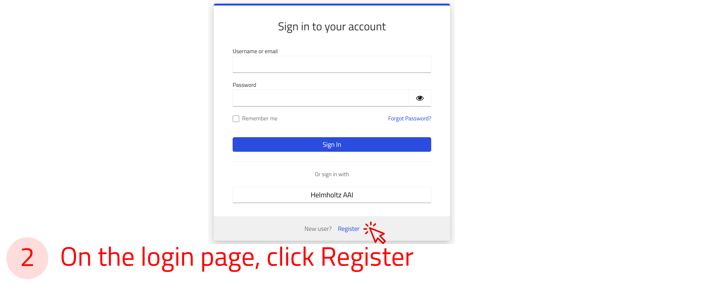
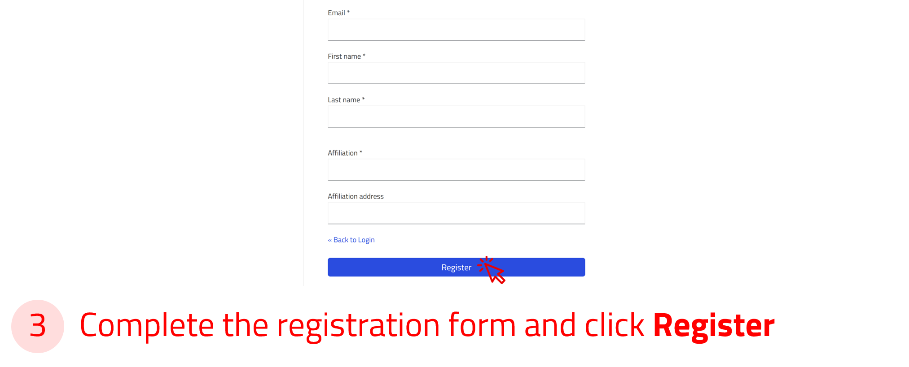
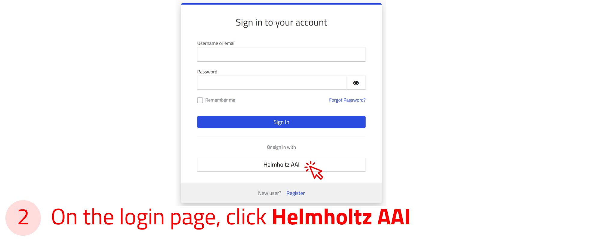
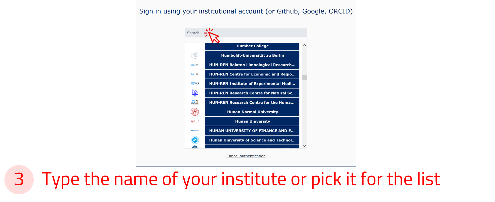

# How to create a NOMAD Central account and sign in

This page describes account creation and sign-in for **NOMAD Central**, the public FAIRmat-hosted platform. If you use an institution-specific **NOMAD Oasis**, authentication may differ depending on local deployment settings.

## Create a NOMAD account

A NOMAD user account is required if you want to upload, share, publish, or analyze your data. However, exploring data in NOMAD does not require an account. Creating a NOMAD user account is quick and free.

**Use the arrow buttons below to slide through the steps and create a NOMAD account.**

    
←

    
    
    
    
    
→

## Sign in via Helmholtz AAI

You can also log in to NOMAD using your university or research institute credentials, or with social accounts such as GitHub, ORCID, or Google via the [Helmholtz AAI](https://hifis.net/aai/){:target="_blank" rel="noopener"} (Authentication and Authorization Infrastructure).

To sign in, select the Helmholtz AAI option in the login form, then choose your institution or preferred social account from the list.

You will be redirected to your institution’s login page, where you can enter your credentials securely.

!!! info "Helmholtz AAI"

    Helmholtz AAI ensures secure and privacy-compliant authentication. Most major universities and research institutions in Germany and across Europe are supported.

**Use the arrow buttons below to see how to sign in via Helmholtz AAI.**

    
←

    
    
    
    
→

