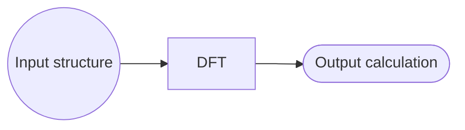
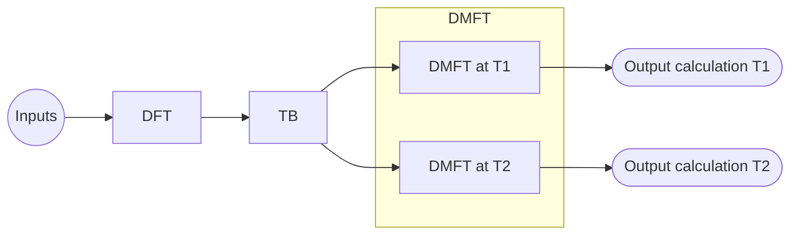

# How to create custom workflows

This guide shows you how to create a custom workflow Entry that connects
existing NOMAD Entries and archive sections as inputs, tasks, and outputs. It
covers Entries created from supported files or schemas, references within and
across Projects, and nested workflows. The resulting Entry contains an
interactive workflow graph for inspecting the connections and navigating to
the referenced data.

To begin, you need a Project to which you can add files. The Entries and data that the
workflow connects can already exist, or you can add their files together with
the workflow file, as in the downloadable examples in this guide.

The simulation examples in this guide have been tested on
[NOMAD Central](https://nomad-lab.eu/prod/v1/gui/v2/){:target="_blank" rel="noopener"}.
They can also be reproduced on a NOMAD Oasis with the
[`electronic-parsers` plugin](https://github.com/nomad-coe/electronic-parsers){:target="_blank" rel="noopener"}
installed.

!!! note
    When trying these examples on NOMAD Central, keep test Projects
    unpublished. Publishing is permanent and cannot be undone.

## Recommended preparation

- {{ nav_link("howto/manage/gui/upload.md", breadcrumb=True) }}
- {{ nav_link("explanation/basics.md", breadcrumb=True) }}
- {{ nav_link("explanation/data.md", breadcrumb=True) }}

## Further resources

- {{ nav_link("explanation/workflows.md", breadcrumb=True) }}
- {{ nav_link("tutorial/workflows_projects.md", breadcrumb=True) }}

## Overview

NOMAD workflows connect archive sections through inputs, tasks, and outputs.
For supported data, NOMAD may create a workflow automatically during
[Explanation > Processing](../../../explanation/processing.md). A custom workflow Entry lets
you define these connections when the workflow is not created automatically.

The examples in this guide use supported simulation files to provide reproducible task
Entries. Their scientific methods are not relevant to the workflow patterns
demonstrated here.

## Simple workflows with supported tasks

Start with a workflow containing one task, one input, and one output:



The task is represented by `dft.xml`, the mainfile of a density functional
theory (DFT) calculation performed with VASP, an electronic-structure
simulation code. In this example, the VASP parser provided by the
[electronic-parsers plugin](https://github.com/nomad-coe/electronic-parsers){:target="_blank" rel="noopener"}
creates an Entry with a `workflow2` section representing the single-point
calculation. This behavior is specific to the parser and is not a general
feature of all parser-supported mainfiles.

<!-- TODO: When this example transitions to nomad-simulation-parsers, link to
the corresponding parser documentation. -->

Open the parser-generated Entry and select **CONNECTIVITY** to view its workflow
graph:

{:.screenshot}
{:.screenshot}

The parser normalizer exposes three global output links in this graph. The two
nodes labeled **Output calculation** refer to the same final calculation
section, while **Output system** refers to the final system section. They do
not represent three separate calculations. The duplicate calculation link is a
normalizer artifact rather than a distinct result.

For simplicity, the custom workflow below does not reproduce this
parser-specific output set. Instead, it recreates the central input-task-output
path of the `SinglePoint` workflow graph in a separate custom workflow Entry
using YAML, as described in
[How-to guides > ... > Populate data](../../schemas/define.md#populate-data).
The custom workflow references the parser-generated `workflow2` section
as its task and explicitly uses the same system and final calculation sections
as its input and output.

### Create the custom workflow YAML file

To define the initial workflow, create a file `dft.workflow.archive.yaml` with the following content:

```yaml
workflow2:
  name: DFT SinglePoint
  inputs:
    - name: Input system
      section: '../upload/archive/mainfile/dft.xml#/run/0/system/-1'
  outputs:
    - name: Output calculation
      section: '../upload/archive/mainfile/dft.xml#/run/0/calculation/-1'
  tasks:
    - m_def: nomad.datamodel.metainfo.workflow.TaskReference
      task: '../upload/archive/mainfile/dft.xml#/workflow2'
      name: DFT
      inputs:
        - name: Input structure
          section: '../upload/archive/mainfile/dft.xml#/run/0/system/-1'
      outputs:
        - name: Output calculation
          section: '../upload/archive/mainfile/dft.xml#/run/0/calculation/-1'
```

The repeated `section` references create the graph edges. The workflow input
and task input both reference the same system section, while the task output
and workflow output both reference the same calculation section. More
generally, NOMAD connects nodes whose matching references point to the same
archive section. Between two tasks, the source task's output and the target
task's input must match in this way.

!!! Warning "Important"
    A workflow file created from YAML must have a filename ending in
    `.archive.yaml`.

This file follows NOMAD's schemas for
[Explanation > Data structure > Archives](../../../explanation/data.md#archives)
and
[Explanation > Workflows > The built-in abstract workflow schema](../../../explanation/workflows.md#the-built-in-abstract-workflow-schema).
The `workflow2` section has three possible subsections: `inputs`, `outputs`, and
`tasks`:

**`inputs`**: a list of references to the global inputs of the workflow, with `name` and `section` attributes. `section` corresponds to a path for linking to the relevant archive section. In this case, the relative section path is `run[0].system[-1]`, linked to the Entry defined by the mainfile `dft.xml`. The prefix is discussed under [Archive path specification](#path-specification).

**`outputs`**: identical to the inputs list, representing the global outputs of the workflow, with the relative section path `run[0].calculation[-1]` in this case.

**`tasks`**: a list of references to the tasks/steps of the workflow. Each task
in this example contains `m_def`, `task`, `name`, `inputs`, and `outputs`
attributes. `name` supplies the task label shown in the workflow graph.
`inputs`/`outputs` are task-specific versions of the lists defined above.

`m_def` defines the type of task according to NOMAD's Metainfo schema, in this case a `TaskReference` to the archive `workflow2` section. The use of `TaskReference` is clarified under [Nested workflows > In multiple Entries](#in-multiple-entries).

`task` is the path for linking to the relevant archive section, analogous to the `section` attribute for `inputs`/`outputs`. However, this path **must** reference a task, which in all practical cases corresponds to a `workflow2` section.

<a id="path-specification"></a>

### Archive path specification

In general, an archive reference can be represented as
`<prefix>/<entry_locator>#/<relative_archive_path>`:

- `<relative_archive_path>` identifies the section within the target Entry. Open the Entry's **ARCHIVE** page and navigate to the section you want to reference.
- **Entry in the same Project:**
    - `<prefix>` is `../upload/archive/mainfile`
    - `<entry_locator>` is the path to the Entry's mainfile from the Project root
- **Entry in another Project:**
    - `<prefix>` is `../uploads/<upload_id>/archive`
    - `<entry_locator>` is `<entry_id>`

In archive-reference paths, `upload` and `uploads` are backend terms for Projects, and `upload_id` is equivalent to the Project ID.

For the general principles and supported forms, see
[How-to guides > ... > Link data with references](../../schemas/define.md#link-data-with-references)
and [Reference > Schema language > Reference forms](../../../reference/metainfo.md#reference-forms).

### Download and reproduce the example

[Download simple_workflow.zip](data/simple_workflow.zip){:.md-button .nomad-button}

The compressed file contains:

```tree
.
├── dft.xml
├── dft.workflow.archive.yaml
```

To reproduce the example in a new Project:

1. Open **PROJECTS** and select **NEW PROJECT**.
2. Enter a Project name, select **ADD FILES**, and add
   `simple_workflow.zip`.
3. Select **CREATE**.
4. After processing completes, open **ENTRIES** and confirm that NOMAD created two successfully processed Entries:
     - a single-point Entry with the mainfile `dft.xml`; and
     - a custom workflow Entry with the mainfile
     `dft.workflow.archive.yaml`.

5. Open the custom workflow Entry. Its **Overview** page contains this graph:

{:.screenshot}
{:.screenshot}

This graph has one output node because the task output and global workflow
output reference the same calculation section. The visualizer represents this
shared section as one connected output node.

??? tip "Add the methodology as a workflow input"

    You can also represent the calculation's methodological parameters as an
    input. They are stored at `run[0].method[-1]` in the `dft.xml` Entry. Add
    the following item to both `workflow2.inputs` and
    `workflow2.tasks[0].inputs` in `dft.workflow.archive.yaml`:

    ```yaml
    - name: Input methodology parameters
      section: '../upload/archive/mainfile/dft.xml#/run/0/method/-1'
    ```

    Reprocessing the updated file adds another input node to the custom
    workflow graph.

## Reference an Entry in another Project

A workflow Entry can reference tasks or data in another Project on the same
NOMAD deployment. For these references, use
`../uploads/<upload_id>/archive/<entry_id>#/<relative_archive_path>` as
described under [Archive path specification](#path-specification).

To find the required identifiers:

1. Open the target Entry, select **ARCHIVE**, and navigate to
   `metadata` > `upload_id`. Copy this value and use it as `<upload_id>`.
   Alternatively, open the target Project, select **SETTINGS**, and copy its
   **Project ID**, which is the same identifier.
2. In the target Entry's **ARCHIVE**, navigate to `metadata` > `entry_id`.
   Copy this value and use it as `<entry_id>`.
   Alternatively, copy the value immediately after `/entries/` in the Entry's
   URL.

For example, the `dft.workflow.archive.yaml` file from the previous section can
be adapted as follows:

??? example "Reference the `dft.xml` Entry from another Project"
    ```yaml
    workflow2:
      name: DFT SinglePoint
      inputs:
        - name: Input system
          section: '../uploads/<upload_id>/archive/<entry_id>#/run/0/system/-1'
      outputs:
        - name: Output calculation
          section: '../uploads/<upload_id>/archive/<entry_id>#/run/0/calculation/-1'
      tasks:
        - m_def: nomad.datamodel.metainfo.workflow.TaskReference
          task: '../uploads/<upload_id>/archive/<entry_id>#/workflow2'
          name: DFT
          inputs:
            - name: Input structure
              section: '../uploads/<upload_id>/archive/<entry_id>#/run/0/system/-1'
          outputs:
            - name: Output calculation
              section: '../uploads/<upload_id>/archive/<entry_id>#/run/0/calculation/-1'
    ```

To test the cross-Project references:

1. Create a file named `dft-cross-project.workflow.archive.yaml` using the
   contents shown above. Replace `<upload_id>` and `<entry_id>` with the
   identifiers for the Project and Entry containing `dft.xml`.
2. Create another Project and add only the new
   `dft-cross-project.workflow.archive.yaml` file.
3. After processing completes, open the resulting workflow Entry and confirm
   that its graph contains the referenced DFT task from the original Project.

## Nested workflows

Nested, or hierarchical, workflows contain task nodes that can themselves be
represented as directed graphs. The
[Explanation > Workflows > The built-in abstract workflow schema](../../../explanation/workflows.md#the-built-in-abstract-workflow-schema)
supports this pattern through the inheritance relationship from `Task` to
`Workflow`.

### In multiple Entries

The most common way to construct a nested workflow is by creating a separate
Entry for each sub-workflow. Each sub-workflow archive then contains a populated
`workflow2` section. To use it as a task, reference that section directly with
`task: <prefix>/<entry_locator>#/workflow2`, following the forms under
[Archive path specification](#path-specification).

!!! Warning "Important"
    When `task` references a `workflow2` section in another Entry, define the
    sub-workflow task as a `TaskReference` by setting
    `m_def: nomad.datamodel.metainfo.workflow.TaskReference`. The default type,
    `nomad.datamodel.metainfo.workflow.Task`, can contain a `Task` directly but
    cannot reference one in another Entry. See
    [Explanation > Workflows > The built-in abstract workflow schema](../../../explanation/workflows.md#the-built-in-abstract-workflow-schema).

We have already seen this case in
[Simple Workflows with Supported Tasks](#simple-workflows-with-supported-tasks).
On NOMAD Central, the installed simulation parsers add a workflow representation
to recognized simulation Entries, including single-step calculations. A workflow
that references these parser-generated simulation Entries as tasks is therefore
a nested workflow. Other deployments may provide different simulation parsers
and workflow metadata.

### In a single Entry

Since a `Workflow` instance is also a `Task` instance due to inheritance, you
can nest workflows directly within a single Entry. The following computational
workflow illustrates this pattern:



This workflow contains a series of electronic-structure calculations: a
density functional theory (DFT) calculation and a tight-binding (TB)
calculation performed in series, followed by two dynamical mean-field theory
(DMFT) calculations performed in parallel at different temperatures. The DMFT
workflow task is represented as a sub-workflow.

The mainfiles for these calculations are organized in the following file structure, stored with `nested_workflow_one-entry.zip`:

```tree
.
├── DFT
│   └── dft.xml
├── TB
│   ├── tb.wout
│   └── ...extra auxiliary files
├── DMFT
    ├── T1
    │    └── dmft_t1.hdf5
    └── T2
        └── dmft_t2.hdf5
```

The following snippets construct
`nested_workflow_one-entry.archive.yaml` in parts for clarity.

The overall `workflow2` section and global workflow `inputs`:

```yaml
workflow2:
  name: DFT+TB+DMFT
  inputs:
    - name: Input structure
      section: '../upload/archive/mainfile/DFT/dft.xml#/run/0/system/-1'
```

The global workflow outputs `outputs`:

```yaml
  outputs:
    - name: Output DMFT at T1 calculation
      section: '../upload/archive/mainfile/DMFT/T1/dmft_t1.hdf5#/run/0/calculation/-1'
    - name: Output DMFT at T2 calculation
      section: '../upload/archive/mainfile/DMFT/T2/dmft_t2.hdf5#/run/0/calculation/-1'
```

The workflow `tasks`:

```yaml
  tasks:
    - m_def: nomad.datamodel.metainfo.workflow.TaskReference
      task: '../upload/archive/mainfile/DFT/dft.xml#/workflow2'
      name: DFT
      inputs:
        - name: Input structure
          section: '../upload/archive/mainfile/DFT/dft.xml#/run/0/system/-1'
      outputs:
        - name: Output DFT calculation
          section: '../upload/archive/mainfile/DFT/dft.xml#/run/0/calculation/-1'
    - m_def: nomad.datamodel.metainfo.workflow.TaskReference
      task: '../upload/archive/mainfile/TB/tb.wout#/workflow2'
      name: TB
      inputs:
        - name: Input DFT calculation
          section: '../upload/archive/mainfile/DFT/dft.xml#/run/0/calculation/-1'
      outputs:
        - name: Output TB calculation
          section: '../upload/archive/mainfile/TB/tb.wout#/run/0/calculation/-1'
    - m_def: nomad.datamodel.metainfo.workflow.Workflow
      name: DMFT
      inputs:
        - name: input TB calculation
          section: '../upload/archive/mainfile/TB/tb.wout#/run/0/calculation/-1'
      outputs:
        - name: Output DMFT at T1 calculation
          section: '../upload/archive/mainfile/DMFT/T1/dmft_t1.hdf5#/run/0/calculation/-1'
        - name: Output DMFT at T2 calculation
          section: '../upload/archive/mainfile/DMFT/T2/dmft_t2.hdf5#/run/0/calculation/-1'
      tasks:
        - m_def: nomad.datamodel.metainfo.workflow.TaskReference
          task: '../upload/archive/mainfile/DMFT/T1/dmft_t1.hdf5#/workflow2'
          name: DMFT at T1
          inputs:
            - name: Input TB calculation
              section: '../upload/archive/mainfile/TB/tb.wout#/run/0/calculation/-1'
          outputs:
            - name: Output DMFT at T1 calculation
              section: '../upload/archive/mainfile/DMFT/T1/dmft_t1.hdf5#/run/0/calculation/-1'
        - m_def: nomad.datamodel.metainfo.workflow.TaskReference
          task: '../upload/archive/mainfile/DMFT/T2/dmft_t2.hdf5#/workflow2'
          name: DMFT at T2
          inputs:
            - name: Input TB calculation
              section: '../upload/archive/mainfile/TB/tb.wout#/run/0/calculation/-1'
          outputs:
            - name: Output DMFT at T2 calculation
              section: '../upload/archive/mainfile/DMFT/T2/dmft_t2.hdf5#/run/0/calculation/-1'
```

Unlike the pattern under
[Nested workflows > In multiple Entries](#in-multiple-entries), which uses a
`TaskReference`, this example defines the `DMFT` task directly as a `Workflow`.

When added to a Project with the example data, this workflow file produces an
Entry whose **Overview** page initially shows the complete `DFT+TB+DMFT`
workflow:

{:.screenshot}
{:.screenshot}

Select the `DMFT` task to enter the sub-workflow. The graph then shows the
`DMFT at T1` and `DMFT at T2` tasks and their connections to the TB input and
the two DMFT outputs. Use the back arrow in the workflow toolbar to return to
the parent graph.

{:.screenshot}
{:.screenshot}

To reproduce this example, download the compressed bundle and add it while
creating a Project. The workflow YAML is located at the root of the bundle.

[Download nested_workflow_one-entry.zip](data/nested_workflow_one-entry.zip){:.md-button .nomad-button}

## Workflows with custom tasks

A custom task is a task whose raw files NOMAD does not automatically recognize,
or a task that has no associated raw files. The task must still be represented by
an Entry before a workflow can reference it. One option is to create that Entry
from a built-in or custom Electronic Lab Notebook (ELN) schema.

**Related pages:** {{ nav_link("howto/schemas/schemas.md") }}.

### Represent files with `ElnFileManager`

`ElnFileManager` is a built-in schema for referencing and annotating files in an
ELN Entry. To instantiate this schema from YAML, set `data.m_def` to its full
section-definition path. See
[How-to guides > ... > Populate data](../../schemas/define.md#populate-data)
for the general purpose and syntax of `m_def`.

For example, the following file defines an Entry that describes the creation of
a force-field file:

<h4><code>create_force_field.archive.yaml</code></h4>
```yaml
data:
  m_def: 'nomad.datamodel.metainfo.eln.ElnFileManager'
  name: 'Create force field'
  description: 'The force field is defined for input to the MD simulation engine.'
  Files:
  - file: 'Custom_ELN_Entries/water.top'
    description: 'The force field file for simulation input.'
```

The `file` value identifies the path to `water.top` from the Project root. In
this example, the file must therefore be stored at
`Custom_ELN_Entries/water.top` for NOMAD to resolve the reference during
processing.

### Example workflow with ELN tasks

For a concrete example, consider a workflow consisting of three tasks for
setting up a molecular dynamics (MD) simulation. Each task receives parameters
or an execution script and produces a file.

Use `ElnFileManager` to create Entries for each task and the execution scripts.
The workflow parameters use the more general `ElnBaseSection` schema:

??? success "`create_force_field.archive.yaml`"

    ```yaml
    data:
      m_def: 'nomad.datamodel.metainfo.eln.ElnFileManager'
      name: 'Create force field'
      description: 'The force field is defined for input to the MD simulation engine.'
      Files:
      - file: 'Custom_ELN_Entries/water.top'
        description: 'The force field file for simulation input.'
    ```

??? success "`create_box.archive.yaml`"

    ```yaml
    data:
      m_def: 'nomad.datamodel.metainfo.eln.ElnFileManager'
      name: 'Create box'
      description: 'The initial simulation box is created.'
      Files:
      - file: 'Custom_ELN_Entries/box.gro'
        description: 'An empty structure file with the box vectors.'
    ```

??? success "`insert_water.archive.yaml`"

    ```yaml
    data:
      m_def: 'nomad.datamodel.metainfo.eln.ElnFileManager'
      name: 'Insert water'
      description: 'Water is inserted into the simulation box, creating the structure file for simulation input.'
      Files:
      - file: 'Custom_ELN_Entries/water.gro'
        description: 'The structure file for simulation input.'
    ```

??? success "`workflow_parameters.archive.yaml`"

    ```yaml
    data:
      m_def: nomad.datamodel.metainfo.eln.ElnBaseSection
      name: 'Workflow Parameters'
      description: 'This is a description of the overall workflow parameters, or alternatively standard workflow specification...'
    ```

??? success "`workflow_scripts.archive.yaml`"

    ```yaml
    data:
      m_def: 'nomad.datamodel.metainfo.eln.ElnFileManager'
      name: 'Workflow Scripts'
      description: 'All the scripts run during setup of the MD simulation.'
      Files:
      - file: 'Custom_ELN_Entries/workflow_script_1.py'
        description: 'Creates the simulation box and inserts water molecules.'
      - file: 'Custom_ELN_Entries/workflow_script_2.py'
        description: 'Creates the appropriate force field files for the simulation engine.'
    ```

Define the workflow in `setup_workflow.archive.yaml` using the Entries shown
above:

??? success "`setup_workflow.archive.yaml`"

    ```yaml
    workflow2:
      name: 'MD Setup workflow'
      inputs:
      - name: 'workflow parameters'
        section: '../upload/archive/mainfile/Custom_ELN_Entries/workflow_parameters.archive.yaml#/data'
      - name: 'workflow scripts'
        section: '../upload/archive/mainfile/Custom_ELN_Entries/workflow_scripts.archive.yaml#/data/Files'
      outputs:
      - name: 'structure file'
        section: '../upload/archive/mainfile/Custom_ELN_Entries/insert_water.archive.yaml#/data/Files/0/file'
      - name: 'force field file'
        section: '../upload/archive/mainfile/Custom_ELN_Entries/create_force_field.archive.yaml#/data/Files/0/file'
      tasks:
      - m_def: 'nomad.datamodel.metainfo.workflow.TaskReference'
        name: 'create box'
        task: '../upload/archive/mainfile/Custom_ELN_Entries/create_box.archive.yaml#/data'
        inputs:
        - name: 'workflow parameters'
          section: '../upload/archive/mainfile/Custom_ELN_Entries/workflow_parameters.archive.yaml#/data'
        - name: 'workflow script 1'
          section: '../upload/archive/mainfile/Custom_ELN_Entries/workflow_scripts.archive.yaml#/data/Files/0/file'
        outputs:
        - name: 'initial box'
          section: '../upload/archive/mainfile/Custom_ELN_Entries/create_box.archive.yaml#/data/Files/0/file'
      - m_def: 'nomad.datamodel.metainfo.workflow.TaskReference'
        name: 'insert water'
        task: '../upload/archive/mainfile/Custom_ELN_Entries/insert_water.archive.yaml#/data'
        inputs:
        - name: 'initial box'
          section: '../upload/archive/mainfile/Custom_ELN_Entries/create_box.archive.yaml#/data/Files/0/file'
        - name: 'workflow script 1'
          section: '../upload/archive/mainfile/Custom_ELN_Entries/workflow_scripts.archive.yaml#/data/Files/0/file'
        outputs:
        - name: 'structure file'
          section: '../upload/archive/mainfile/Custom_ELN_Entries/insert_water.archive.yaml#/data/Files/0/file'
      - m_def: 'nomad.datamodel.metainfo.workflow.TaskReference'
        name: 'create force field'
        task: '../upload/archive/mainfile/Custom_ELN_Entries/create_force_field.archive.yaml#/data'
        inputs:
        - name: 'workflow parameters'
          section: '../upload/archive/mainfile/Custom_ELN_Entries/workflow_parameters.archive.yaml#/data'
        - name: 'workflow script 2'
          section: '../upload/archive/mainfile/Custom_ELN_Entries/workflow_scripts.archive.yaml#/data/Files/1/file'
        outputs:
        - name: 'force field file'
          section: '../upload/archive/mainfile/Custom_ELN_Entries/create_force_field.archive.yaml#/data/Files/0/file'
    ```

After processing, the workflow Entry contains the following graph:

{:.screenshot}
{:.screenshot}

To reproduce the example, download the bundle and add it to a Project. It
contains the referenced files, the Entry YAML files, and the workflow YAML shown
above.

[Download Custom_ELN_Entries.zip](data/Custom_ELN_Entries.zip){:.md-button .nomad-button}

## Create an experimental workflow with an ELN

To build an experimental workflow by linking process and measurement Entries
with the built-in *Experiment ELN* schema, follow
[Tutorials > ... > Integrate your experiment](../../../tutorial/eln/built_in_templates.md#integrate-your-experiment).

<!-- TODO: Document GUI-based workflow authoring here if the GUI gains a
supported workflow-building flow. -->

## Using the workflow visualizer

When an Entry contains a `workflow2` section, its **CONNECTIVITY** page shows
an interactive workflow graph. Depending on the Entry layout, a **Workflow**
card may also appear on **OVERVIEW**. In addition to the graph,
**CONNECTIVITY** lists Entries referenced by or referencing the current Entry,
as well as activity references.

The visualizer supports the following actions:

- **Inspect the workflow structure:** Inputs, tasks, and outputs are arranged
  from left to right. Arrows show their connections, and hovering over graph
  elements highlights them or reveals their full labels.
- **Navigate nested workflows:** Select a task node to open its workflow layer.
  Use the back control or select the current workflow node to return to the
  previous layer.
- **Open referenced data:** Select the label of an input, task, or output to
  open the referenced Entry or archive section. Use the browser's back button
  to return to the workflow Entry.
- **Focus on a connection:** Select an arrow between tasks to show the connected
  tasks and their shared input and output context.
- **Filter tasks:** Use the **Filter tasks to show** bar to limit the tasks
  displayed in a large graph. Enter zero-based indices and press Enter to apply
  the filter. For example, `0` selects the first task, `0,2,4` selects
  individual tasks, `0:5` selects the first five tasks, `:50%` selects the
  first half, and `-5:` selects the last five tasks.
- **Adjust or export the view:** Enable the force-directed layout, show or hide
  the legend, reset the graph, or download it as an SVG file.

<!-- TODO: Consider adding an in-product workflow visualizer tour or linking to
a stable public demonstrator workflow Entry once one is maintained. -->

## Advanced Topics

<!-- TODO: Consider adding an advanced example that combines a schema
normalizer plugin with YAML instantiation of a workflow, such as an NEB
workflow. -->

### Extending the workflow schema

The abstract workflow schema supports general tools such as workflow searches,
navigation, and graph visualization. You can extend it with specialized
references, workflow or task parameters, and other workflow-specific metadata.
The distinction between these general and specialized schemas is described in
[Explanation > Workflows > Custom and standardized workflows](../../../explanation/workflows.md#custom-and-standardized-workflows).

The following example defines a specialized `GeometryOptimizationWorkflow`
with a convergence threshold and a reference to the final calculation:

```yaml
definitions:
  sections:
    GeometryOptimizationWorkflow:
      base_section: nomad.datamodel.metainfo.workflow.Workflow
      quantities:
        threshold:
          type: float
          unit: eV
        final_calculation:
          type: runschema.calculation.Calculation

workflow2:
  m_def: GeometryOptimizationWorkflow
  final_calculation: '#/run/0/calculation/-1'
  threshold: 0.029
  name: GeometryOpt
  inputs:
    ...
```

For the general schema inheritance syntax, see
[How-to guides > ... > Inherit from a base section](../../schemas/define.md#inherit-from-a-base-section).
