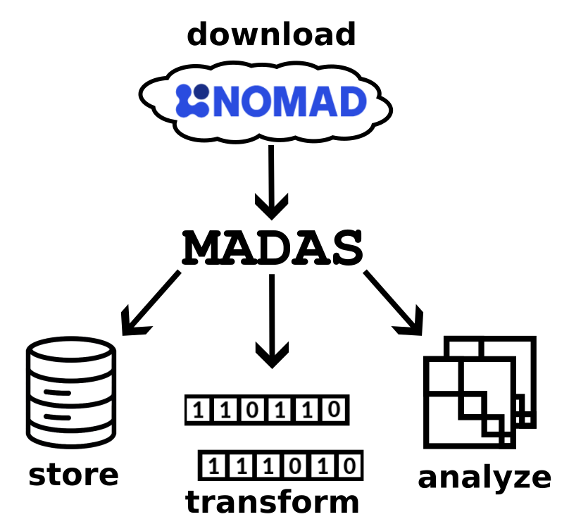
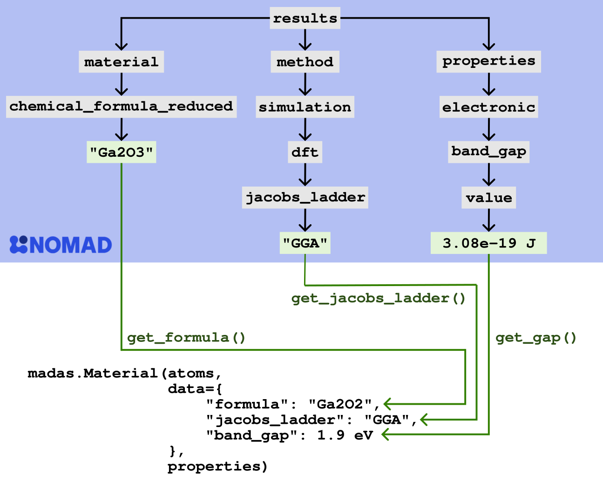

# Data analytics with `MADAS`

For more advanced machine learnining and data analytics tasks, it may be beneficial to download and cache data from NOMAD locally. This functionality is supported by the MAterials DAta Similarity (`MADAS`) framework.

    </img>

Using `MADAS`, data can be downloaded, transformed, and analyzed, making it a comprehensive framework for working with data from NOMAD. To simplify the analyis, starting from the rather verbose schema of within NOMAD, it allows to define functions that map selected quantities to a new schema. After downloading the data, it can be stored in a local database, ensuring reproducibility of results within the analysis pipeline. The stored data can be used to derive fingerprints, which allow to represent the data for different data analytics and machine learning tasks.

An example of the data transformation is shown below: For a DFT calculation of Ga2O3, the band gap was calculated on the generalized-gradient approximation level of exchange-correlation functionals. The figure shows the part of the results`results` section the NOMAD schema that contains these three pieces of information. From the NOMAD schema, they can be extracted and, via custom functions, transformed into data of a `madas.Material` object.

    </img>

This allows to reduce the complexity of the schema for subsequent data analytics. Furthermore, these transforming functions can perform more complex tasks, e.g., unit transformations or aggregations.

`MADAS` has its own [comprehensive documentation](https://madas.readthedocs.io). It is an open-source Python package, the code can be found on [GitHub](https://github.com/kubanmar/madas).
