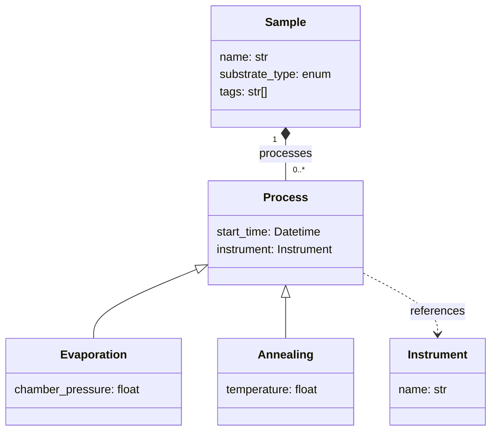

# How to define a schema

A schema tells NOMAD what your data looks like: which *sections* it is made of, which *quantities*
each section holds, and how those sections relate to each other. This page covers every concept you
need to write one.

Schemas can be written in two syntaxes, Python and YAML, and they describe exactly the same thing.
Every example below is shown in both — **use the tabs to switch language, and your choice carries
down the whole page**. If you have not picked a syntax yet, see
{{ nav_link("howto/schemas/schemas.md", breadcrumb=True) }}.

## The running example

Every example on this page builds the same small schema for a materials lab:

- a **`Sample`** — the specimen being studied;
- a **`Process`** carried out on it, specialized into **`Evaporation`** and **`Annealing`**;
- an **`Instrument`** that a process was carried out on.



## Define a section

A *section* groups related data. It is the basic building block of every schema: you define a section
once, and NOMAD can then create, store, search and display any number of instances of it.

=== "Python"

    A section is a Python class. All definitions must sit between the `SchemaPackage()` constructor
    and the `__init_metainfo__()` call that finalizes them.

    ```python
    from nomad.datamodel.data import EntryData
    from nomad.metainfo import Quantity, SchemaPackage

    m_package = SchemaPackage()


    class Instrument(EntryData):
        """A piece of equipment used to carry out a process."""

        name = Quantity(type=str)


    m_package.__init_metainfo__()
    ```

=== "YAML"

    A section is an entry under `definitions.sections`. The whole `definitions` block is the schema
    package.

    ```yaml
    definitions:
      name: 'Sample management example schema'
      sections:
        Instrument:
          description: A piece of equipment used to carry out a process.
          base_sections:
            - nomad.datamodel.data.EntryData
          quantities:
            name:
              type: str
    ```

Inheriting `EntryData` is what makes a section usable as the root of an entry — it is why an
`Instrument` can exist as an entry of its own. See [Inherit from a base section](#inherit-from-a-base-section).

## Add quantities

A *quantity* is a single piece of data: a name, a number, a date, an array. Quantities are where your
measurements actually live.

=== "Python"

    ```python
    from nomad.metainfo import MEnum, Quantity


    class Sample(EntryData):
        """A specimen that a sequence of processes is carried out on."""

        name = Quantity(
            type=str,
            description='A short name for this sample.',
        )
        substrate_type = Quantity(
            type=MEnum('silicon', 'glass', 'sapphire'),
            description='The material the sample was grown on.',
        )
        tags = Quantity(
            type=str,
            shape=['*'],
            description='Free-form labels used to group samples.',
        )
    ```

=== "YAML"

    ```yaml
    Sample:
      description: A specimen that a sequence of processes is carried out on.
      base_sections:
        - nomad.datamodel.data.EntryData
      quantities:
        name:
          type: str
          description: A short name for this sample.
        substrate_type:
          type:
            type_kind: Enum
            type_data:
              - silicon
              - glass
              - sapphire
          description: The material the sample was grown on.
        tags:
          type: str
          shape: ['*']
          description: Free-form labels used to group samples.
    ```

Four attributes carry most of the meaning:

- **`type`** — what values are allowed. Python types (`str`, `int`, `float`, `bool`), NumPy types
  (`np.float64`), `Datetime`, an enumeration, or another section to make a
  [reference](#link-sections-with-references).
- **`shape`** — the dimensionality. Omit it for a single value, `['*']` for a list, `[3, 3]` for a
  3-by-3 matrix, `['n_atoms', 3]` to tie a dimension to another quantity.
- **`unit`** — a physical unit such as `pascal` or `m/s**2`. Values are converted to it on assignment.
- **`description`** — what the quantity means. This is shown in the GUI and the Metainfo browser, so
  it is worth writing.

For the full type table, the shape rules and the naming conventions, see
{{ nav_link("reference/metainfo.md", breadcrumb=True) }}.

### Add a unit

Quantities that hold a physical measurement should declare a unit. NOMAD then knows what the number
means, can convert it, and can display it in whatever unit the reader prefers.

=== "Python"

    ```python
    class Annealing(Process):
        temperature = Quantity(
            type=float,
            unit='kelvin',
            description='The temperature the sample was held at.',
        )
    ```

=== "YAML"

    ```yaml
    Annealing:
      base_section: Process
      quantities:
        temperature:
          type: float
          unit: kelvin
          description: The temperature the sample was held at.
    ```

Units are parsed by [Pint](https://pint.readthedocs.io/en/stable/){:target="_blank" rel="noopener"},
so both names and expressions work: `m`, `meter`, `mm`, `m/s`, `m/s**2`. Uploaded schemas may use any
unit; the built-in NOMAD Metainfo uses SI units only. See
{{ nav_link("howto/plugins/tools/units.md", breadcrumb=True) }}.

## Add subsections

A *subsection* nests one section inside another, building a containment hierarchy. Use it when the
nested data is genuinely *part of* its parent — a sample's processes belong to that sample and have
no independent existence.

Set `repeats` when the parent can hold many of them.

=== "Python"

    ```python
    from nomad.metainfo import SubSection


    class Sample(EntryData):
        processes = SubSection(section=Process, repeats=True)
    ```

=== "YAML"

    ```yaml
    Sample:
      sub_sections:
        processes:
          section: Process
          repeats: true
    ```

If the nested data has a life of its own — an instrument used by many processes — use a
[reference](#link-sections-with-references) instead of a subsection.

## Inherit from a base section

Inheritance lets you build a *specialized* definition from a more *abstract* one. The specialization
gets every property of its base and can add more, so shared quantities are written once.

Here `Evaporation` and `Annealing` both inherit `start_time` and `instrument` from `Process`:

=== "Python"

    Inheritance is ordinary Python class inheritance.

    ```python
    from nomad.metainfo import Datetime, Quantity


    class Process(ArchiveSection):
        """A single step carried out on a sample."""

        start_time = Quantity(type=Datetime)


    class Evaporation(Process):
        chamber_pressure = Quantity(type=float, unit='pascal')


    class Annealing(Process):
        temperature = Quantity(type=float, unit='kelvin')
    ```

=== "YAML"

    Use `base_section` for a single base, or `base_sections` for a list.

    ```yaml
    Process:
      description: A single step carried out on a sample.
      quantities:
        start_time:
          type: Datetime
    Evaporation:
      base_section: Process
      quantities:
        chamber_pressure:
          type: float
          unit: pascal
    Annealing:
      base_section: Process
      quantities:
        temperature:
          type: float
          unit: kelvin
    ```

Sections support multiple inheritance, which is how one section can be both a specialized concept and
an entry root section at the same time.

### Choose the right base section

- Inherit from the **most specialized** base section that still fits your data. The more specific the
  base, the more built-in NOMAD functionality applies to your entries automatically.
- Inherit `nomad.datamodel.data.EntryData` for any section that should be the root of an entry. It is
  an abstract placeholder, and it is what makes your section appear under an entry's `data`.
- Inherit `nomad.datamodel.data.ArchiveSection` for any section that needs a
  [normalize function](#add-normalize-functions). `EntryData` already includes it.

### Commonly used built-in base sections

| Section definition or package | Purpose |
| --- | --- |
| `nomad.datamodel.EntryArchive` | The root object of all NOMAD entries. |
| `nomad.datamodel.EntryMetadata` | Standard NOMAD metadata: ids, upload, processing and author information. |
| `nomad.datamodel.data.EntryData` | The abstract section definition for an entry's `data` section. |
| `nomad.datamodel.data.ArchiveSection` | Adds support for `normalize` functions. |
| `nomad.datamodel.metainfo.basesections.*` | The entity-activity base sections: samples, instruments, processes, measurements, analyses. |
| `nomad.datamodel.metainfo.eln.*` | Commonly used ELN quantities. These are indexed, so specializations can use the NOMAD search. |
| `nomad.datamodel.metainfo.workflow.*` | The definitions NOMAD uses to model workflows. |
| `nomad.parsing.tabular.TableData` | Inherit parsing of `.csv` and `.xls` files. See [Parse tabular data](./tabular.md). |
| `nomad.datamodel.metainfo.basesections.HDF5Normalizer` | Link quantities to HDF5 datasets for large data. See {{ nav_link("howto/plugins/tools/hdf5.md", breadcrumb=True) }}. |

For what these mean and why they are shaped the way they are, see
{{ nav_link("explanation/base_sections.md", breadcrumb=True) }}. For the generated per-class listing,
see {{ nav_link("reference/basesections.md", breadcrumb=True) }}.

## Rely on polymorphism

A subsection or reference declares the *most abstract* section it accepts, and any specialization of
that section is then a valid value. Because `Sample.processes` declares `Process`, a sample can hold
an `Evaporation` and an `Annealing` in the same list, and each keeps its own extra quantities.

This is what lets one schema define a relationship and another schema extend what can fill it.

=== "Python"

    Iterating a subsection yields instances of whichever subclass was actually stored.

    ```python
    sample = Sample(name='S1')
    sample.processes.append(Evaporation(chamber_pressure=1e-5))
    sample.processes.append(Annealing(temperature=600))

    for process in sample.processes:
        print(type(process).__name__, process.start_time)

    # The specialized quantities are available on each instance:
    sample.processes[0].chamber_pressure
    sample.processes[1].temperature
    ```

=== "YAML"

    Each item in the list carries an `m_def` naming which specialization it is.

    ```yaml
    data:
      m_def: Sample
      name: S1
      processes:
        - m_def: Evaporation
          chamber_pressure: 1.0e-05
        - m_def: Annealing
          temperature: 600
    ```

!!! note
    `m_def` is only needed when the section definition cannot be worked out from context. A
    subsection that accepts exactly one type does not need it; a polymorphic one does.

## Link sections with references

Subsections express a *part-of* relationship. When data is linked rather than contained — a process
pointing at the instrument it ran on, where that instrument is shared by many processes — use a
*reference*.

A reference is a uni-directional link from a *source* section to a *target* section. You define it as
a quantity whose `type` is the target's section definition.

=== "Python"

    ```python
    class Process(ArchiveSection):
        instrument = Quantity(
            type=Instrument,
            description='The instrument used for this process.',
        )
    ```

=== "YAML"

    ```yaml
    Process:
      quantities:
        instrument:
          type: Instrument
          description: The instrument used for this process.
    ```

A reference quantity can hold many targets: give it a `shape` of `['*']`. The shape describes the
number of *references*, not the shape of the data they point at.

In memory a reference simply holds the target section. When the archive is saved, it is serialized as
a URL — a path from the archive root such as `#/data/processes/0`, or a longer form that crosses into
another entry or another NOMAD installation. The full list of reference forms is in
{{ nav_link("reference/metainfo.md", breadcrumb=True) }}.

### Reference across entries

Because `Instrument` inherits `EntryData`, each instrument is its own entry, and a sample in one entry
references an instrument in another. In YAML you write that target as a path to the other file:

```yaml
data:
  m_def: Sample
  name: S1
  processes:
    - m_def: Evaporation
      instrument: ../upload/raw/evaporator.archive.yaml#/data
```

The schema declaration is identical in both languages — only the serialized value differs, and NOMAD
resolves it for you when the archive is read.

!!! note
    References are resolved lazily. On loading, a reference becomes a placeholder that is replaced by
    the real section the first time you access it. This is what makes references between entries, and
    even between NOMAD installations, possible. See
    [Advanced schema concepts](./advanced.md#resolve-references-lazily-with-proxies).

## Annotate for the GUI

A schema says what data *is*. *Annotations* say what NOMAD should *do* with it — which editor to
show, how to plot it, which unit to display. Adding ELN annotations is what turns a schema into an
electronic lab notebook that users can fill in through the browser.

The component you choose has to suit the quantity's type: a string gets a text field, a datetime gets
a date picker, an enumeration gets a dropdown, a reference gets a search-and-select field.

=== "Python"

    Annotations are keyword arguments beginning with `a_`.

    ```python
    from nomad.datamodel.metainfo.annotations import ELNAnnotation


    class Sample(EntryData):
        name = Quantity(
            type=str,
            a_eln=ELNAnnotation(component='StringEditQuantity'),
        )
        substrate_type = Quantity(
            type=MEnum('silicon', 'glass', 'sapphire'),
            a_eln=ELNAnnotation(component='EnumEditQuantity'),
        )
    ```

=== "YAML"

    Annotations are named blocks under `m_annotations`.

    ```yaml
    Sample:
      quantities:
        name:
          type: str
          m_annotations:
            eln:
              component: StringEditQuantity
        substrate_type:
          type:
            type_kind: Enum
            type_data: [silicon, glass, sapphire]
          m_annotations:
            eln:
              component: EnumEditQuantity
    ```

Annotating the *section* as well makes it selectable when a user creates a new entry from the GUI.

Beyond `eln`, annotations control plotting, display units and HDF5 visualization. Every annotation
and its arguments is listed in {{ nav_link("reference/annotations.md", breadcrumb=True) }}.

## Populate data

With the schema defined, you create instances of it and fill them in.

=== "Python"

    Section instances behave like ordinary Python objects. Values are converted to the declared type
    and unit on assignment.

    ```python
    sample = Sample(name='S1', substrate_type='glass')
    sample.tags = ['internal']

    evaporation = Evaporation(chamber_pressure=1e-5)
    sample.processes.append(evaporation)

    print(sample.m_to_json(indent=2))
    ```

    Methods beginning with `m_` provide the metainfo behaviour: `m_to_json` and `m_to_dict`
    serialize, `m_from_dict` reads back. To set and read properties by name at runtime, see
    [Advanced schema concepts](./advanced.md#populate-data-dynamically).

=== "YAML"

    Data goes under the top-level `data` key, with `m_def` naming the section it instantiates. It can
    live in the same file as the schema, or in a file of its own.

    ```yaml
    data:
      m_def: Sample
      name: S1
      substrate_type: glass
      tags: [internal]
      processes:
        - m_def: Evaporation
          chamber_pressure: 1.0e-05
    ```

## Add normalize functions

A *normalize function* runs every time an entry is processed, which happens whenever a file is
uploaded or changed. Use it to derive values, fill in defaults, or copy data into a more
interoperable part of the archive.

!!! note "Python only"
    Normalize functions are the one capability YAML schemas do not have, because they are code rather
    than data. If you need derived values, write the schema in Python. This is the most common reason
    to move a working YAML schema into a plugin.

The section must inherit `ArchiveSection` — `EntryData` already does:

```python
class Sample(EntryData):
    name = Quantity(type=str)
    sample_id = Quantity(type=str)

    processes = SubSection(section=Process, repeats=True)

    def normalize(self, archive, logger):
        super().normalize(archive, logger)

        if self.sample_id is None and self.name is not None:
            self.sample_id = f'{self.name}--{len(self.processes)}'
```

Always call `super().normalize(...)` so multiple inheritance keeps working.

Normalize functions run for every subsection before their parent. To control the order among sections
at the same level, set `normalizer_level`; it defaults to `0` and sections run from low to high.

Design a normalize function so it only needs data from its own section. Use `m_parent` and `m_root` to
*read* from the surrounding archive when you must, but avoid writing outside your own section.

!!! note
    A `normalize` function is not the same thing as a *normalizer*. A normalizer is a separate plugin
    entry point that operates on a whole entry. See
    {{ nav_link("howto/plugins/types/normalizers.md", breadcrumb=True) }} and
    {{ nav_link("explanation/basics.md", breadcrumb=True) }}.

## The complete example

Everything above, as one working schema. The two files define exactly the same sections and
quantities; only the normalize function is Python-only.

=== "Python"

    <!-- fmt: off -->
    ```python
    --8<-- "examples/schemas/sample_schema.py"
    ```
    <!-- fmt: on -->

=== "YAML"

    ```yaml
    --8<-- "examples/schemas/sample.archive.yaml"
    ```

## Related materials

- {{ nav_link("howto/schemas/schemas.md", breadcrumb=True) }} — choosing a syntax and getting a schema into NOMAD.
- {{ nav_link("reference/metainfo.md", breadcrumb=True) }} — quantity types, attributes and naming conventions.
- {{ nav_link("reference/annotations.md", breadcrumb=True) }} — every annotation and its arguments.
- {{ nav_link("howto/schemas/tabular.md", breadcrumb=True) }} — fill a schema from a spreadsheet.
- {{ nav_link("howto/schemas/evolution.md", breadcrumb=True) }} — changing a schema that already has data.
