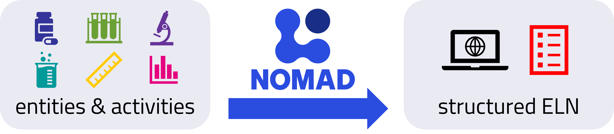
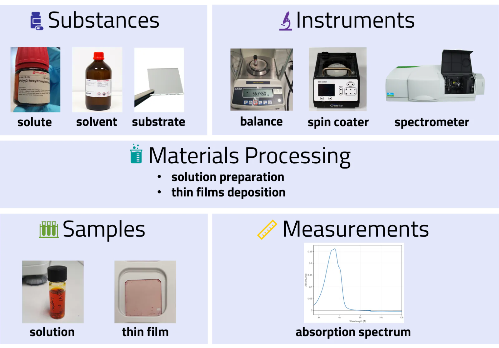
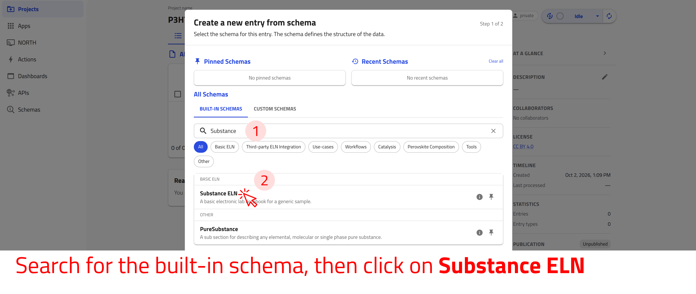
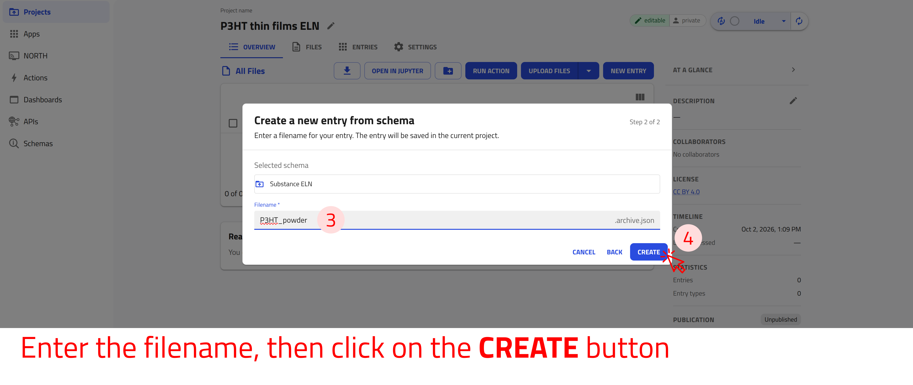
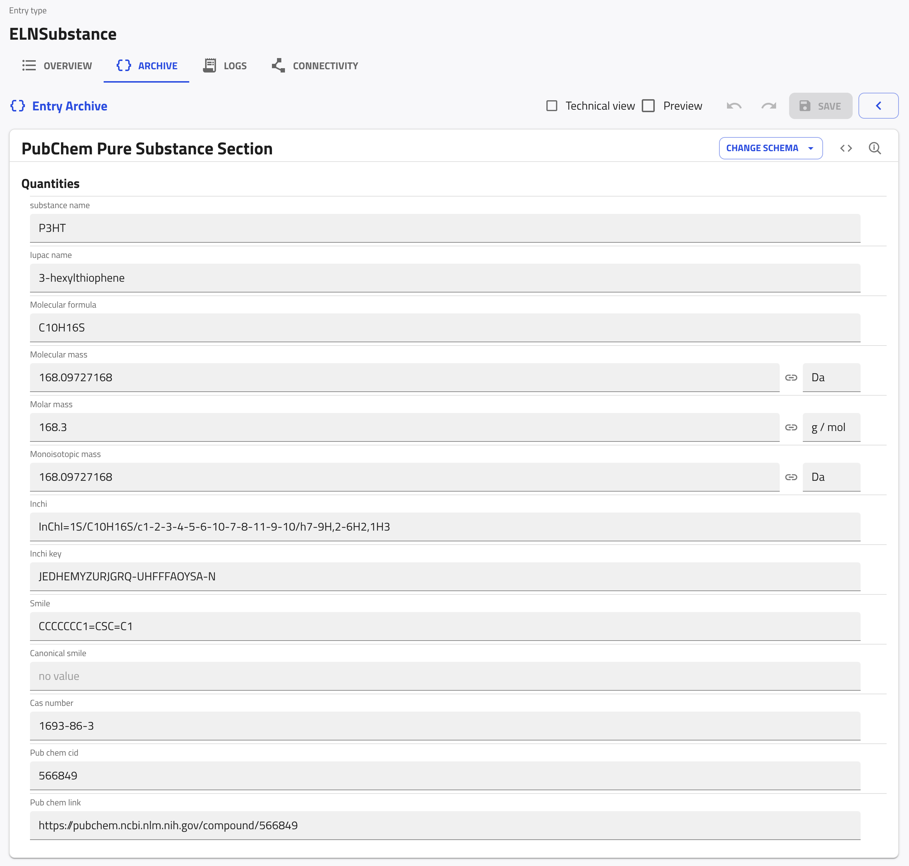
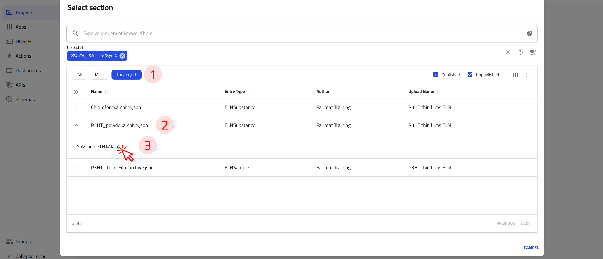
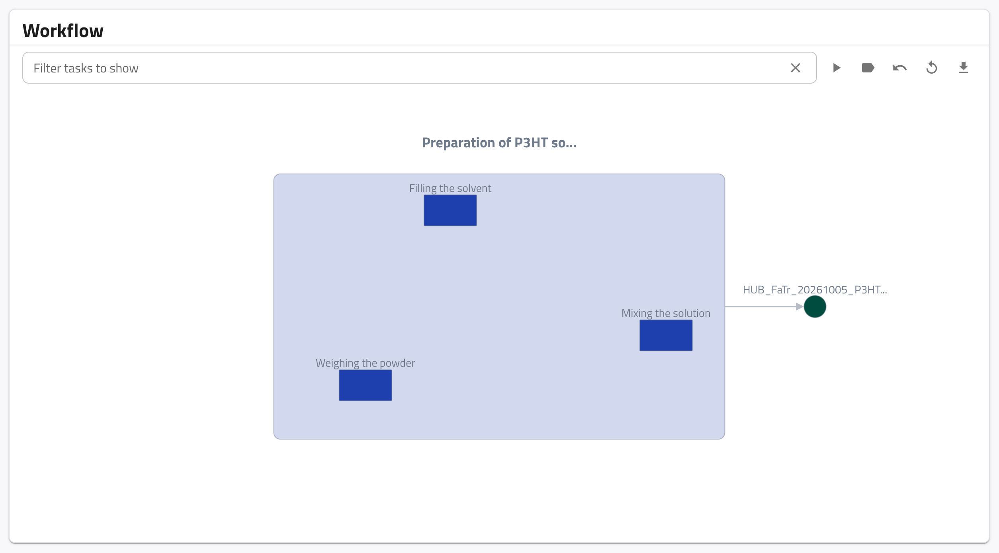
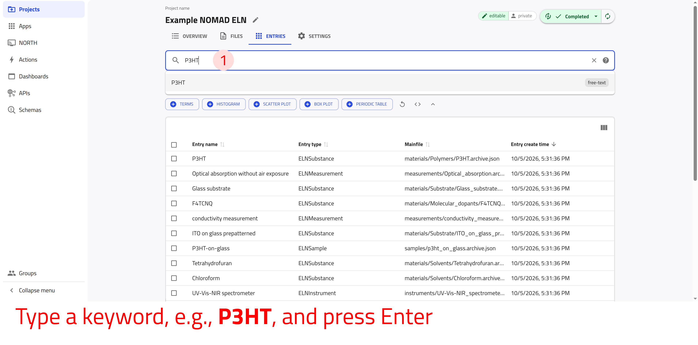
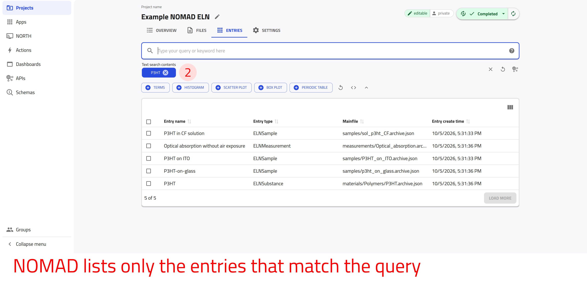
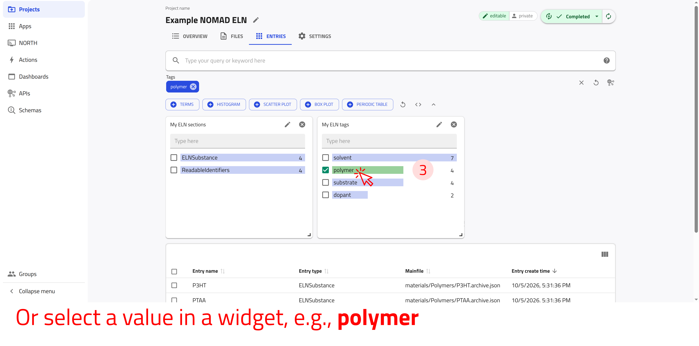

# Use built-in ELN templates in NOMAD

In this tutorial, we use NOMAD’s Electronic Lab Notebook (ELN) functionality to document an experiment in the NOMAD GUI. We follow the experimental workflow from defining substances and instruments to recording processing steps and measurements, using built-in ELN templates to structure and interlink the resulting entries. By the end of the tutorial, we will have documented an example experiment as a coherent, navigable ELN record in NOMAD.

---

## What you will learn

In this tutorial, you will learn how to:

1. Create and manage an ELN project in NOMAD
2. Create ELN entries for substances, samples, instruments, processes, and measurements using built-in schemas
3. Reference and interlink ELN entries to represent complete experimental workflows
4. Document material processing steps and visualize them using workflow graphs
5. Combine processes and measurements into a single experiment entry
6. Search, filter, and explore your ELN entries using the NOMAD GUI and custom widgets

---

## Before you begin

This tutorial requires no prior experience with NOMAD.

Before starting, make sure you have:

1. **NOMAD user account**  
   Creating and editing ELN entries requires a NOMAD user account.
   You can create an account by following the steps described in the
   [How-to guides > ... > Create a NOMAD account](../../howto/manage/gui/account.md#create-a-nomad-account).

2. **Basic familiarity with experimental workflows**  
   Familiarity with preparation, processing, and measurements can be helpful, but is not required.

In this tutorial, we will use an example experiment involving the preparation of solution-processed polymer thin films and the measurement of their optical absorption spectrum.

??? example "About the example experiment used for this exercise"
    In this exercise, we will work with an example experiment involving the preparation and characterization of poly(3-hexylthiophene-2,5-diyl) ("P3HT") thin films. The experiment consists of three main activities: preparing solutions, depositing thin films, and measuring optical absorption.

    1. **Preparing solutions:** The polymer powder is mixed with a solvent in predefined quantities to achieve the desired concentration. A scale is used to accurately weigh the polymer powder, ensuring precise solution concentration.

    2. **Depositing thin films:** The prepared solution is used to create a thin film on a glass substrate through spin-coating. By carefully controlling the spin speed and duration, the desired film thickness is achieved.

    3. **Measuring optical absorption:** The optical absorption spectrum of the thin film is acquired using a UV-Vis-NIR spectrometer. The measurement results are saved as a `.csv` file for further analysis.

    To effectively document this experiment, we will create and interlink electronic lab notebook (ELN) entries in NOMAD. These entries will include key entities such as substances, instruments, and samples, as well as activities like material processing and measurements. By structuring the data in this way, we ensure a comprehensive and FAIR-compliant record of the experiment.

    

---

## Create a new ELN project

In NOMAD, an ELN is created within a NOMAD project. The project allows you to structure and document your research data efficiently. Create a new project named `P3HT thin films ELN` by following the steps in [Create a new project](../upload_publish.md#create-a-new-project).

## Create ELN entries

The next step is to create entries for your substances, instruments, processes, and measurements. In NOMAD, each ELN entry is structured using templates called *built-in schemas*. These templates are specifically designed to capture relevant information for different types of entries, ensuring consistency and completeness in documentation.

They include general fields tailored to the type of entry you are creating.

To create ELN entries using the templates provided by NOMAD, we will generate instances from the built-in schemas. This will automatically create entries with predefined fields, allowing us to efficiently fill in the relevant information of our experiment.

To create an ELN entry from a built-in schema:

1. On your project page, click **NEW ENTRY**.
2. In the **BUILT-IN SCHEMAS** tab, click the built-in schema for your entry. To find a schema quickly, type its name into the **Search schemas** field.
3. Enter a **Filename** for the entry and click **CREATE**. NOMAD adds the extension `.archive.json` to the filename.

NOMAD creates the entry and opens it, so that you can fill in its fields.

**Use the arrow buttons ⬅️➡️ below to follow the steps for creating an ELN entry from a built-in schema.**

    
←

    
    
    
→

The following sections refer to these steps and tell you which built-in schema and filename to use for each entry.

### Create a substance entry

Now, let's create an entry for the **P3HT powder**. Follow the steps described above to create an entry: select *Substance ELN* as the built-in schema and enter `P3HT_powder` as the **Filename**.

??? info "Input fields offered by the built-in schema *Substance ELN*"
    The built-in schema *Substance ELN* provides the following fields for input:

    - **substance name:** Automatically used as the entry name.
    - **Datetime:** Allows entry of a date/time stamp.
    - **substance ID:** A unique, human-readable ID for the substance.
    - **detailed substance description:** A free text field for additional information.
    - **Tags:** User-selected tags to improve searchability.

    Additional subsections available in the *data* subsection include:

    - **Elemental composition:** Define the chemical composition with atomic and mass fractions.
    - **Pure substance:** Specify if the material is a pure substance purchased from an external vendor, with fields like:
        - substance name
        - Iupac name
        - Molecular formula
        - Cas number
        - Inchi key, Smile, and more
    - **Substance identifiers:** Identifiers of the substance, from which NOMAD creates the **substance ID**.

Once the entry is created, we can fill in the relevant fields with detailed and accurate information. Fields can also be updated as needed to keep the entry accurate and useful.

NOMAD has already filled in the **substance name** (from the filename), the **Datetime**, and the **substance ID**. You can change them if needed. To fill in the rest of the substance entry:

1. In the **detailed substance description** field, describe the substance, e.g., `Regioregular poly(3-hexylthiophene-2,5-diyl) powder for preparing P3HT solutions.` You can also add images to this field.
2. Click the **(+)** button at the right end of the **Tags** field, and enter a tag, e.g., `polymer`. Tags improve the searchability of your entries.
3. Under **Subsections**, click the **(+)** button next to **Pure substance**.
4. Click **CHANGE SCHEMA** and select *PubChem Pure Substance Section*.
5. Click the check mark (✓) next to **CHANGE SCHEMA** to confirm your selection.
6. In the **substance name** field of the pure substance, enter `P3HT`.
7. Click **SAVE**.

NOMAD searches PubChem for the substance name and fills in the other fields, e.g., **Iupac name**, **Molecular formula**, **Molar mass**, and **Cas number**. For `P3HT`, PubChem provides the data of its monomer, 3-hexylthiophene.

??? task "Create an ELN entry for substances"
    Create an ELN entry with the *Substance ELN* schema for each of the following substances. Use the given filenames:

    - Chloroform: `Chloroform`
    - Glass substrate: `Glass_substrate`

    Include as many details as you like, e.g., a **detailed substance description** and **Tags**. For chloroform, add a **Pure substance** subsection with the *PubChem Pure Substance Section*, and enter `chloroform` as its **substance name**.

---

### Create a sample entry

Now, let's create an entry for the **P3HT thin film**. Follow the steps described above to create an entry: select *Generic Sample ELN* as the built-in schema and enter `P3HT_Thin_Film` as the **Filename**.

??? info "Input fields offered by the built-in schema *Generic Sample ELN*"
    The built-in schema *Generic Sample ELN* provides the following fields for input:

    - **name:** Automatically used as the entry name.
    - **Datetime:** Allows entry of a date/time stamp.
    - **ID:** A unique, human-readable ID for the sample.
    - **Description:** A free text field for additional information.
    - **Tags:** User-selected tags to improve searchability.

    Additional subsections available in the *data* subsection include:

    - **Elemental composition:** Define the chemical composition with atomic and mass fractions.
    - **Components:** Specify the components used to create the sample, including raw materials or system components.
    - **Sample identifiers:** Identifiers of the sample, from which NOMAD creates the **ID**.

Once the entry is created, we can fill in the relevant fields with detailed and accurate information. Fields can also be updated as needed to keep the entry accurate and useful.

Fill in the fields of the sample entry in the same way as for the substance entry. In addition, reference the substance from which the thin film is made:

1. Under **Subsections**, click the **(+)** button next to **Components**.
2. Click **CHANGE SCHEMA** and select *SystemComponent*.
3. Click the check mark (✓) next to **CHANGE SCHEMA** to confirm your selection.
4. Click the pencil icon at the right end of the **System** field.
5. In the **Select section** dialog, click **This project** to show only the entries of your project.
6. Click `P3HT_powder.archive.json`, and then click **Substance ELN (./data)** below it.
7. Click **SAVE**.

The **System** field now refers to the `P3HT_powder` entry, and NOMAD fills in the **component label** with the name of the substance.

You can reference other entries in the same way wherever an ELN field refers to another entry, e.g., to instruments, samples, or input substances.

??? task "Create an ELN entry for a sample"

    Create an ELN entry for the P3HT solution in chloroform with the *Generic Sample ELN* schema and the filename `P3HT_solution_in_CF`. Reference its components, the `P3HT_powder` and `Chloroform` entries, in the same way as above: add one component, click **SAVE**, click **data** in the path at the top, and add the second one.

    Include as many details as you like, e.g., a **Description** and **Tags**.

---

### Create an instrument entry

Now, let's create an entry for the **balance** that is used to weigh the polymer powder. Follow the steps described above to create an entry: select *Instrument ELN* as the built-in schema and enter `Balance` as the **Filename**.

??? info "Input fields offered by the built-in schema *Instrument ELN*"
    The built-in schema *Instrument ELN* provides the following fields for input:

    - **name:** Automatically used as the entry name.
    - **Datetime:** Allows entry of a date/time stamp.
    - **ID:** A unique, human-readable ID for the instrument.
    - **Description:** A free text field for additional information.
    - **Tags:** User-selected tags to improve searchability.

    Additional subsections available in the *data* subsection include:

    - **Instrument identifiers:** Identifiers of the instrument, from which NOMAD creates the **ID**.

Once the entry is created, we can fill in the relevant fields with detailed and accurate information. Fields can also be updated as needed to keep the entry accurate and useful.

As for the substance entry, NOMAD has already filled in the **name**, the **Datetime**, and the **ID**. Fill in further fields, e.g., **Description** and **Tags**, and click **SAVE**.

??? task "Create an ELN entry for an instrument"
    Create an ELN entry with the *Instrument ELN* schema for each of the following instruments. Use the given filenames:

    - Optical spectrometer: `Optical_spectrometer`
    - Spin coater: `Spin_coater`

    Include as many details as you like, e.g., a **Description** and **Tags**.

---

### Create a process entry

Now, let's create an entry for the **preparation of the P3HT solution**. Follow the steps described above to create an entry: select *Material Processing ELN* as the built-in schema and enter `Preparation_of_P3HT_solution` as the **Filename**.

??? info "Input fields offered by the built-in schema *Material Processing ELN*"
    The *Material Processing ELN* schema provides the following fields for input:

    - **name:** Automatically used as the entry name.
    - **starting Time:** Allows entry of a date/time stamp for the start of the process.
    - **ID:** A unique, human-readable ID for the process.
    - **Description:** A free text field for additional information about the process.
    - **Location:** A text field specifying the location where the process took place.
    - **ending time:** Allows entry of a date/time stamp for the end of the process.
    - **Tags:** User-selected tags to improve searchability.

    Additional subsections available in the *data* subsection include:

    - **Steps:** Define the step-by-step procedure for the material processing.
    - **Instruments:** List the instruments used in the process.
    - **Samples:** Reference the samples that have undergone the process. NOMAD shows them as outputs of the process in the workflow graph.
    - **Process identifiers:** Identifiers of the process, from which NOMAD creates the **ID**.

Once the entry is created, we can fill in the relevant fields with detailed and accurate information. Fields can also be updated as needed to keep the entry accurate and useful.

Fill in the fields of the process entry, e.g., the **starting Time** and **ending time** of the process, **Location**, **Description**, and **Tags**. In addition, reference the balance that you used to weigh the powder:

1. Under **Subsections**, click the **(+)** button next to **Instruments**.
2. Keep *InstrumentReference* and click the check mark (✓) next to **CHANGE SCHEMA** to confirm it.
3. Reference the `Balance` entry in the **instrument reference** field, in the same way as you referenced the P3HT powder in the sample entry.
4. Click **SAVE**, and then click **data** in the path at the top to return to the process.

??? task "Reference a sample to your process ELN"
    For the process entry created above, reference the sample entry `P3HT_solution_in_CF` in the **Samples** subsection, click **SAVE**, and then click **data** in the path at the top to return to the process. NOMAD then shows this sample as the output of the process in the workflow graph, as described below.

    If this sample entry does not exist yet, first create it with the *Generic Sample ELN* schema, as described in the sample task above.

**Defining the steps of a process**

The **Steps** subsection in the *Material Processing ELN* allows us to document each stage of the process and visualize them in an interactive workflow graph.

For the example process entry **Preparation of P3HT solution**, we will define the following three steps:

1. Weighing the powder
2. Filling the solvent
3. Mixing the solution

To add these steps to the process entry:

1. Under **Subsections**, click the **(+)** button next to **Steps**.
2. Enter a descriptive name for the step in the **step name** field, e.g., `Weighing the powder`.
3. In the unit field at the right end of the **Duration** field, type `minute` and select it from the list. Then enter the duration, e.g., `5`.
4. Click **SAVE**.
5. In the path at the top, click **data** to return to the process, and add the other two steps in the same way, e.g., `Filling the solvent` with `2` minutes and `Mixing the solution` with `30` minutes.

You can also fill in the **starting time** and a **Comment** for each step. If you enter a **Duration** for every step, NOMAD calculates the **starting time** of each step from the **starting Time** of the process and fills in the **ending time** of the process.

NOMAD uses the steps to create a workflow graph of the process. To see it, click the **OVERVIEW** tab of the entry and scroll down to the **Workflow** card. The steps appear as tasks of the process. The samples that you reference in the **Samples** subsection, e.g., `P3HT_solution_in_CF` from the task above, appear as outputs of the process.

---

### Create a measurement entry

Now, let's create an entry for the **optical absorption measurement**. Follow the steps described above to create an entry: select *Measurement ELN* as the built-in schema and enter `Optical_absorption_measurement` as the **Filename**.

??? info "Input fields offered by the built-in schema *Measurement ELN*"
    - **name:** Automatically used as the entry name.
    - **starting Time:** Allows entry of a date/time stamp for the measurement.
    - **ID:** A unique, human-readable ID for the measurement.
    - **Description:** A free text field for additional information about the measurement.
    - **Location:** A text field specifying the location where the measurement took place.
    - **Tags:** User-selected tags to improve searchability.

    Additional subsections available in the *data* subsection include:

    - **Steps:** Define the step-by-step procedure for the measurement.
    - **Samples:** Specify the samples that are being measured.
    - **Instruments:** List the instruments used in the measurement.
    - **Results:** Provide information about the results of the measurements (text and images).
    - **Measurement identifiers:** Identifiers of the measurement, from which NOMAD creates the **ID**.

Once the entry is created, we can fill in the relevant fields with detailed and accurate information. Fields can also be updated as needed to keep the entry accurate and useful.

Fill in the fields of the measurement entry, e.g., **starting Time**, **Location**, **Description**, and **Tags**. In addition:

1. Under **Subsections**, click the **(+)** button next to **Instruments**, keep *InstrumentReference*, and click the check mark (✓) next to **CHANGE SCHEMA**.
2. Reference the `Optical_spectrometer` entry from the instrument task in the **instrument reference** field, in the same way as you referenced entries before, and click **SAVE**.
3. In the path at the top, click **data**, and then click the **(+)** button next to **Results**.
4. Enter a **name** for the result, e.g., `Absorption spectrum`, and describe the outcome of the measurement in the **Result** field, e.g., `Absorption maximum at 552 nm.` You can also add images to this field.
5. Click **SAVE**.

---

### Integrate your experiment

Once all substances, samples, processes, and measurements are defined, you can integrate them into a structured workflow using the *Experiment ELN* schema. The *Experiment ELN* schema allows linking *processes* and *measurements* into a single entry for a comprehensive overview of your experimental workflow.

Now, create an entry for the **characterization of P3HT**. Follow the steps described above to create an entry: select *Experiment ELN* as the built-in schema and enter `Characterization_of_P3HT` as the **Filename**.

??? info "Input fields offered by the built-in schema *Experiment ELN*"
    - **name:** Automatically used as the entry name.
    - **starting Time:** Allows entry of a date/time stamp for the experiment.
    - **ID:** A unique, human-readable ID for the experiment.
    - **Description:** A free text field for additional information about the experiment.
    - **Location:** A text field specifying the location where the experiment took place.
    - **Tags:** User-selected tags to improve searchability.

    Additional subsections available in the *data* subsection include:

    - **Steps:** Reference the processes and measurements that make up the experiment.
    - **Experiment identifiers:** Identifiers of the experiment, from which NOMAD creates the **ID**.

The **Steps** subsection allows us to reference the various processes and measurements that are part of the experiment. By organizing these elements into a structured and interactive workflow, we can provide a clearer overview of the experimental sequence, enabling better visualization and understanding of how different steps are interconnected.

Add a step for each process and measurement of your experiment, in the order in which they were performed, e.g., first `Preparation_of_P3HT_solution` and then `Optical_absorption_measurement`:

1. Under **Subsections**, click the **(+)** button next to **Steps**.
2. Reference the process or measurement entry in the **Activity** field, in the same way as you referenced entries before.
3. Click **SAVE**.
4. In the path at the top, click **data**, and repeat these steps for the next entry.

NOMAD fills in the **step name**, the **starting time**, and the **activity ID** of each step from the referenced entry.

---

## Explore and search your ELN

<!-- TODO consider changing this admonition to a download button -->
??? example "Download the example file for this exercise"
    [Download example data ZIP](https://github.com/FAIRmat-NFDI/FAIRmat-tutorial-16/raw/refs/heads/main/tutorial_16_materials/part_4_files/example_NOMAD_ELN.zip){:target="_blank" rel="noopener"}.

    The file contains multiple NOMAD ELN entries in `.json` format.

    These entries have been created using the NOMAD ELN built-in schema, organized into folders, and categorized with custom tags.

    To follow the search example below, create a new project named `Example NOMAD ELN` and upload this file with **UPLOAD FILES**. Wait until the processing status at the top right of the project page shows **Completed**. If it stays **Idle**, click the status, and switch on **Auto Reprocessing** in the **Processing status** panel.

Imagine you have created multiple entries for substances, samples, instruments, processes, and measurements, and you need to quickly find a specific experiment or material. Instead of manually searching through files, NOMAD’s ELN allows you to search, filter, and organize your entries—saving you time and effort.

??? info "Organizing your ELN project"
    NOMAD is a file-based system. You can access, organize, and download the files of each project. You can also create folders to categorize entries into materials, samples, instruments, processes, and results, as well as upload additional documents, such as relevant PDFs.

    !!! warning "If you plan to organize your entries into separate folders, do so before you reference them to each other. Moving them afterward may break the reference links."

    You can follow these steps to organize your ELN entries:

    1. Select the **FILES** tab on your project page. This view works like a file explorer, in which you can view and manage the files of your project.
    2. To create a folder, click the folder icon with the plus sign, to the left of **UPLOAD FILES**. Enter a **Folder Name**, e.g., `materials`, and click **CREATE FOLDER**. Create further folders in the same way, e.g., `samples`, `instruments`, `processes`, `measurements`, and `results`.
    3. To move a file into a folder, click the three dots (⋮) at the right end of the file's row and select **Move**. Select the checkbox of the destination folder and click **MOVE FILE**. To keep the original file, select **Copy** instead of **Move**.
    4. Once all files are sorted, take a moment to review the resulting folder structure.

**Searching your ELN entries**

To search for entries in your ELN, select the **ENTRIES** tab on your project page. It lists all entries of your project and provides a search bar and widgets to filter them.

**Use the arrow buttons ⬅️➡️ below to follow the steps for searching your ELN entries.**

    
←

    
    
    
    
→

In the **ENTRIES** tab, you can enter specific keywords in the search bar to find relevant entries or create custom widgets to visualize your ELN data. The widgets in the last image are created in the task below.

??? info "Filtering entries in NOMAD"
    NOMAD provides various filters that can be used to efficiently find your ELN entries, but the following two filters are particularly effective:

    - Filter by built-in schema used to create the entry.

        For example: *ELNInstrument*, *ELNSubstance*, *ELNSample*, etc.

    - Filter by custom tags, where you assign common tags to related entries for easy grouping.

        For example: tag all solvents as "my_solvent" or all samples as "my_samples".

    Using these filters helps you quickly locate specific entries in your ELN.

**Customize your search interface with widgets**

Widgets allow you to customize your search interface to better suit your data exploration needs. By adding and rearranging widgets, you can create a personalized view that highlights the filters, metadata, or visualizations most relevant to your research.

??? task "Create a custom widget for ELN sections and custom tags"
    To create a custom widget for filtering your ELN, follow these steps in the **ENTRIES** tab of your project:

    1. Click the **TERMS** button to add a terms widget.
    2. In the **Search quantity** field, type `eln`. A list of the available quantities appears.
    3. Select `results.eln.sections` from the list. This enables filtering based on the built-in ELN sections used in your project.
    4. Enter a descriptive **Title** for the widget, e.g., `My ELN sections`.
    5. Click **DONE**.

    The new widget displays the ELN entry types in your project along with their corresponding counts.

    You can now follow the same steps to create a custom widget for filtering by custom tags. In step 3, select `results.eln.tags` instead of `results.eln.sections`, and in step 4, enter `My ELN tags` as the **Title**. The new widget allows you to quickly view and filter your entries by the custom tags you have assigned.

---
