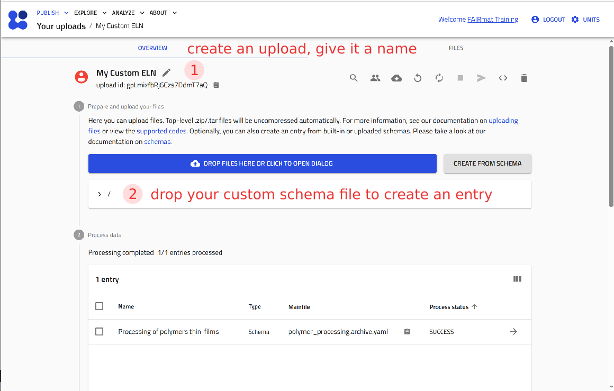
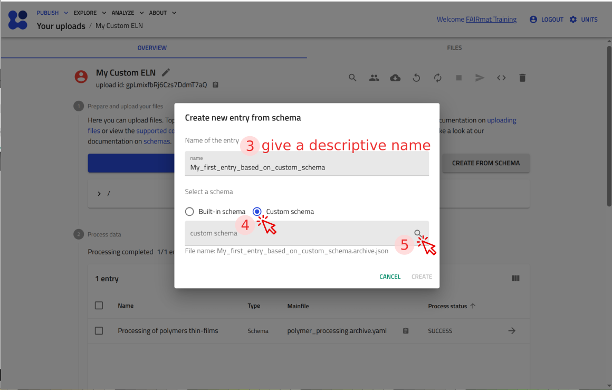
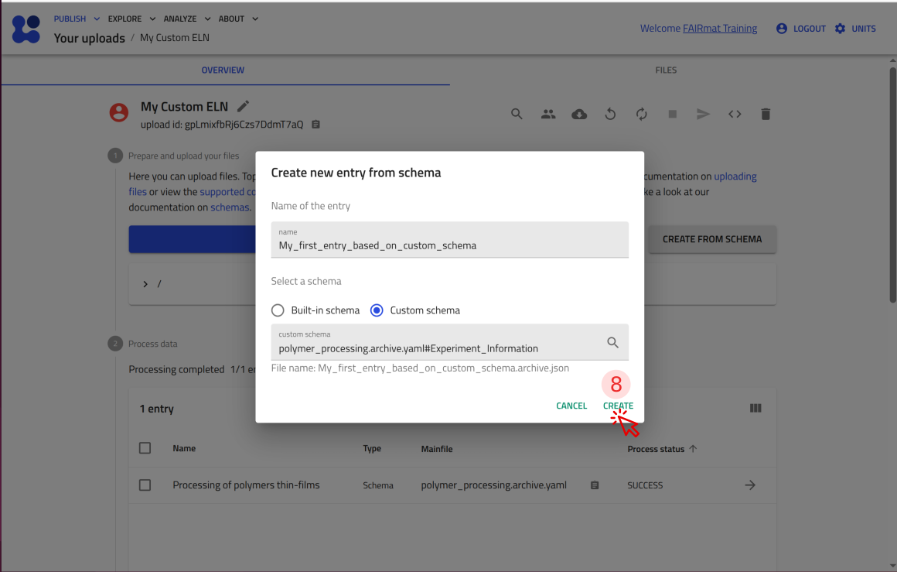
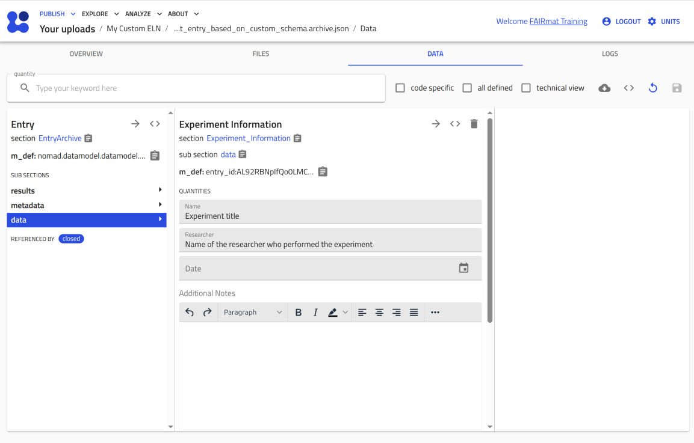
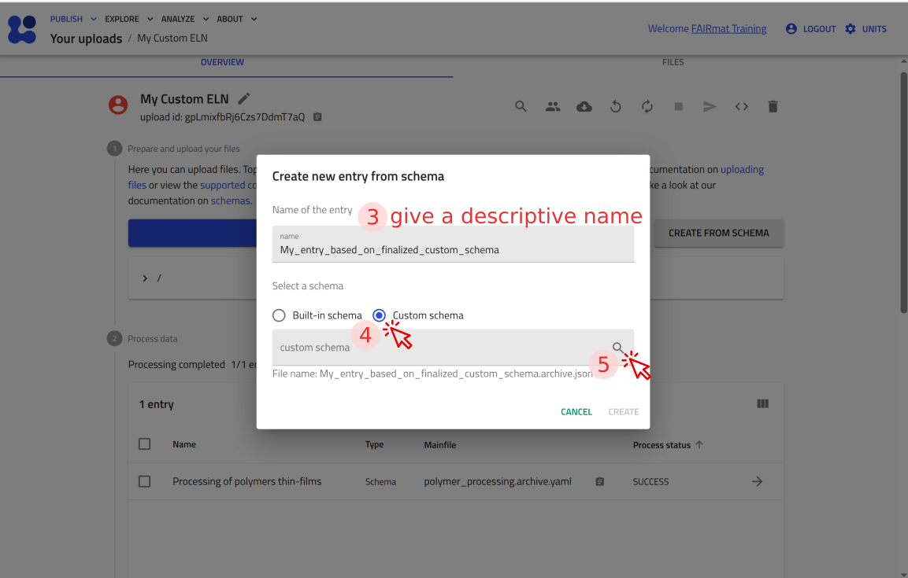
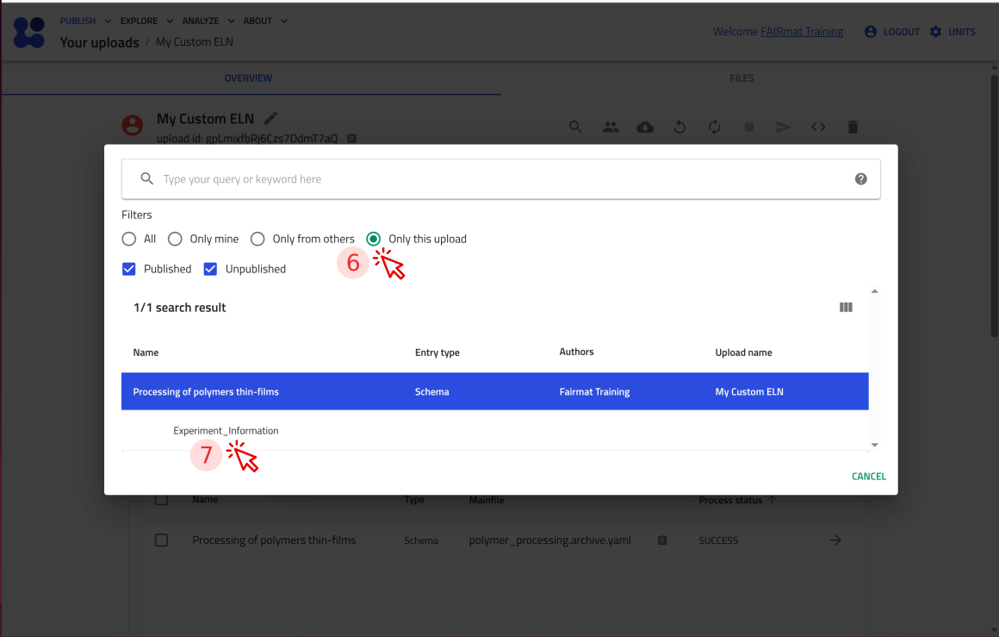
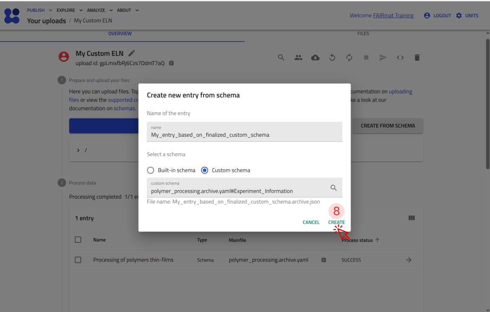
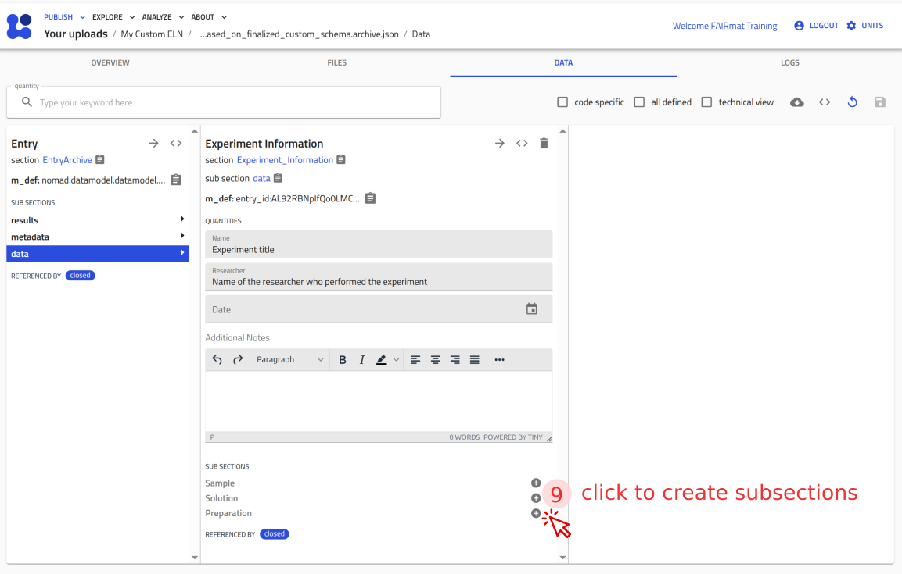

<!-- markdownlint-disable MD013 -->
<!-- Disabled MD013: long lines are needed in this tutorial -->

# Create a custom ELN schema in NOMAD using YAML

In this tutorial, we create a custom ELN schema in NOMAD by writing a YAML-based schema file. We follow a step-by-step workflow to build a structured ELN template for documenting polymer thin-film processing experiments and displaying selected fields in the NOMAD ELN overview. By the end of the tutorial, we will have a functional custom ELN schema that can be uploaded to NOMAD and used to document experiments in the GUI.

---

## What you will learn

In this tutorial, you will learn how to:

1. Create a custom ELN schema package using a `.archive.yaml` file
2. Define sections and quantities in a NOMAD schema
3. Reuse existing NOMAD data models by inheriting from NOMAD base sections
4. Configure ELN form fields using annotations
5. Structure an ELN template using nexted subsections
6. Apply a custom ELN schema to document experiments in the NOMAD ELN

---
## Before you begin

Before starting, make sure you have:

1. **NOMAD user account**  
   Creating and editing ELN entries requires a NOMAD user account.  
   You can create an account by following the steps described in the
   [overview page](../overview.md#create-a-nomad-user-account){:target="_blank" rel="noopener"}.
   
2. **Basic understanding of uploads and entries**  
   Familiarity with uploads, entries, and how they relate to each other can be helpful. These concepts are introduced in the section [key elements in NOMAD](../upload_publish.md#the-key-elements-in-nomad){:target="_blank" rel="noopener"} and will be reinforced throughout the tutorial.

3. **Familiarity with key NOMAD schema concepts (optional)**  
   It may be helpful to familiarize yourself with the following concepts before starting:
    - [Schema package](../../reference/glossary.md#schema-package){:target="_blank" rel="noopener"}, [Schema](../../reference/glossary.md#schema){:target="_blank" rel="noopener"}
    - [Section and Subsection](../../reference/glossary.md#section-and-subsection){:target="_blank" rel="noopener"}, [Quantity](../../reference/glossary.md#quantity){:target="_blank" rel="noopener"}
    - [Annotation](../../reference/glossary.md#annotation){:target="_blank" rel="noopener"}


3. **Basic familiarity with YAML configuration files**  
   This tutorial uses YAML to define the structure of a custom ELN schema. Prior experience with YAML syntax and indentation is helpful, but deep knowledge of YAML is not required.

4. **A YAML-capable editor or IDE (e.g., VS Code)**  
    You will edit a YAML file during the tutorial. Using an editor or IDE with YAML support (for example, VS Code) is recommended.


!!! info "YAML indentation matters"
    YAML uses indentation to define hierarchical structure. Indent by **two spaces** for **each level**. If NOMAD reports a YAML error, check that keys at the same level align.

---


## A quick map of what you are building

You will build one schema package `.archive.yaml` file. Inside it, you will define one main section and then extend it using the following keywords:

- `definitions`: starts a **schema package** and provides metadata like the package `name`.
- `sections`: lists the **sections** you define in this package.
- `base_sections`: allows for inheriting existing NOMAD section definitions (so you reuse structure instead of reinventing it).
- `quantities`: defines the **fields** (data items) in a section.
- `m_annotations`: instructs NOMAD how it should handle quantities/sections (e.g. treat this quantity as an editable ELN field)
- `sub_sections` + `section:`: defines nested structure (subsections are also sections)

Keep this mental model in mind while you follow the steps below. After Step 5 you will already have a **working minimal schema** you can upload to NOMAD. After that, you will extend it with subsections.

---

## Step 1: Create the schema file

Create a new file named `polymer_processing.archive.yaml`.

??? info "The `.archive.yaml` extension is needed"
    NOMAD recognizes files with the `.archive.yaml` extension as **schema packages**, meaning they can contain one or more section and quantity definitions.

---

## Step 2: Start defining your schema

In your schema file, start defining the schema package:

- Add `definitions:` to start the schema package. This is where you define metadata of your schema such as its name and the sections it contains.
- Indent one level (two spaces) and use `name:` to give a descriptive name to your schema.
- Add `sections:` at the same indentation level as `name:` to define your first section in the next step.

```yaml
definitions:
  name: Processing of polymers thin-films
  sections:
```

**Where to paste:** at the very top of `polymer_processing.archive.yaml`.
<!-- **How to read it:** this schema file has a name, and it defines the following sections. -->

---

## Step 3: Add your main experiment section

A schema must contain at least one section. Here, let's define `Experiment_Information` as the main section that will hold experiment-related metadata.

To make this section compatible with NOMAD’s data model, you inherit from `nomad.datamodel.data.EntryData` using `base_sections:`.

```yaml
    Experiment_Information:
      base_sections:
        - nomad.datamodel.data.EntryData
```

**Where to paste:** directly under `sections:`, and indented one level (two spaces) with respect to it.

??? example "Your file so far (after Step 3)"
    ```yaml
    definitions:
      name: Processing of polymers thin-films
      sections:
        Experiment_Information:
          base_sections:
            - nomad.datamodel.data.EntryData
    ```

    **How to read it:** so far, this `.archive.yaml` file defines a NOMAD schema package which has a definition. The schema package's `definitions` tells, it has a `name` and defines `sections`. The section `Experiment_Information` inherits from NOMAD base sections (using the `base_sections:` keyword). The one here is `nomad.datamodel.data.EntryData`.

---

## Step 4: Add quantities to the main section

Now add the fields you want to store for each experiment entry:

- `Name`
- `Researcher`
- `Date`
- `Additional_Notes`

Each quantity has a `type`. You can optionally provide a `default` value. If a quantity represents a physical value, you can also add a `unit` keyword.

```yaml
      quantities:
        Name:
          type: str
          default: Experiment title
        Researcher:
          type: str
          default: Name of the researcher who performed the experiment
        Date:
          type: Datetime
        Additional_Notes:
          type: str
```

**Where to paste:** inside `Experiment_Information`, at the same indentation level as `base_sections:`, i.e., `quantities:` aligns with `base_sections:`.

---

## Step 5: Turn quantities into ELN fields

Quantities define what data your schema can store. To control how NOMAD shows and edits those quantities in the GUI, add an `m_annotations:` block to the quantity definitions. In this schema, you add an `eln:` annotation to make each quantity appear as an ELN field, and you choose which ELN `component:` should be used to edit it.

Let’s annotate the `Name` quantity. Since `m_annotations:` keyword is used to annotate the `Name` quantity, indent it one level (two spaces) with respect to `Name:` such that it aligns with `type:` and `default:` in the `Name` block. Use `component: StringEditQuantity` for short text fields

```yaml
        Name:
          type: str
          default: Experiment title
          m_annotations:
            eln:
              component: StringEditQuantity

```

**How to read it:** The quantity `Name` has `type: str` and `default: Experiment title`; `m_annotations:` tells NOMAD to treat it as an ELN field (`eln:`) and to render it with `component: StringEditQuantity`.

Now annotate the remaining quantities in the same way by setting the ELN `component` to `StringEditQuantity` for `Researcher`, `DateTimeEditQuantity` for `Date`, and `RichTextEditQuantity` for `Additional_Notes`.

??? info "NOMAD's editable ELN components"
    For a list of editable components in NOMAD, see [editable quantities](https://nomad-lab.eu/prod/v1/gui/dev/editquantity){:target="_blank" rel="noopener"}.

Check that your `quantities:` block now looks like the annotated version below. If it doesn’t, replace your current `quantities:` block (from Step 4) with this one.

```yaml
      quantities:
        Name:
          type: str
          default: Experiment title
          m_annotations:
            eln:
              component: StringEditQuantity
        Researcher:
          type: str
          default: Name of the researcher who performed the experiment
          m_annotations:
            eln:
              component: StringEditQuantity
        Date:
          type: Datetime
          m_annotations:
            eln:
              component: DateTimeEditQuantity
        Additional_Notes:
          type: str
          m_annotations:
            eln:
              component: RichTextEditQuantity
```

You have reached the milestone: your schema is now functional, so you can upload it and test it in NOMAD.

??? example "Milestone: A working custom ELN schema"
    This is the complete `polymer_processing.archive.yaml` file up to this point. Use it as a checkpoint to compare against your file.

    ```yaml
    definitions:
      name: Processing of polymers thin-films
      sections:
        Experiment_Information:
          base_sections:
            - nomad.datamodel.data.EntryData
          quantities:
            Name:
              type: str
              default: Experiment title
              m_annotations:
                eln:
                  component: StringEditQuantity
            Researcher:
              type: str
              default: Name of the researcher who performed the experiment
              m_annotations:
                eln:
                  component: StringEditQuantity
            Date:
              type: Datetime
              m_annotations:
                eln:
                  component: DateTimeEditQuantity
            Additional_Notes:
              type: str
              m_annotations:
                eln:
                  component: RichTextEditQuantity
    ```

    You can now upload this file to NOMAD and verify that it creates an ELN entry with the fields you defined.

    <p><strong>Use the arrow buttons ⬅️➡️ below to follow the steps for uploading the schema and creating a test ELN entry.</strong></p>
    <div class="image-slider" id="slider_milestone_custom_yaml">
        <div class="nav-arrow left" id="prev_milestone_custom_yaml">←</div>
        
        
        
        
        
        <div class="nav-arrow right" id="next_milestone_custom_yaml">→</div>
    </div>

---

## Step 6: Add subsections for sample, solution, and preparation

Now extend your ELN schema by adding subsections under `Experiment_Information`. This helps you group related information (sample details, solution composition, preparation steps) into separate blocks in your customized ELN template.

To add subsections, start with the keyword `sub_sections:` inside (e.g., bottom of the last line) your main section (here: `Experiment_Information`). Place `sub_sections:` at the same indentation level as `base_sections:` and `quantities:` of the section `Experiment_Information`. Under `sub_sections:`, list each subsection name (here `Sample`, `Solution`, `Preparation`). For each subsection, add the keyword `section:` one level deeper (two spaces), with respect to its name. The `section:` keyword tells NOMAD that you are going to provide a new section definition.

Based on the instructions above, you should have a structure like this, with the keyword `sub_sections:` aligned with the `base_sections:` and `quantities:` keywords of your main section `Experiment_Information`:

```yaml
      sub_sections:
        Sample:
          section:
            ...
        Solution:
          section:
            ...
        Preparation:
          section:
            ...
```

Next, you  define each subsection (`Sample`, `Solution`, and `Preparation`) using the same building blocks as you learned in steps 3 to 5, such as `base_sections:`, `quantities:`, and `m_annotations:`). These keys go under `section:` and are indented one level (two spaces) deeper than `section:`.

Now, let’s define the `Sample` subsection. NOMAD already provides a base section for samples: `nomad.datamodel.metainfo.eln.ELNSample`. By inheriting from it, you reuse NOMAD’s built-in sample structure instead of defining all sample quantities yourself. You can then tailor what is shown in the ELN by annotating the subsection and hiding inherited fields you don’t need.

```yaml
            base_sections:
              - nomad.datamodel.metainfo.eln.ELNSample
            m_annotations:
              eln:
                overview: true
                hide: ['chemical_formula']
```

**Where to paste:** under `sub_sections:` → `Sample:` → `section:` (i.e., replace the placeholder content inside the `Sample` subsection definition, such that the `base_sections:` keyword of the above snippet is one level, i.e., two spaces, indented with respect to the `section:` keyword.

In the above snippet, `overview: true` instructs NOMAD to show the subsection in the entry’s **OVERVIEW** tab, and `hide: ['chemical_formula']`, hides the `chemical_formula` field (inherited from `nomad.datamodel.metainfo.eln.ELNSample`) from your custom ELN.

Now, let’s define the `Solution` subsection. Like `Sample`, it inherits from NOMAD’s built-in sample base section `nomad.datamodel.metainfo.eln.ELNSample`. Here, you also hide inherited fields you don’t need, and you add a new quantity `Concentration` to capture a numeric value with a unit.

```yaml
        Solution:
          section:
            base_sections:
              - nomad.datamodel.metainfo.eln.ELNSample
            m_annotations:
              eln:
                overview: true
                hide: ['chemical_formula', 'description']
            quantities:
              Concentration:
                type: np.float64
                unit: mg/ml
                m_annotations:
                  eln:
                    component: NumberEditQuantity
```

**Where to paste:** paste the above snippet (the `Solution:` section definition) inside your `sub_sections:` list, aligned with `Sample:` and `Preparation:` section definitions. It should replace the placeholder `Solution: section: ...` block.

In addition to hiding `chemical_formula`, this subsection also hides the inherited `description` field. It introduces a new quantity `Concentration` as a numeric value (`type: np.float64`) with unit `mg/ml`, rendered in the GUI as an ELN editable numerical field using `component: NumberEditQuantity`.

Now extend the `Solution` subsection with two nested subsections, `Solute` and `Solvent`. This lets you record the solution composition by linking to existing substance entries and capturing the corresponding mass and volume.

Paste the following `sub_sections:` block inside the `Solution` definition, aligned with the existing `quantities:` block in `Solution`.

```yaml
            sub_sections:
              Solute:
                section:
                  quantities:
                    Substance:
                      type: nomad.datamodel.metainfo.eln.ELNSubstance
                      m_annotations:
                        eln:
                          component: ReferenceEditQuantity
                    Mass:
                      type: np.float64
                      unit: kilogram
                      m_annotations:
                        eln:
                          component: NumberEditQuantity
                          defaultDisplayUnit: milligram
              Solvent:
                section:
                  quantities:
                    Substance:
                      type: nomad.datamodel.metainfo.eln.ELNSubstance
                      m_annotations:
                        eln:
                          component: ReferenceEditQuantity
                    Volume:
                      type: np.float64
                      unit: meter ** 3
                      m_annotations:
                        eln:
                          component: NumberEditQuantity
                          defaultDisplayUnit: milliliter
```

In this snippet, the `Substance` quantity uses `ReferenceEditQuantity` so you can link to an existing `ELNSubstance` entry in your upload. `Mass` and `Volume` are numeric ELN inputs with physical units, and `defaultDisplayUnit` controls which unit is shown by default in the GUI.

Finally, define the `Preparation` subsection. NOMAD provides a base section for processes: `nomad.datamodel.metainfo.eln.Process`. By inheriting from it, you can document preparation steps using NOMAD’s built-in process structure.

```yaml
        Preparation:
          section:
            base_sections:
              - nomad.datamodel.metainfo.eln.Process
            m_annotations:
              eln:
                overview: true
```

**Where to paste:** paste this `Preparation:` section definition under `sub_sections:`, aligned with `Sample` and `Solution` section definitions.

---

??? note "Indentation check"
    Indentation matters in YAML because it defines the structure of your schema.

    - Keys at the same level should have the same indentation (for example, `Sample`, `Solution`, and `Preparation` under `sub_sections:`).
    - Keys that define a section (`base_sections`, `quantities`, `sub_sections`, `m_annotations`) must be indented one level (two spaces) deeper than the section name.
    - Keys that define a quantity (`type`, `unit`, `default`, `m_annotations`) must be indented one level (two spaces) deeper than the quantity name.

??? example "Complete schema file (checkpoint)"
    This is the complete `polymer_processing.archive.yaml` file up to this point. Use it as a checkpoint to compare against your file.

    ```yaml
    definitions:
      name: Processing of polymers thin-films
      sections:
        Experiment_Information:
          base_sections:
            - nomad.datamodel.data.EntryData
          quantities:
            Name:
              type: str
              default: Experiment title
              m_annotations:
                eln:
                  component: StringEditQuantity
            Researcher:
              type: str
              default: Name of the researcher who performed the experiment
              m_annotations:
                eln:
                  component: StringEditQuantity
            Date:
              type: Datetime
              m_annotations:
                eln:
                  component: DateTimeEditQuantity
            Additional_Notes:
              type: str
              m_annotations:
                eln:
                  component: RichTextEditQuantity
          sub_sections:
            Sample:
              section:
                base_sections:
                  - nomad.datamodel.metainfo.eln.ELNSample
                m_annotations:
                  eln:
                    overview: true
                    hide: ['chemical_formula']
            Solution:
              section:
                base_sections:
                  - nomad.datamodel.metainfo.eln.ELNSample
                m_annotations:
                  eln:
                    overview: true
                    hide: ['chemical_formula', 'description']
                quantities:
                  Concentration:
                    type: np.float64
                    unit: mg/ml
                    m_annotations:
                      eln:
                        component: NumberEditQuantity
                sub_sections:
                  Solute:
                    section:
                      quantities:
                        Substance:
                          type: nomad.datamodel.metainfo.eln.ELNSubstance
                          m_annotations:
                            eln:
                              component: ReferenceEditQuantity
                        Mass:
                          type: np.float64
                          unit: kilogram
                          m_annotations:
                            eln:
                              component: NumberEditQuantity
                              defaultDisplayUnit: milligram
                  Solvent:
                    section:
                      quantities:
                        Substance:
                          type: nomad.datamodel.metainfo.eln.ELNSubstance
                          m_annotations:
                            eln:
                              component: ReferenceEditQuantity
                        Volume:
                          type: np.float64
                          unit: meter ** 3
                          m_annotations:
                            eln:
                              component: NumberEditQuantity
                              defaultDisplayUnit: milliliter
            Preparation:
              section:
                base_sections:
                  - nomad.datamodel.metainfo.eln.Process
                m_annotations:
                  eln:
                    overview: true
    ```

    **How to read it:** this `.archive.yaml` file defines a schema package under `definitions`. The package has a `name` and defines one main section called `Experiment_Information` under `sections:` keyword. The main section `Experiment_Information` inherits from some base sections using `base_sections:`keyword (here `nomad.datamodel.data.EntryData`), defines some quantities under `quantities:` keyword, and groups additional information by introducing three subsections  `Sample`, `Solution`, `Preparation`, using `sub_sections:` keyword. Each of these three subsections has its own section definition (with keys like `base_sections:`, `quantities:`, `sub_sections:`, and `m_annotations:` like before). The `Solution` subsection itself also contains two nested subsections, the `Solute` and the `Solvent`, each having their own definition.

---

??? example "Test your custom YAML schema in NOMAD"
    You can now upload this file to NOMAD and verify that it creates an ELN entry with the fields you defined.

    <p><strong>Use the arrow buttons ⬅️➡️ below to follow the steps for uploading the schema and creating a test ELN entry.</strong></p>
    <div class="image-slider" id="slider_final_custom_yaml">
        <div class="nav-arrow left" id="prev_final_custom_yaml">←</div>
        
        
        
        
        
        <div class="nav-arrow right" id="next_final_custom_yaml">→</div>
    </div>

??? info "Reference appendix: the 6 guidelines to make a customized YAML schema package (optional)"
    This appendix is a reference copy of the six guidelines that the tutorial steps build on.

    ## Guidelines for building a custom schema

    To define custom YAML schemas in NOMAD, you need to create a YAML file with the `.archive.yaml` extension. These files represent a [schema package](../../reference/glossary.md#schema-package), which can include one or more section and quantity definitions. Below are six main guidelines for creating a custom YAML schema file.

    ??? info "1. NOMAD's `archive.yaml` files start with the `definitions:` keyword, and must have a `name:`, and can have a `description:`."

        NOMAD syntax:
        ```yaml
        definitions:
          name: ...
          description: ...
        ```

        Example:
        ```yaml
        definitions:
          name: My NOMAD Custom Schema
          description: This is a custom schema that includes several sections.
        ```
    ??? info "2. A schema can have several sections."

        The keyword to introduce different sections of a schema is `sections:`.

        NOMAD syntax:

        ```yaml
        definitions:
          name: ...
          description: ...

          sections:
            MyFirstSection: ...
            MySecondSection: ...
            MyThirdSection: ...
        ```

    ??? info "3. Sections can inherit from NOMAD's `base_sections` or other sections."
        When inheriting structure and definition from an existing section, use the `base_sections:` keyword and list the desired base sections you would like to inherit from. The keyword `base_sections:` additionally allows you to also inherit from other sections (e.g., within the same schema or even a section that have been published in NOMAD, see [schema package references in NOMAD Documentation](https://nomad-lab.eu/prod/v1/docs/howto/customization/basics.html#schema-package-references){:target="_blank" rel="noopener"}). Inherited sections can be given in a python list, or subsequent indented lines starting with a dash, `-`.

        Example:

        ```yaml
        definitions:
          name: My NOMAD Custom Schema
          description: This is a custom schema that includes several sections.

          sections:
            MyFirstSection:
              base_sections:
                - nomad.datamodel.data.EntryData
                - nomad.datamodel.metainfo.eln.ELNSample

            MySecondSection: ...
            MyThirdSection: ...
        ```

        or alternatively in the form of a Python list:

        ```yaml
        definitions:
          name: My NOMAD Custom Schema
          description: This is a custom schema that includes several sections.

          sections:
            MyFirstSection:
              base_sections: ['nomad.datamodel.data.EntryData', 'nomad.datamodel.metainfo.eln.ELNSample']

            MySecondSection: ...
            MyThirdSection: ...
        ```

    ??? info "4. Each section can contain quantities, other sections, and subsections."
        Each section can define quantities, representing parameters such as measurement conditions or sample properties. In addition, sections **can also contain** subsections. When including subsections, you need to tell NOMAD the subsections you included are themselves a section. How? By including the keyword `section:` in the next indented line (see bottom example). A list of editable quantities can be found [here](https://nomad-lab.eu/prod/v1/gui/dev/editquantity){:target="_blank" rel="noopener"}.

        NOMAD syntax is:

        ```yaml
        definitions:
          name: My NOMAD Custom Schema
          description: This is a custom schema that includes several sections.

          sections:
            MyFirstSection:
              base_sections:
                - nomad.datamodel.data.EntryData
                - nomad.datamodel.metainfo.eln.ELNSample
              quantities:
                first_quantity:
                  type: str # Uses python type notation like: int, np.float64, etc.
              sub_sections:
                my_first_subsection:
                  section: ...
                my_second_subsection:
                  section: ...
            MySecondSection: ...
            MyThirdSection: ...
        ```

    ??? info "5. Quantities can be defined with type, shape, unit and other properties"
        Quantities define possible primitive values. The basic properties that can go into a quantity definition are `type`, `shape`, and `unit`.

        ```yaml
        definitions:
          name: My NOMAD Custom Schema
          description: This is a custom schema that includes several sections.

          sections:
            MyFirstSection:
              base_sections:
                - nomad.datamodel.data.EntryData
                - nomad.datamodel.metainfo.eln.ELNSample
              quantities:
                first_quantity:
                  type: #For example, str or np.float64
                  shape: #For example scalar or list (['*'])
                  unit: #For example, meters, amperes, or seconds
              sub_sections:
                my_first_subsection:
                  section: ...
                my_second_subsection:
                  section: ...
                my_third_subsection:
                  section: ...

            MySecondSection: ...
            MyThirdSection: ...
        ```

    ??? info "6. Sections and quantities can have annotations"
        Annotations provide additional information that NOMAD can use to alter its behavior around these definitions and how users can interact with them. The keyword for annotations is `m_annotations:`.
        Among the various functionalities that annotations provide, they enable the transformation of schema sections, subsections, and quantities into ELN components that users can edit directly within the GUI.

        ```yaml
        definitions:
          name: My NOMAD Custom Schema
          description: This is an electronic lab notebook schema that includes several sections.

          sections:
            MyFirstSection:
              base_sections:
                - nomad.datamodel.data.EntryData
                - nomad.datamodel.metainfo.eln.ELNSample
              quantities:
                first_quantity:
                  type: #For example, str or np.float64
                  shape: #For example scalar or list (['*'])
                  unit: #For example, meters, amperes, or seconds
                  m_annotations:
                    annotation_name:
                      key1: value1
              sub_sections:
                my_first_subsection:
                  section: ...
                my_second_subsection:
                  section: ...
                my_third_subsection:
                  section: ...

            MySecondSection: ...
            MyThirdSection: ...
        ```
