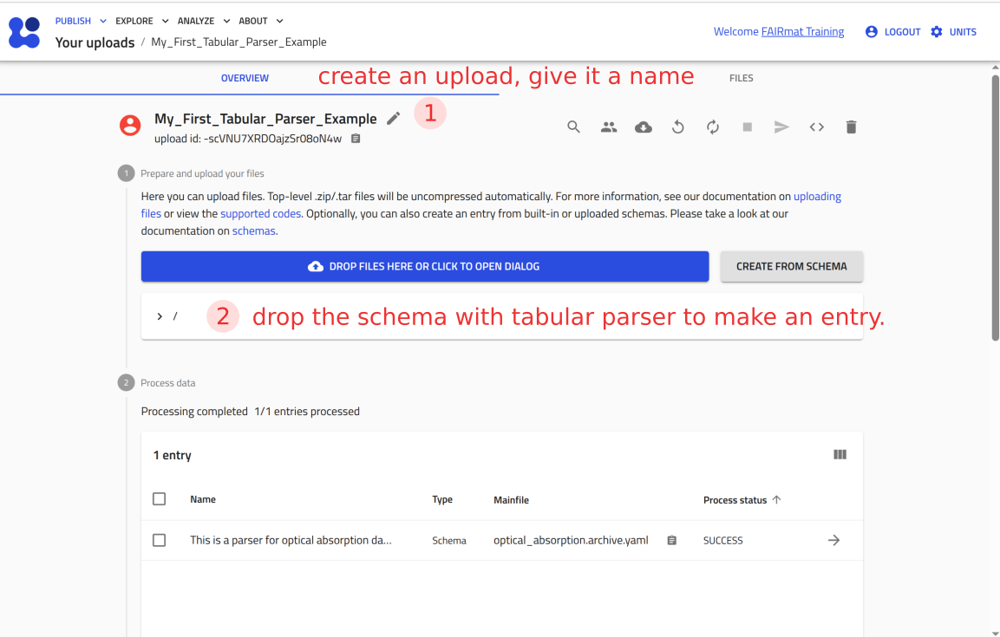
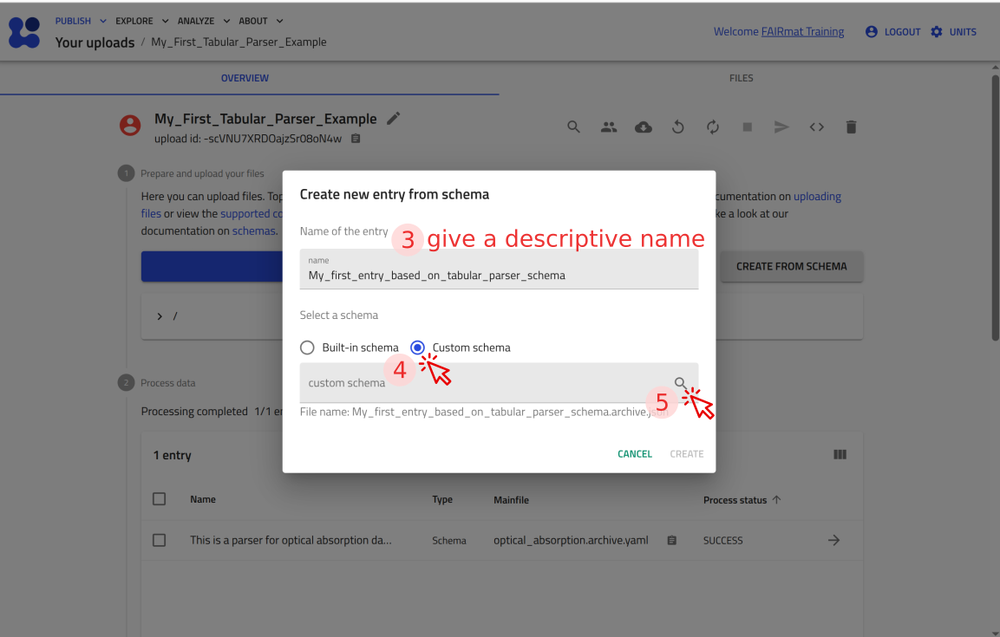
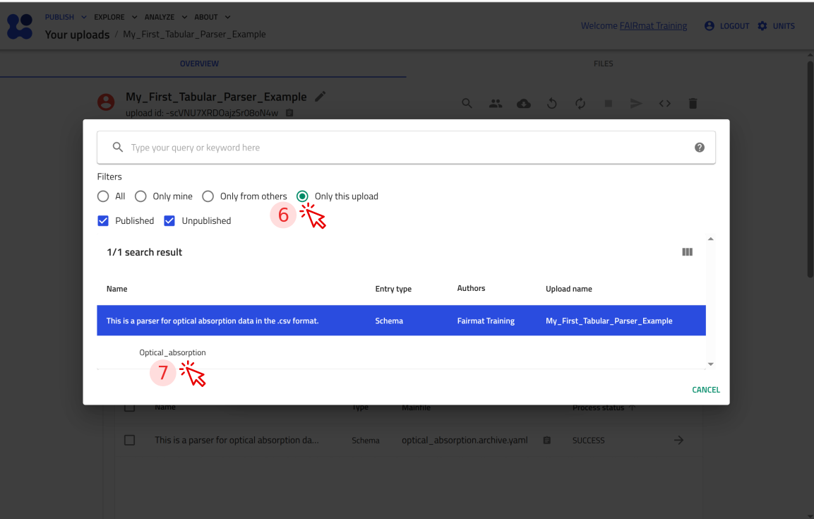
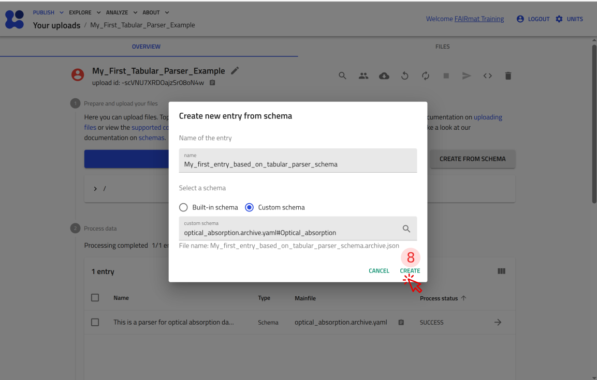
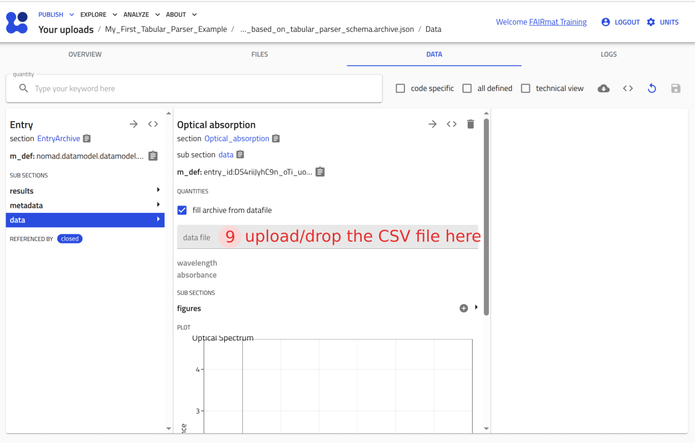
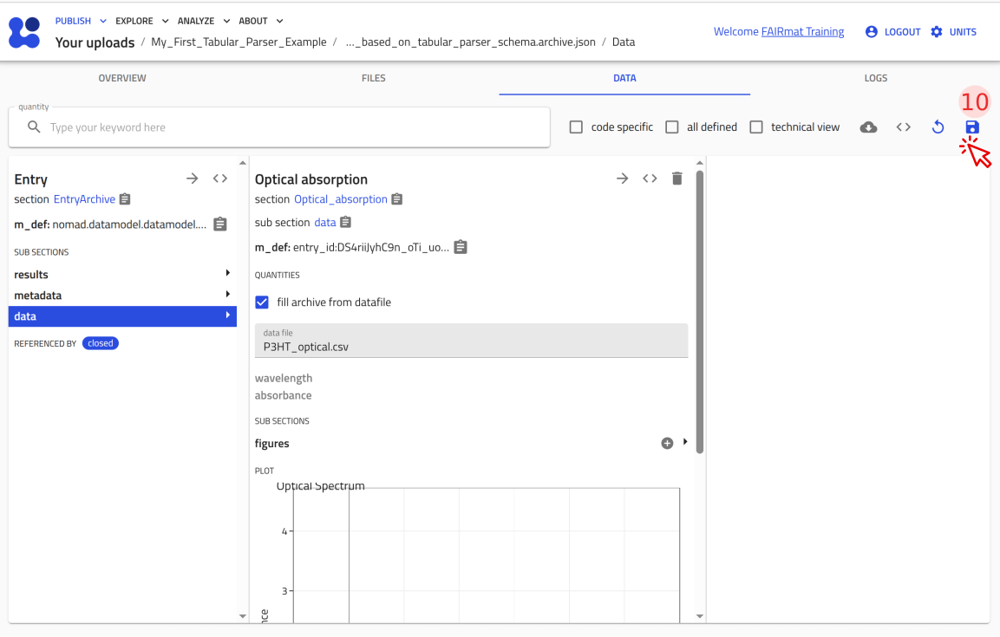
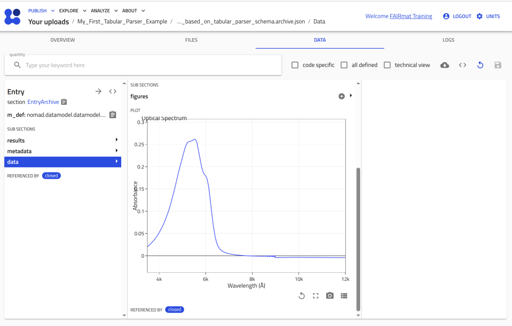

<!-- markdownlint-disable MD013 -->
<!-- Disabled MD013: long lines are needed in this tutorial -->

# Parse tabular measurement data with the tabular parser

It is very common to export measurement data into a tabular format such as `.csv` or `.xlsx`. In this tutorial, you will use NOMAD’s tabular parser to turn such a file into a NOMAD entry where the data is parsed into quantities and visualized as a plot in the ELN. You will first build a small schema for optical absorption data, and then reuse the same parser section inside your custom polymer-processing ELN schema. This tutorial uses a `.csv` example file.

---

## Before you begin

Before starting, make sure you have:

1. A NOMAD user account
2. Knowledge about custom YAML schemas from the previous tutorial: [Create a custom ELN schema in NOMAD using YAML](custom_eln_yaml.md)
3. The custom polymer-processing schema file [`polymer_processing.archive.yaml`](custom_eln_yaml.md#step-1-create-the-schema-file) from the previous tutorial
4. The example measurement file [`P3HT_optical.csv`](P3HT_optical.csv){:download}

---

## What you will learn

You will learn how to:

1. Define a small YAML schema that lets NOMAD parse a `.csv` file into array quantities
2. Configure the tabular parser mapping so NOMAD reads specific columns (e.g., `Wavelength`, `Absorbance`) into your quantities
3. Visualize the parsed data in the ELN using a plot annotation
4. Reuse the same tabular-parser section inside your polymer-processing ELN schema to attach measurement data to your custom template

---

## A quick map of what you are building

You will build one small `.archive.yaml` schema that lets NOMAD:

- accept a tabular data CSV file via a file field (here `data_file`),
- parse specific CSV columns into array quantities (here `wavelength` and `absorbance`), and
- display the parsed data as a plot inside the ELN entry.

To do this, your section combines three base sections (`EntryData`, `TableData`, `PlotSection`) and uses `m_annotations:` to configure file upload + parsing (`tabular_parser`) and plotting (`plotly_graph_object`).

As an optional final step, you will integrate this tabular-parser section into your `polymer_processing.archive.yaml` from the previous tutorial to obtain a more extended custom ELN template.

---

## Step 1: Start the schema package and your parsing section

Create a new file named `optical_absorption.archive.yaml` and start defining your section.

```yaml
definitions:
  name: This is a parser for optical absorption data in the .csv format.
  sections:
    Optical_absorption:
```

**Where to paste:** at the very top of your `optical_absorption.archive.yaml` file.

## Step 2: Add the base sections for parsing and plotting

Now inherit the base sections that make this section (1) create an entry, (2) parse tabular files, and (3) support plots.

```yaml
      base_sections:
        - nomad.datamodel.data.EntryData
        - nomad.parsing.tabular.TableData
        - nomad.datamodel.metainfo.plot.PlotSection
```

**Where to paste:** under the name of your main section `Optical_absorption:` and one level (two spaces) indented with respect to it.

## Step 3: Define the quantities of your schema

Now define the quantities your tabular parser section needs:

- `data_file` to upload the data file and apply the tabular parser.
- `wavelength` to store x-axis values extracted by the parser.
- `absorbance` to store y-axis values extracted by the parser.

`wavelength` and `absorbance` are stored as arrays, so you set `shape: ['*']`. If a quantity represents a physical value, you can also provide a `unit` (here: `nm` for `wavelength`).

```yaml
      quantities:
        data_file:
          type: str
        wavelength:
          type: np.float64
          unit: nm
          shape: ['*']
        absorbance:
          type: np.float64
          shape: ['*']

```

**Where to paste:** under your main section `Optical_absorption:`, aligned with `base_sections:`.

## Step 4: Instruct NOMAD how to treat the quantities

In Step 3 you defined the quantities. Now you add `m_annotations:` blocks so NOMAD knows how to handle these quantities in the GUI and during parsing.

- **The `data_file` quantity**

You will add three annotations to `data_file`.

The first one is a GUI element which enables drag-and-drop or file selection for this quantity:

```yaml
            eln:
              component: FileEditQuantity
```

The second one tells the NOMAD GUI to show a raw-file selection lane for that quantity, so you can pick a file from the files already inside your NOMAD upload (and it also supports file actions like preview in the GUI).

```yaml
            browser:
              adaptor: RawFileAdaptor
```

The third one instructs NOMAD to apply the tabular parser to extract the data from the uploaded file:

```yaml
            tabular_parser:
              parsing_options:
                comment: '#'
                skiprows: [1]
              mapping_options:
                - mapping_mode: column
                  file_mode: current_entry
                  sections:
                    - '#root'
```

In the above snippet that annotates the `data_file` quantity, you tell NOMAD to apply the `tabular_parser` when a file is provided in this field. Under `parsing_options`, you configure how the file should be read: `comment: '#'` tells the parser to ignore commented lines, and `skiprows: [1]` skips the second row of the CSV (row index `1`), because it contains the units. This way, the remaining rows can be parsed as numeric values. Under `mapping_options`, you tell NOMAD how to map the parsed table into your schema. With `mapping_mode: column`, NOMAD reads each CSV column as an array. `file_mode: current_entry` means the parser should read the file you attached in this entry (via `data_file`). Finally, `sections: ['#root']` tells NOMAD to write the parsed quantities directly into the root section of this entry (your `Optical_absorption` section), where `wavelength` and `absorbance` are defined.

Now combine the three annotations into a single `m_annotations:` block under `data_file`, so NOMAD can accept a file in the GUI and parse it with the tabular parser:

```yaml
          m_annotations:
            eln:
              component: FileEditQuantity
            browser:
              adaptor: RawFileAdaptor
            tabular_parser:
              parsing_options:
                comment: '#'
                skiprows: [1]
              mapping_options:
                - mapping_mode: column
                  file_mode: current_entry
                  sections:
                    - '#root'
```

**Where to paste:** inside your `data_file:` quantity block, aligned with `type:` .

- **The `wavelength` quantity**

This quantity will be filled with values extracted from the CSV column whose header is `Wavelength`. Add a `tabular` annotation under `wavelength` so NOMAD knows which column to map into this quantity:

```yaml
          m_annotations:
            tabular:
              name: Wavelength
```

**Where to paste:** inside your `wavelength:` quantity block, aligned with `type:`.

- **The `absorbance` quantity**

This quantity will be filled with values extracted from the CSV column whose header is `Absorbance`. Add the following annotation under `absorbance` quantity:

```yaml
          m_annotations:
            tabular:
              name: Absorbance
```

**Where to paste:** inside your `absorbance:` quantity block, aligned with `type:`.

!!! note "Use the exact column header"
    Set `tabular: name:` to the **exact CSV column header** you want to read (same spelling and capitalization). Here, so that NOMAD fills the `wavelength` and `absorbance` quantities from the columns whose headers are `Wavelength` and `Absorbance`, set `name: Wavelength` under the `wavelength` quantity, and `name: Absorbance` under the `absorbance` quantity.

## Step 5: Create a plot for the data

To visualize the data from the uploaded and parsed file within the ELN, add a `plotly_graph_object` annotation to the `Optical_absorption` section. This tells NOMAD which quantity should be used for the x-axis and which for the y-axis, and it lets you set a plot title.

In the `plotly_graph_object` annotation, the `data` block selects what to plot on each axis. Here, `#wavelength` and `#absorbance` are references (paths) to the `wavelength` and `absorbance` quantities in your entry. The plot `title` is set under `layout`.

```yaml
      m_annotations:
        plotly_graph_object:
          data:
            x: "#wavelength"
            y: "#absorbance"
          layout:
            title: Optical Spectrum
```

**Where to paste:** inside your `Optical_absorption:` section definition, aligned with `base_sections:` and `quantities:`.

??? example "Milestone: A working tabular-parser schema"
    This is the complete schema file up to this point. Use it as a checkpoint to compare against your file.

    ```yaml
    definitions:
      name: This is a parser for optical absorption data in the .csv format.
      sections:
        Optical_absorption:
          base_sections:
            - nomad.datamodel.data.EntryData
            - nomad.parsing.tabular.TableData
            - nomad.datamodel.metainfo.plot.PlotSection
          quantities:
            data_file:
              type: str
              m_annotations:
                eln:
                  component: FileEditQuantity
                browser:
                  adaptor: RawFileAdaptor
                tabular_parser:
                  parsing_options:
                    comment: '#'
                    skiprows: [1]
                  mapping_options:
                    - mapping_mode: column
                      file_mode: current_entry
                      sections:
                        - '#root'
            wavelength:
              type: np.float64
              unit: nm
              shape: ['*']
              m_annotations:
                tabular:
                  name: Wavelength
            absorbance:
              type: np.float64
              shape: ['*']
              m_annotations:
                tabular:
                  name: Absorbance
          m_annotations:
            plotly_graph_object:
              data:
                x: "#wavelength"
                y: "#absorbance"
              layout:
                title: Optical Spectrum
    ```

    **How to read it:** this `.archive.yaml` file defines a schema package under `definitions`. The package has a `name` and defines one main section called `Optical_absorption` under `sections:` keyword. The `Optical_absorption` section uses `nomad.datamodel.data.EntryData` to make an entry, `nomad.parsing.tabular.TableData` to be able to read the tabular data files, and `nomad.datamodel.metainfo.plot.PlotSection` to prepare a plot. It defines three quantities `data_file`, `wavelength`, and `absorbance` with proper `shape` and `type`, and uses `m_annotations:` to configure file upload, parsing, and to plot `absorbance` versus `wavelength`.

    You can now upload this file to NOMAD and verify that it creates an entry where you can attach `P3HT_optical.csv` and see the plot.

    <p><strong>Use the arrow buttons ⬅️➡️ below to follow the steps for uploading the schema and creating a test entry.</strong></p>
    <div class="image-slider" id="slider_milestone_tabular_parser">
        <div class="nav-arrow left" id="prev_milestone_tabular_parser">←</div>
        
        
        
        
        
        
        
        <div class="nav-arrow right" id="next_milestone_tabular_parser">→</div>
    </div>

## Step 6 (optional): Add a short description field

If you only want to publish your data and graph, consider adding a short description. Add the following quantity to your `quantities:` block:

```yaml
            info_about_data:
              type: str
              m_annotations:
                eln:
                  component: RichTextEditQuantity
```

**Where to paste:** in your `Optical_absorption:` section definition, inside `quantities:` block, aligned with `data_file:`, `wavelength:`, and `absorbance:`.

??? info "NOMAD's editable ELN components"
    For a list of editable components in NOMAD, see [editable quantities](https://nomad-lab.eu/prod/v1/gui/dev/editquantity){:target="_blank" rel="noopener"}.

## Add optical absorption data to your polymer-processing ELN template

You can reuse the `Optical_absorption` section you created in this tutorial inside your polymer-processing ELN template from the previous tutorial ([Creating a custom ELN schema in NOMAD](custom_eln_yaml.md)).

You can include this section definition wherever it fits your template, e.g. as another subsection under `Experiment_Information`, aligned with `Sample`, `Solution`, and `Preparation`. This lets you upload an optical-absorption file and view the plot directly in the same ELN entry.

??? example "Example: Add `Optical_absorption` as a subsection of your polymer-processing schema"
    In your `polymer_processing.archive.yaml`, add an `Optical_absorption` subsection under `Experiment_Information` and give it the same section definition you built in this tutorial (the one that includes `TableData` and `PlotSection`).

    The complete example below shows one possible result, where `Optical_absorption` is added at the same level as `Sample`, `Solution`, and `Preparation`.

    ```yaml
    definitions:
      name: Processing of polymers thin-films
      sections:
        Experiment_Information:
          base_sections:
            - nomad.datamodel.data.EntryData
          quantities:
            Name:
              type: str
              default: Experiment title
              m_annotations:
                eln:
                  component: StringEditQuantity
            Researcher:
              type: str
              default: Name of the researcher who performed the experiment
              m_annotations:
                eln:
                  component: StringEditQuantity
            Date:
              type: Datetime
              m_annotations:
                eln:
                  component: DateTimeEditQuantity
            Additional_Notes:
              type: str
              m_annotations:
                eln:
                  component: RichTextEditQuantity
          sub_sections:
            Sample:
              section:
                base_sections:
                  - nomad.datamodel.metainfo.eln.ELNSample
                m_annotations:
                  eln:
                    overview: true
                    hide: ['chemical_formula']
            Solution:
              section:
                base_sections:
                  - nomad.datamodel.metainfo.eln.ELNSample
                m_annotations:
                  eln:
                    overview: true
                    hide: ['chemical_formula', 'description']
                quantities:
                  Concentration:
                    type: np.float64
                    unit: mg/ml
                    m_annotations:
                      eln:
                        component: NumberEditQuantity
                sub_sections:
                  Solute:
                    section:
                      quantities:
                        Substance:
                          type: nomad.datamodel.metainfo.eln.ELNSubstance
                          m_annotations:
                            eln:
                              component: ReferenceEditQuantity
                        Mass:
                          type: np.float64
                          unit: kilogram
                          m_annotations:
                            eln:
                              component: NumberEditQuantity
                              defaultDisplayUnit: milligram
                  Solvent:
                    section:
                      quantities:
                        Substance:
                          type: nomad.datamodel.metainfo.eln.ELNSubstance
                          m_annotations:
                            eln:
                              component: ReferenceEditQuantity
                        Volume:
                          type: np.float64
                          unit: meter ** 3
                          m_annotations:
                            eln:
                              component: NumberEditQuantity
                              defaultDisplayUnit: milliliter
            Preparation:
              section:
                base_sections:
                  - nomad.datamodel.metainfo.eln.Process
                m_annotations:
                  eln:
                    overview: true
            Optical_absorption:
              section:
                base_sections:
                  - nomad.datamodel.data.EntryData
                  - nomad.parsing.tabular.TableData
                  - nomad.datamodel.metainfo.plot.PlotSection
                quantities:
                  info_about_data:
                    type: str
                    m_annotations:
                      eln:
                        component: RichTextEditQuantity
                  data_file:
                    type: str
                    m_annotations:
                      eln:
                        component: FileEditQuantity
                      browser:
                        adaptor: RawFileAdaptor
                      tabular_parser:
                        parsing_options:
                          comment: '#'
                          skiprows: [1]
                        mapping_options:
                          - mapping_mode: column
                            file_mode: current_entry
                            sections:
                              - '#root'
                  wavelength:
                    type: np.float64
                    unit: nm
                    shape: ['*']
                    m_annotations:
                      tabular:
                        name: Wavelength
                  absorbance:
                    type: np.float64
                    shape: ['*']
                    m_annotations:
                      tabular:
                        name: Absorbance
                m_annotations:
                  plotly_graph_object:
                    data:
                      x: "#wavelength"
                      y: "#absorbance"
                    layout:
                      title: Optical Spectrum
    ```
