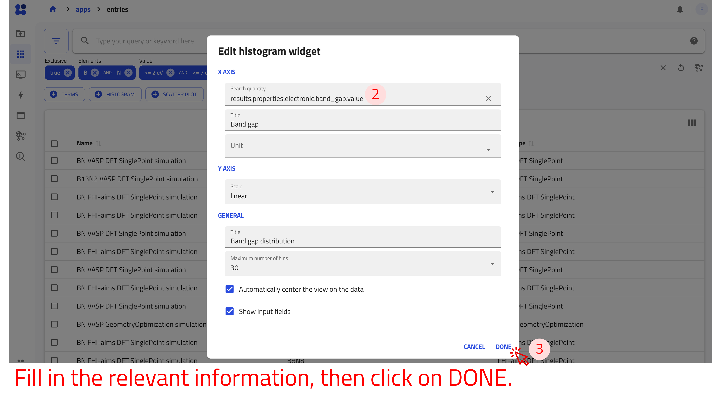
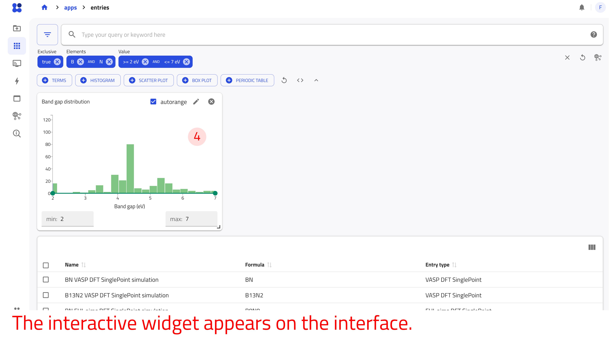

# Explore data in NOMAD

In this tutorial, we explore published entries in NOMAD using the search apps available from the **APPS** page. We use the **Entries** app, which supports searching across all data, and introduce domain-specific apps tailored to particular research fields. Following a step-by-step workflow, we search for entries, apply and combine filters, query structured metadata, and create interactive widgets. By the end of the tutorial, we will have identified relevant entries and constructed customized searches and dashboards using filters, queries, and widgets.

---

## What you will learn

In this tutorial, you will learn how to:

1. Navigate through the **APPS** page of the NOMAD GUI
1. Search and filter published entries across different domains
1. Use the search bar to query structured metadata and perform range-based searches
1. Apply and combine filters to refine search results efficiently
1. Create and customize interactive widgets for advanced data exploration
1. Use NOMAD’s search applications to answer concrete scientific questions using real data

---

## Before you begin

This tutorial requires no prior experience with NOMAD.

Before starting, make sure you have the following:

1. **Access to the public NOMAD platform via a modern web browser**  
   You can explore published data in NOMAD without logging in.

1. **Basic familiarity with materials-science concepts**  
   Familiarity with composition, electronic properties (for example, band gap), and common experimental or computational methods can be helpful, but it is not required.

---

## Navigate to NOMAD search apps

Select **APPS** from the menu on the left to access NOMAD’s search applications. Each app provides filters and widgets tailored to a particular domain or data type.

In this tutorial, we use the **Entries** app to search across all data published on NOMAD and briefly introduce the **Solar Cells** app as an example of a domain-specific search interface.

To begin, open the **APPS** page and select **Entries**.

??? info "Search applications available in NOMAD"
    The **APPS** page provides search interfaces for different domains and data types. The available apps include:

    - **Entries:** Search entries across all domains.
    - **Experiment:** Search experimental data through apps such as **ELN** and **NeXus**.
    - **Solar cells:** Explore general solar-cell data and specialized perovskite databases.
    - **Theory:** Search computational data through apps such as **Calculations** and **Alexandria**.
    - **Tools:** Find resources such as **AI Toolkit Notebooks**.
    - **Use cases:** Explore specialized data for catalysis, metal-organic frameworks, polymerization reactions, and other applications.

    Each app provides filters and widgets tailored to its data and intended use.

---

### Search interface and filters

In the **Entries** app, the filter panel on the left allows you to narrow the search results using structured metadata. Filters are grouped into categories such as:

- **Material:** Elements, chemical formulas, and structural information.
- **Method:** Computational and experimental methods.
- **Properties:** Available physical and electronic properties.
- **Use Cases:** Application-specific classifications, such as solar cells.
- **Origin:** Information about the data’s authorship, project, and publication.

Search results update automatically as you apply filters. Let's narrow the results to VASP calculations of hexagonal boron nitride that contain band-structure data.

- Under **Elements/Formula**, select *B* and *N* in the periodic table and check the box *only compositions that exclusively contain these atoms*. The search results now contain entries with only boron and nitrogen.
- Under **Structure/Symmetry**, select *hexagonal* from the **Crystal system** section. Notice that the results are now limited to hexagonal structures containing boron and nitrogen.
- Under **Method**, select *VASP* from the **Program name** section. The results now show entries from calculations performed with VASP.
- Under **Electronic**, select *Band structure* from the **Electronic properties** section.

You have now narrowed the search to VASP calculations of hexagonal boron nitride that contain band-structure data.

You can pin filters that you want to keep readily accessible. Click the **(+)** button next to each of the filters you just used. The pinned filters are added to the search interface, where you can access and modify them without navigating through the filter menu.

---

### Search bar for data exploration
<!-- Add a page in Reference, that explains all possible syntax for the searches in the search bar -->

You can also search for specific quantities and values directly from the search bar. As you type, NOMAD suggests searchable quantities and shows their paths in the NOMAD metainfo.

Start by searching for the elements from the previous example:

- Type "boron" and select *results.material.material_name = Boron* from the suggested quantities.
- Type "nitrogen" and select *results.material.material_name = Nitrogen* from the suggested quantities.

Notice that the search results update as you add each condition.

!!! task "Can you find a filter for the band gap?"
    Use the search bar to find a quantity related to the band gap.

    - Try searching for *"bandgap"*, *"band gap"*, or *"band_gap"*.
    - Look at the suggested quantities and their metainfo paths.
    - Can you find a quantity containing the band gap value?
    - Can you find information indicating whether the band gap is **direct** or **indirect**?

You can also use numerical conditions in the search bar. For example, to find materials with a band gap of at least 2 eV, type `results.properties.electronic.band_gap.value >= 2 eV` into the search bar.

Similarly, you can define a bounded range for the values. For example, to find materials with a band gap between 2 eV and 4 eV, type `2 <= results.properties.electronic.band_gap.value <= 4 eV` into the search bar.

---

### Custom widgets for data exploration

NOMAD provides configurable widgets for building interactive search dashboards. You can add widgets using the buttons below the search bar in any search app.

Five widget types are available:

- **TERMS** groups entries by the values of a selected categorical quantity.
- **HISTOGRAM** displays the distribution of a selected numerical quantity.
- **SCATTER PLOT** visualizes the relationship between two numerical quantities.
- **BOX PLOT** summarizes and compares the distributions of numerical quantities.
- **PERIODIC TABLE** displays the occurrence of chemical elements and allows you to filter entries by element.

Let's add a **HISTOGRAM** widget to explore the distribution of band gap values in the current search results.

**Use the arrow buttons ⬅️➡️ below to follow the steps for adding and configuring the histogram widget.**

    
←

    
    
    
    
→

Notice that the histogram shows the distribution of band gap values for the current search results. You can use the range controls below the histogram to further filter the results.

---

## Example: compare ETL materials for perovskite solar cells

Let's apply the filters and widgets introduced above to a solar-cell research question.
Imagine that we have fabricated a solar-cell device using *CsPbBr2I*, a mixed-halide perovskite, as the absorber material and compact TiO2 (TiO2-c) as the electron transport layer (ETL).

**Device structure:**

    

|Component                         | Material                         |
|----------------------------------|----------------------------------|
|**Top contact**                   | Au                               |
|**HTL (hole transport layer)**    | Spiro-OMeTAD (C81​H68​N4​O8​)        |
|**Perovskite absorber**           | CsPbBr2I                         |
|**ETL (electron transport layer)**| TiO2-c (compact titanium dioxide)|
|**Bottom contact**                | FTO (fluorine-doped tin oxide)   |
|**Substrate**                     | SLG (soda-lime glass)            |

Let's explore the available solar-cell data to investigate the following question:

!!! task "Which ETL materials are associated with higher open-circuit voltages?"

    Explore entries with a Cs-Pb-Br-I absorber and compare the ETL materials represented in the available data.

### Filter by absorber composition

- Under **Elements/Formula** in the filter menu, click the **(+)** button next to the periodic table to pin the widget to the dashboard.
- Select *Cs*, *Pb*, *Br*, and *I* to find entries containing the elements of the absorber.

The results are now limited to entries containing Cs, Pb, Br, and I.

### Compare ETL materials

- Click the **TERMS** button to add a widget that filters by ETL materials.
- For the quantity, type `electron_transport_layer` and select `results.properties.optoelectronic.solar_cell.electron_transport_layer`.
- Set the statistics scaling to *linear* and enter `ETL` as the widget title.
- Click *DONE*.

### Explore device performance

- Click the **SCATTER PLOT** button to add a widget that compares device-performance quantities:
- In the x-axis quantity field, type `open_circuit_voltage` and select `results.properties.optoelectronic.solar_cell.open_circuit_voltage`.
- In the y-axis quantity field, type `efficiency` and select `results.properties.optoelectronic.solar_cell.efficiency`.
- In the marker color field, type `short_circuit_current` and select `results.properties.optoelectronic.solar_cell.short_circuit_current_density`.

Hover over individual data points to inspect their values. Use the *ETL* widget to select different ETL materials and observe how the distribution of points changes.

Notice which ETL materials occur among entries with higher open-circuit voltages. The plot shows relationships in the available data; it does not by itself establish that the ETL material causes a change in device performance.

Click an entry to inspect its full metadata, associated datasets, and publication information.

---

## Example: explore HTL materials in Sn-based solar cells

Let's now use the domain-specific Solar Cells app to investigate HTL materials in Sn-based solar cells that use C60 as the electron transport layer (ETL).

!!! task "Which HTL materials are associated with higher efficiencies in Sn-based solar cells?"

    Explore Sn-based solar-cell entries with C60 as the ETL and compare the HTL materials represented in the available data.

### Open the Solar Cells app

Open the **APPS** page and select **Solar Cells**.

The Solar Cells app provides predefined filters and widgets for exploring solar-cell data.

### Filter by absorber and ETL

- Select *Sn* in the periodic table to find entries containing tin.
- In the ETL **TERMS** widget, select *C60*.

The results are now limited to Sn-based solar-cell entries that use C60 as the ETL.

### Compare HTL materials

Use the HTL **TERMS** widget to identify the hole transport materials represented in the filtered results.

- Select an HTL material to further narrow the search results.
- Compare the efficiency values for entries using different HTL materials.
- Hover over data points in the performance plots to inspect individual values.

Notice which HTL materials occur among entries with higher reported efficiencies. As in the previous example, relationships in the available data do not by themselves establish that the HTL material causes a change in device performance.

---
