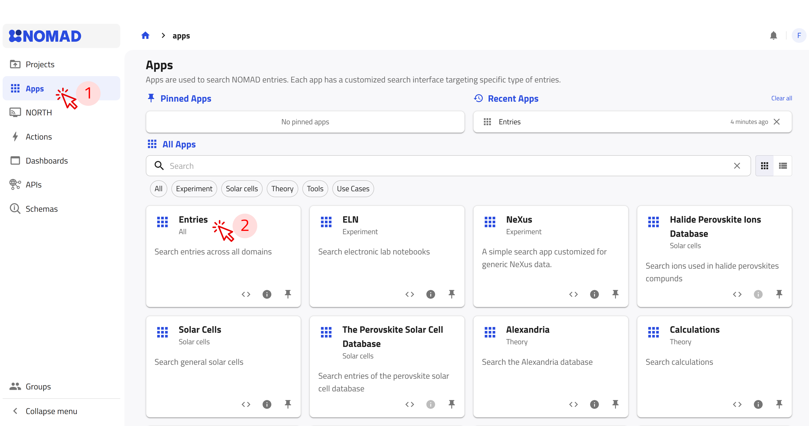
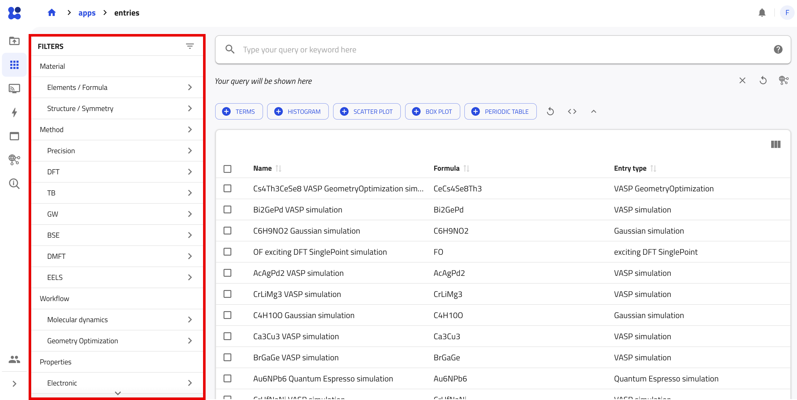
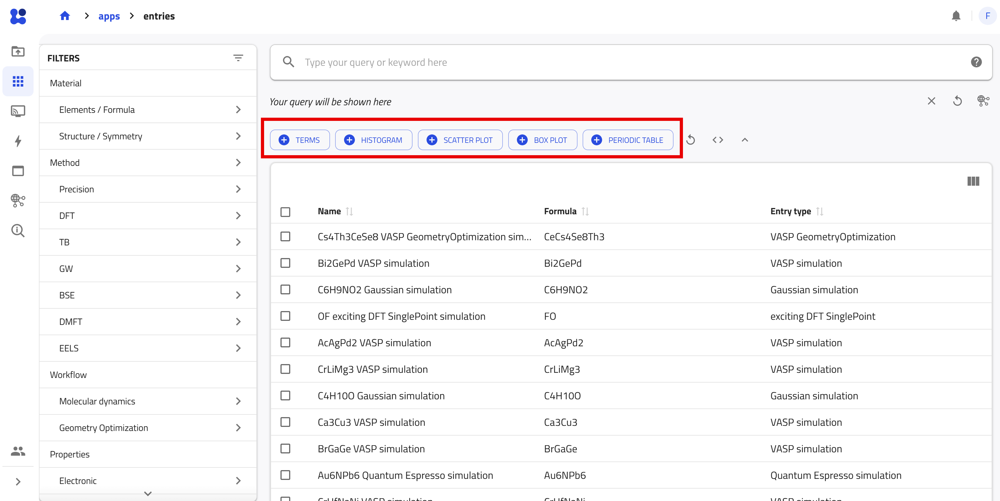
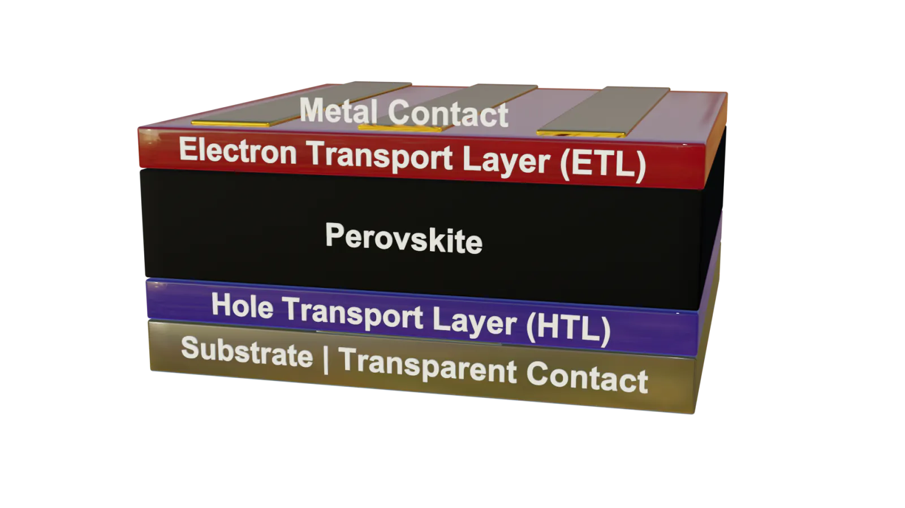
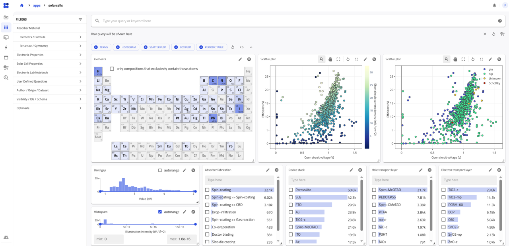

# Explore data in NOMAD

In this tutorial, we explore published entries in NOMAD using the search apps available from the **APPS** page. We use the **Entries** app, which supports searching across all data, and introduce domain-specific apps tailored to particular research fields. Following a step-by-step workflow, we search for entries, apply and combine filters, query structured metadata, and create interactive widgets. By the end of the tutorial, we will have identified relevant entries and constructed customized searches and dashboards using filters, queries, and widgets.

---

## What you will learn

In this tutorial, you will learn how to:

1. Navigate through the **APPS** page of the NOMAD GUI
1. Search and filter published entries across different domains
1. Use the search bar to query structured metadata and perform range-based searches
1. Apply and combine filters to refine search results efficiently
1. Create and customize interactive widgets for advanced data exploration
1. Use NOMAD’s Explore dashboards to answer concrete scientific questions using real data

---

## Before you begin

This tutorial requires no prior experience with NOMAD.

Before starting, make sure you have the following:

1. **Access to the NOMAD GUI via a modern web browser**  
   You can explore published data in NOMAD without logging in.

1. **Basic familiarity with materials-science concepts**  
   Familiarity with composition, electronic properties (for example, band gap), and common experimental or computational methods can be helpful, but it is not required.

---

## Navigate to NOMAD's APPs

Select **APPS** from the menu on the left to access NOMAD’s search applications. Each app provides filters and widgets tailored to a particular domain or data type.

In this tutorial, we use the **Entries** app to search across all data published on NOMAD and briefly introduce the **Solar Cells** app as an example of a domain-specific search interface. 

To begin, open **APPS** and select **Entries**

??? info "Search applications available in NOMAD"
    The **APPS** page provides search interfaces for different domains and data types. The available apps include:

    - **Entries:** Search entries across all domains.
    - **Experiment:** Search experimental data through apps such as **ELN** and **NeXus**.
    - **Solar cells:** Explore general solar-cell data and specialized perovskite databases.
    - **Theory:** Search computational data through apps such as **Calculations** and **Alexandria**.
    - **Tools:** Find resources such as **AI Toolkit Notebooks**.
    - **Use cases:** Explore specialized data for catalysis, metal-organic frameworks, polymerization reactions, and other applications.

    Each app provides filters and widgets tailored to its data and intended use.

---

### Search interface and filters

In the **Entries** app, the filter panel on the left allows you to narrow the search results using structured metadata. Filters are grouped into categories such as:

- **Material:** Elements, chemical formulas, and structural information.
- **Method:** Computational and experimental methods.
- **Properties:** Available physical and electronic properties.
- **Use Cases:** Application-specific classifications, such as solar cells.
- **Origin:** Information about the data’s authorship, project, and publication.

NOMAD enables you to search entries using structured metadata. Some metadata are extracted automatically during processing, while other metadata are provided by users through schemas. Only metadata represented in NOMAD’s data schemas can be queried through the search interface.

Search results update automatically as you apply filters. Try combining the following filters:

- **Elements/Formula**: Click on **B** and **N** in the periodic table to find entires including these elements.
- **Structure/Symmetry**: Select **hexagonal** from the *Crystal system* section to limit the search for hexagonal Boron Nitride. 
- **Method**: Select **VASP** from the *Program name* section to show calculations performed with VASP.
- **Electronic**: select **Band structure** in the *Electronic propoertis* section to show entries containing band-structure data

Together, these filters help identify VASP calculations of hexagonal boron nitride that contain band-structure data.

Use the **(+)** button to pin frequently used filters to the search interface.

---

### Search bar: a quick way to explore data
<!-- Add a page in Reference, that explains all possible syntax for the searches in the search bar -->

You can use the NOMAD search bar to find indexed quantities. As you begin typing, all available and searchable sets (with their paths in the NOMAD metainfo) appear in the advanced menu below the search bar. Continue typing to refine the results and select the desired set.

For the example presented above (searching for Boron Nitride):

- Type "Boron" and select *results.material.material_name = Boron*.
- Type "Nitrogen" and select *results.material.material_name = Nitrogen*.

Alternatively, you can directly enter the element paths in the search field:

- *results.material.elements = B*
- *results.material.elements = N*

!!! task "Does NOMAD have a bandgap filter?"
    Can you find a filter for bandgap? Does it provide the bandgap value or indicate the direct/indirect nature?

    - Try typing variations like **"bandgap"**, **"band gap"**, or **"band_gap"** into the search bar.
    - Search for **"direct"** or **"indirect"** to explore bandgap characteristics.

In addition, you can also perform range-based searches for values using the search bar. This allows you to find materials with specific properties that fall within a defined numerical range.

For example, if you want to find materials with a band gap of 2 eV or larger, enter the following in the search bar:

- *results.properties.electronic.band_gap.value >= 2 eV*

Similarly, you can define a bounded range for the values. For example, to search for materials with a band gap between 2 eV and 4 eV, enter the following line in the search bar:

- *2 <= results.properties.electronic.band_gap.value <= 4 eV*

---

### Custom widgets for advanced searches

NOMAD provides configurable widgets for building interactive search dashboards. You can add widgets using the buttons below the search bar in any search app.

Five widget types are available:

- **TERMS:** Groups entries by the values of a selected categorical quantity.
- **HISTOGRAM:** Displays the distribution of a selected numerical quantity.
- **SCATTER PLOT:** Visualizes the relationship between two numerical quantities.
- **BOX PLOT:** Summarizes and compares the distributions of numerical quantities.
- **PERIODIC TABLE:** Displays the occurrence of chemical elements and allows you to filter entries by element.

---

## Example 1: find alternative ETL materials for perovskite solar cells

In the following, we'll walk through an example to help you better understand how to use these widgets. Imagine we are working on solar cell research and have fabricated solar cell devices using the absorber material *CsPbBr2I* (Cesium Lead Bromine Iodide), a mixed halide perovskite.

**Device Structure**:

    

|Component                         | Material                         |
|----------------------------------|----------------------------------|
|**Top Contact**                   | Au                               |
|**HTL (Hole Transport Layer)**    | Spiro-OMeTAD (C81​H68​N4​O8​)        |
|**Perovskite Absorber**           | CsPbBr2I                         |
|**ETL (Electron Transport Layer)**| TiO2-c (compact Titanium Dioxide)|
|**Bottom Contact**                | FTO (Fluorine-doped Tin Oxide)   |
|**Substrate**                     | SLG (Soda Lime Glass)            |

Now, let us answer the following question:

!!! task "What ETL materials can replace TiO2-c to improve Voc (open-circuit voltage) in perovskite solar cells?"

    To gain insights into this question, we can utilize NOMAD's widgets to explore relevant data:

    1. **Start with the Periodic Table**:
        - Click on the **PERIODIC TABLE** widget button and use the **(+)** button to pin it to the dashboard.
        - Select the elements of the absorber from the periodic table: Cs, Pb, Br, and I.
        - After selecting these elements, you should see approximately 7,500 entries matching your search filters.

    1. **Use the TERMS Widget**:
        - To find out what ETL and HTL materials are used in the available data, click on the **TERMS** widget button.
        - For the X-axis, type 'electron transport layer'. As you type, suggestions will appear. Choose `results.properties.optoelectronic.solar_cell.electron_transport_layer`.
        - Set the statistics scaling to linear, give the widget a descriptive title like "ETL", and pin it to the dashboard.
        - Repeat the process for the HTL materials.

    1. **Create a Scatter Plot**:
        - Click on the **SCATTER PLOT** widget button to visualize the relationship between open-circuit voltage (Voc), short-circuit current density (Jsc), and efficiency.
        - Set the X-axis to "Open Circuit Voltage (Voc)", the Y-axis to "Efficiency", and use the marker color to represent "Short Circuit Current Density".
        - The scatter plot will allow you to explore the data interactively.

        

            <video controls autoplay loop muted playsinline width="800">
                <source src="images/custom_widgets_example.webm" type="video/webm">
            </video>
        

    1. **Interpreting Results**

        - Interactive scatter plots reveal relationships between **ETLs, HTLs, and performance**.
        - Hover over data points for details.
        - Click entries for **full metadata, dataset links, and publication info**.

        Custom widgets provide a **powerful way** to explore NOMAD data and answer research questions efficiently.

---

## Example 2: explore Sn-based solar cells

Let’s explore how **hole transport layer (HTL) materials** affect efficiency in **Sn-based solar cells** with **C60** as the electron transport layer (ETL).

In this example, we will utilize the Solar Cell Explore page, which offers filters and widgets that make it easier to search for solar cell entries.

**Step 1: Navigate to the Solar Cell Explore Page**

- Navigate to **EXPLORE** → **Solar Cells**.
- This dashboard provides predefined filters and plots optimized for solar cell research.

The dashboard includes the following preset widgets:

- **Periodic Table:** Filter materials by elements.
- **Scatter Plots:** Explore efficiency vs. Voc, Jsc, and device architecture.
- **Histograms:** Analyze bandgap and illumination intensity.
- **TERMS Plots:** Categorize fabrication method, device stack, ETL, and HTL materials.

**Step 2: Apply Filters**

- Select Sn in the **Periodic Table** to filter Sn-based absorbers.
- Set ETL = C60 in the **TERMS** plot. (~400 entries remain)
- Narrow results further using:
    - Bandgap slider (e.g., >1.3 eV).
    - Device architecture scatter plot (e.g., pin).

**Step 3: Customize Widgets**

Click the *pen icon* on any widget to modify its plotted quantities, color mapping, or units. Each widget offers a customizable set of filters or visualizations, depending on the data type.

**Step 4: Inspect the Results Matching the Criteria**

- Hover over scatter plots to inspect data points.
- Click entries for full metadata, dataset links, and further analysis.

    <video controls autoplay loop muted playsinline width="800">
        <source src="images/sn_based_solar_cells_example.webm" type="video/webm">
    </video>

---
