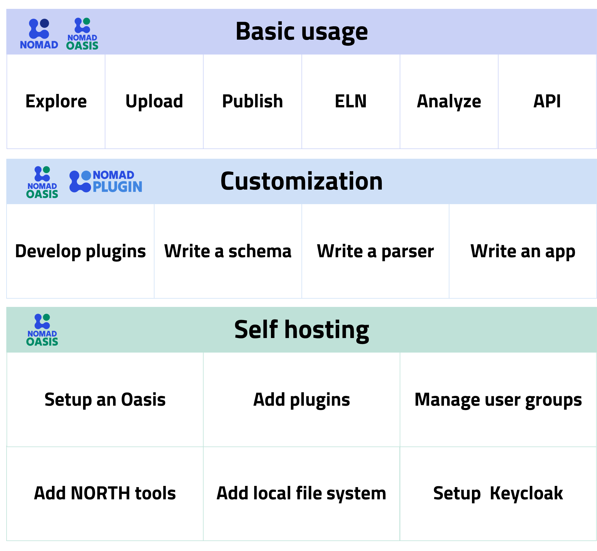
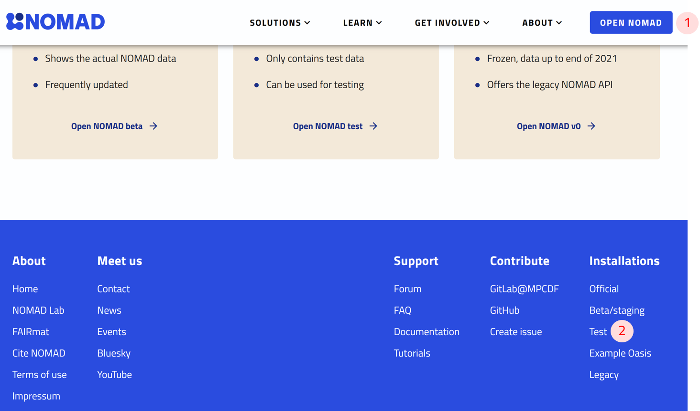
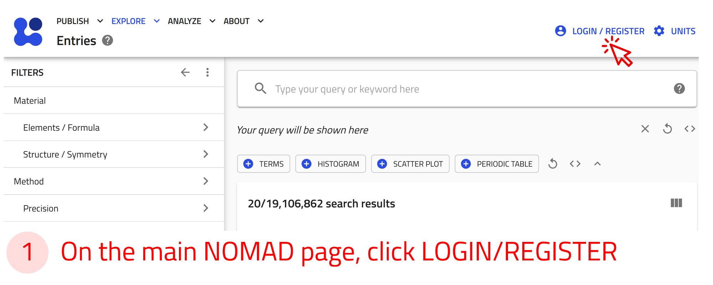
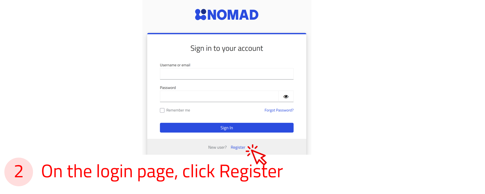
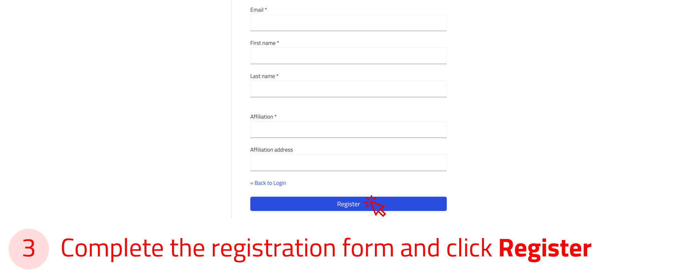
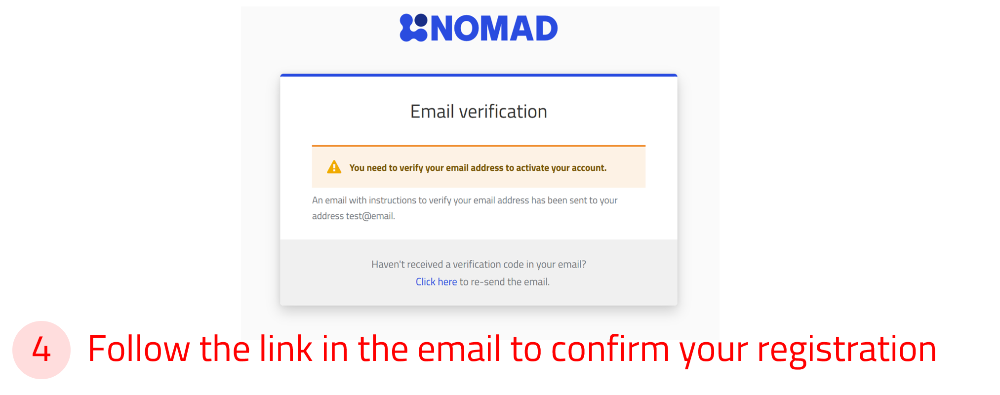
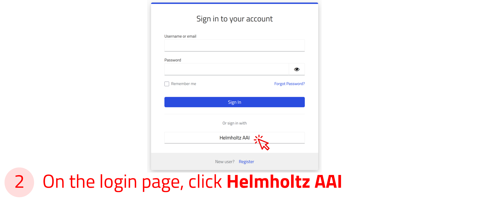
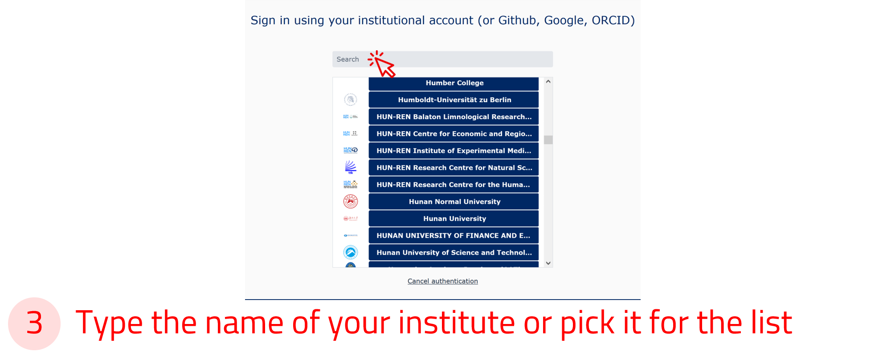

# NOMAD Tutorials

This section of the documentation provides practical, hands-on instructions for working with NOMAD. Each tutorial is designed to guide you through specific tasks while focusing on key learning outcomes.

By following these tutorials, you will be able to:

- Interact directly with NOMAD to perform essential tasks.
- Develop a deeper understanding of its features and capabilities.
- Gain confidence in using NOMAD efficiently for your research.

These tutorials provide a structured learning experience that helps you apply concepts to real-world scenarios while reinforcing your knowledge.

As you go through the tutorial pages, you will encounter embedded boxes with different colors and icons, each providing distinct types of information or instructions. Below is a list of the various box types and guidance on how to use them:

!!! info "Offers additional information to enhance your understanding of NOMAD."
!!! task "Presents hands-on tasks or questions with instructions to complete them."
!!! example "Shares example files for you to try out, along with explanations of their contents and scientific use cases."
!!! warning "Displays important warnings to consider before proceeding further in the tutorial."

## Scope of the Tutorials

NOMAD is available in two flavours to address the diverse needs of scientists: **Central NOMAD** and **NOMAD Oasis**. To learn more about these solutions, refer to our [web page](https://nomad-lab.eu/){:target="_blank"}.

Our tutorial documentation covers basic usage that can be performed in both Central NOMAD and NOMAD Oasis. These tasks range from basic operations using the graphical user interface (GUI) to a certain level of tailorling electronic lab notebooks using YAML files, which do not require local installations.

Additionally, the tutorials include in-depth customization of NOMAD Oasis using NOMAD Plugins. However, more advanced topics such as installing an Oasis, setting up an internal Keycloak instance, managing a local file system, or adding tools to NORTH are not currently covered in the tutorials. Users interested in these topics should refer to other sections of the documentation, such as:

- [How-to guides](../howto/overview.md) for step-by-step instructions,
- [Explanations](../explanation/data.md) for deeper conceptual understanding, and
- [Reference](../reference/config.md) documentation for detailed technical information.

An overview of the skills required to use NOMAD and NOMAD Oasis, categorized into basic use, customization, and self hosting, is presented in the figure below.

------

## Ways to Access NOMAD

There are multiple access points to NOMAD. The general [_landing page_](https://nomad-lab.eu/nomad-lab/){:target="_blank"} provides an overview of NOMAD’s features, along with links to documentation, tutorials, and project history.

From this page, we can navigate to NOMAD to upload, manage, and explore data.

Two public versions that are relevant to the tutorials are:

1. [**Official**](https://nomad-lab.eu/prod/v1/gui/search/entries){:target="_blank"} – The latest stable version of NOMAD.

    Access it by clicking the "Open NOMAD" button at the top of the landing page.

2. [**Test**](https://nomad-lab.eu/prod/v1/test/gui/search/entries){:target="_blank"} – Runs the latest released version of NOMAD but on temporary test data that is routinely wiped.

    Access it from the *Installations* menu at the bottom of the landing page by selecting "Test."

!!! info "These tutorials are based on the official version of NOMAD. All instructions are based on it unless stated otherwise."

    

------------
## Create a NOMAD User Account

A NOMAD user account is required if you want to upload, share, publish, or analyze your data. However, exploring data in NOMAD does not require an account.

Creating a NOMAD user account is quick and free. Follow these steps to set up your account (click on the arrows to navigate between steps):

    
←

    
    
    
    
    
→

----------

## Login Options via Helmholtz AAI

You can also log in to NOMAD using your university or research institute credentials, or with social accounts such as GitHub, ORCID, or Google via the [Helmholtz AAI](https://hifis.net/aai/) (Authentication and Authorization Infrastructure).

To sign in, select the Helmholtz AAI option in the login form, then choose your institution or preferred social account from the list.

You will be redirected to your institution’s login page, where you can enter your credentials securely.

!!! info "Helmholtz AAI ensures secure and privacy-compliant authentication 🔒. Most major universities and research institutions in Germany and across Europe are supported."

    
←

    
    
    
    
→

----------