# Upload and publish data in NOMAD

In this tutorial, we walk through the complete workflow for uploading and publishing research data in NOMAD via the graphical user interface (GUI). Using example files from computational and experimental research, we demonstrate how raw files are transformed into structured data and organized into projects that can be shared and published. By the end of the tutorial, we will publish the data in NOMAD and assign the project a Digital Object Identifier (DOI).

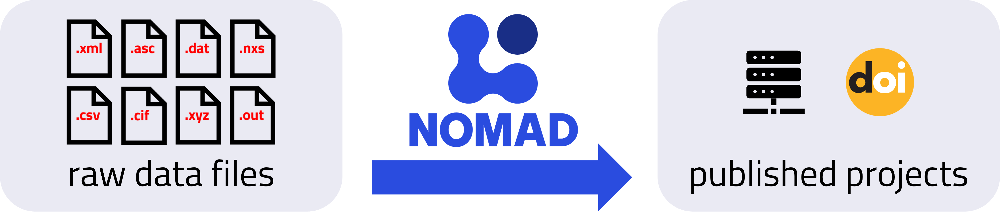

---

## What you will learn

In this tutorial, you will learn how to:

1. Upload raw research data files to NOMAD and organize them using projects
1. View the entries that NOMAD generates from your files and check their processing status
1. Share projects with collaborators and manage access permissions
1. Publish projects and understand the role of embargoes
1. Assign a Digital Object Identifier (DOI) to your published project

---

## Before you begin

This tutorial requires no prior experience with NOMAD.

Before starting, make sure you have the following:

1. **NOMAD user account**  
    In order to upload and publish data in NOMAD, a user account is required.
    You can create an account by following the steps described in the
    [How-to guides > ... > Create a NOMAD account](../howto/manage/gui/account.md#create-a-nomad-account).

1. **Example files available on your local machine**  
    This tutorial uses the following example data files:
    - [Miscellaneous files (PDF, images, tables)](https://github.com/FAIRmat-NFDI/FAIRmat-tutorial-16/raw/refs/heads/main/tutorial_16_materials/part_3_files/example_files_upload/miscellaneous_data/miscellaneous_data.zip){:target="_blank" rel="noopener"},
    - [Computational data (DFT calculations)](https://github.com/FAIRmat-NFDI/FAIRmat-tutorial-16/raw/refs/heads/main/tutorial_16_materials/part_3_files/example_files_upload/computations_data/FHI-aims.zip){:target="_blank" rel="noopener"},
    - [Experimental data (XPS measurements)](https://github.com/FAIRmat-NFDI/FAIRmat-tutorial-16/raw/refs/heads/main/tutorial_16_materials/part_3_files/example_files_upload/experiments_data/xps_nexus_data.zip){:target="_blank" rel="noopener"}.

---

## Create a new project

Select **Projects** from the menu on the left to view your projects and their details. From this page, you can also create a new project or add an example project prepared by others.

**Use the arrow buttons ⬅️➡️ below to follow the steps for creating your first project.**

    
←

    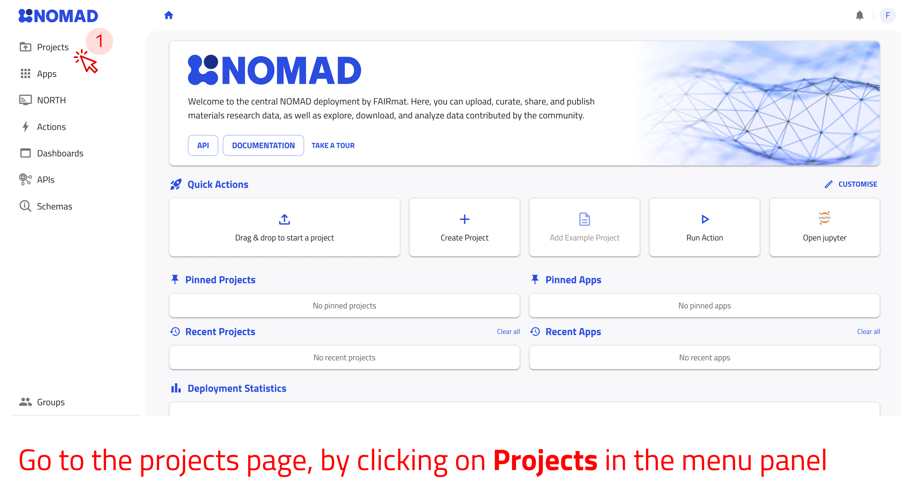
    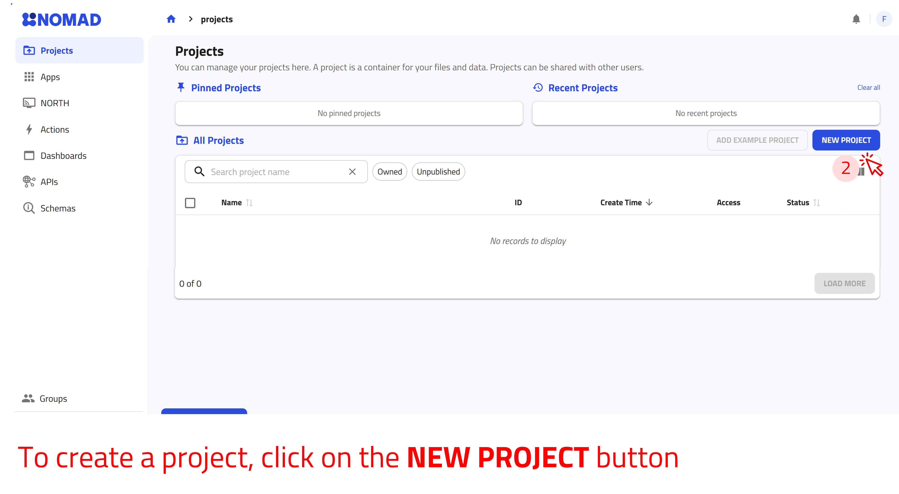
    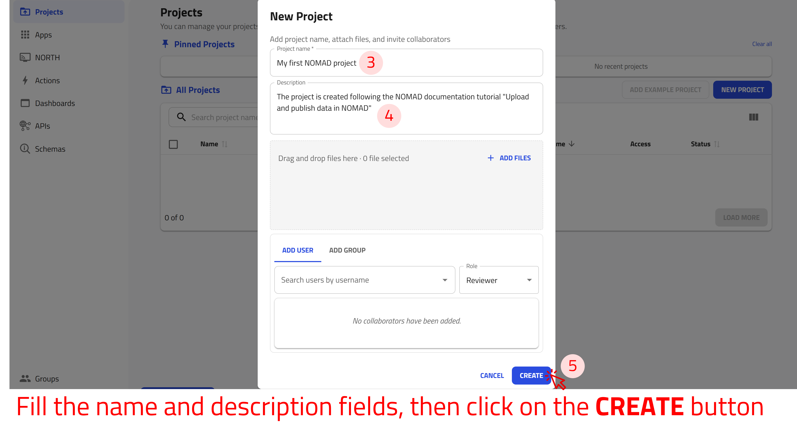
    
→

NOMAD will then open the project page, where you can upload files, add collaborators, change the project’s visibility settings, and eventually publish it and assign a DOI. You can also modify the project’s name and description and upload a Markdown (README.md) file to provide additional information about the project.

---

## Share and publish projects

NOMAD projects can be shared with selected users or published for wider access. In both cases, the selected access settings apply to all entries and files within the project.

??? info "What is the difference between sharing and publishing a project?"
    **Sharing a project** gives selected colleagues and collaborators access to the project.

    - Sharing supports collaboration and progress reviews, while allowing its contents to be modified.
    - Users can be granted read/write access as coauthors or read-only access as reviewers.

    **Publishing a project** makes it publicly findable and accessible through NOMAD.

    - Once published, the project becomes immutable, i.e. its entries and files can no longer be modified.
    - An embargo can be applied to restrict access to the files until a specified date.
    
A NOMAD project can have one of four states, depending on its sharing and visibility settings:

|Status    | Icon                                                                           | Description                                                           |
|----------|--------------------------------------------------------------------------------|-----------------------------------------------------------------------|
|Private   | |The project is unpublished, accessible only to you, and can still be edited by you.            |
|Shared    |       |The project is unpublished, accessible to you and selected collaborators, and can still be edited by you and coauthors. |
|Published | |The project is published, accessible to everyone, and can no longer be edited.                          |
|Visible   |     |The project is unpublished, accessible to everyone, and can still be edited by you and coauthors.                  |

### Share your project

Share your project with other NOMAD users by adding them as coauthors or reviewers. Coauthors receive read/write access, while reviewers receive read-only access. You can manage collaborators from the **SETTINGS** tab on the project page.

**Use the arrow buttons ⬅️➡️ below to follow the steps for sharing your project.**

    
←

    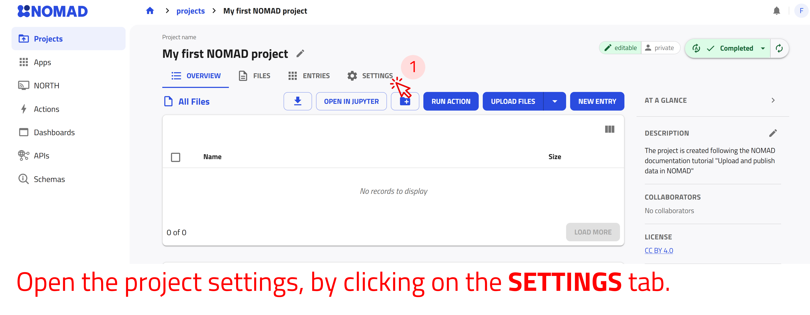
    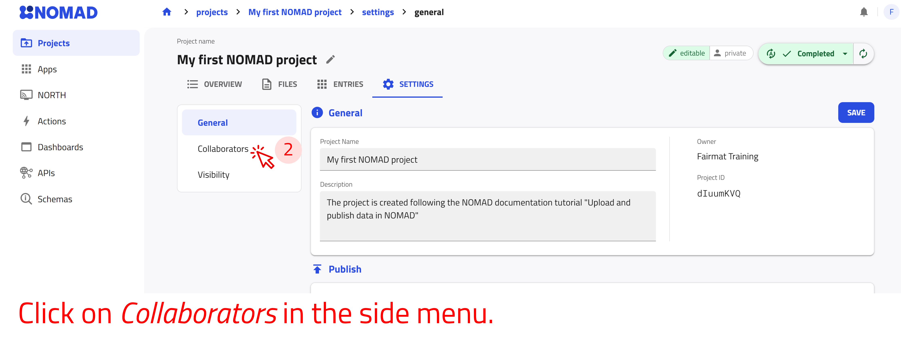
    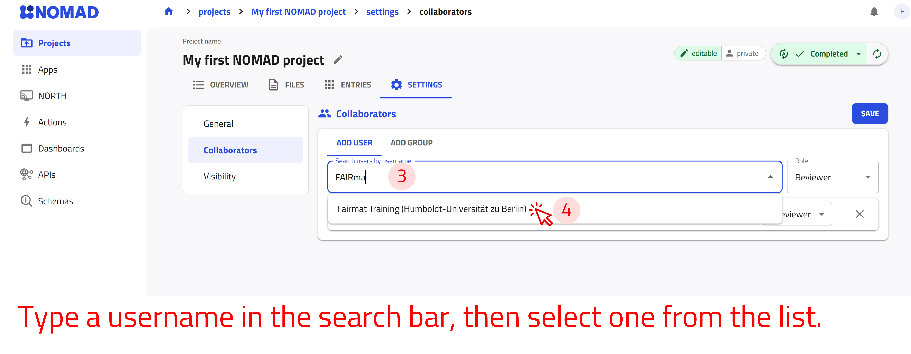
    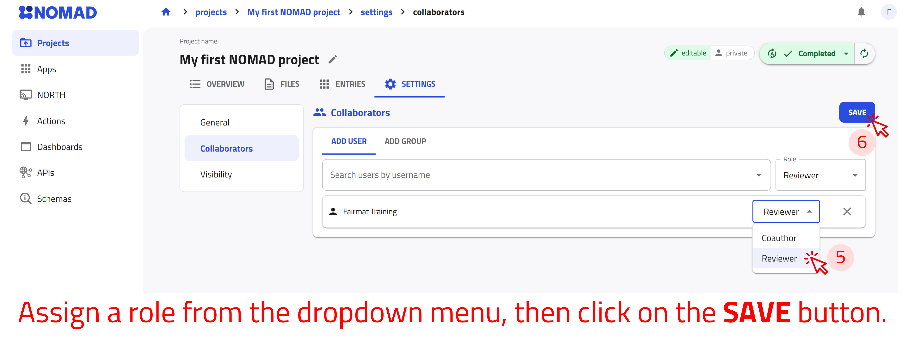
    
→

The project remains unpublished and editable, and you can change or remove collaborators at any time.

### Make your project public

Make your unpublished project visible to all users, including guests without a NOMAD account. You can manage public access from the **SETTINGS** tab on the project page.

**Use the arrow buttons ⬅️➡️ below to follow the steps for making your project visible to everyone.**

    
←

    
    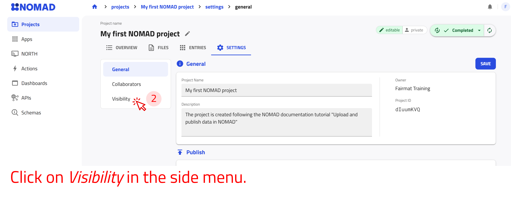
    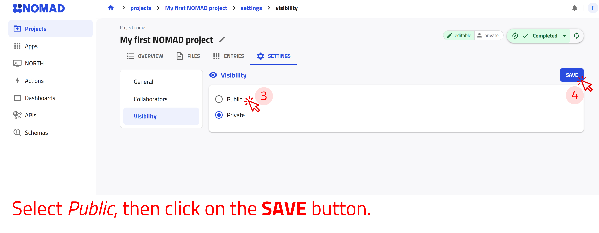
    
→

The project remains editable, and you can change its access settings at any time.

---

## Add files to your project

Now, let’s add files to the project using three different examples:

1. Miscellaneous files (documents, images, or spreadsheets).
1. DFT calculation of iron(III) oxide.
1. X-ray photoelectron spectroscopy (XPS) measurement on polymers.

Files can be added to a project individually, or you can group them into a compressed file in `.zip` or `.tar` formats.

??? info "How NOMAD processes uploaded files"
    Whether an uploaded file is processed into an entry (structured archive) depends on its format and whether NOMAD has a compatible parser.

    **Files recognized by NOMAD**

    - If NOMAD recognizes a mainfile, i.e. a compatible parser exists, it uses the corresponding parser to extract and organize the data according to a data schema.

    - The structured data become an **entry** that can be searched, analyzed, and displayed through visualizations.

    - Other uploaded files may be associated with the entry as supporting files.

    <!-- See [supported file formats](...) for a list of formats that NOMAD can parse. -->

    **Files not recognized by NOMAD**

    - If no compatible parser is available, NOMAD cannot automatically extract and structure the file’s data.

    - The file remains part of the project and can still be downloaded, shared, and published, but it does not generate an entry.

    - NOMAD can preview some common unparsed file formats directly in the interface, including `.txt`, `.csv`, `.pdf`, `.png`, and `.jpg`.

### Upload miscellaneous files

??? example "Download the example files for this exercise"
    <!-- TODO consider changing this admonition to a download button -->
    [Download example data ZIP](https://github.com/FAIRmat-NFDI/FAIRmat-tutorial-16/raw/refs/heads/main/tutorial_16_materials/part_3_files/example_files_upload/miscellaneous_data/miscellaneous_data.zip){:target="_blank" rel="noopener"}.

    Download the folder, then uncompress it on your local machine in your preferred directory.

    The folder contains files of the following formats: `.zip`, `.pdf`, `.jpg`, `.txt`, and `.csv`.

    | file name                      | format | description                                                                 |
    |--------------------------------|--------|-----------------------------------------------------------------------------|
    | FAIRmat_graphics               | .zip   | Compressed file that contains several FAIRmat logos in `.png` format        |
    | JOSS_2023                      | .pdf   | A publication of NOMAD in the Journal of Open Source Software               |
    | Nature_2022                    | .pdf   | A FAIRmat publication in Nature                                             |
    | P3HT_optical_absorption        | .csv   | An absorption measurement of P3HT using a PerkinElmer spectrometer          |
    | note_properties_of_good_dopants| .txt   | Notes recorded during a conference talk                                     |
    | experiment_polymer_doping      | .jpg   | A photograph of an experiment preparing doped polymer solutions             |

Files such as images, PDF files, text files, and tabular data do not generate entries because NOMAD does not have a compatible parser for their formats.

They remain part of your project and can still be accessed, shared, downloaded, and published, but their contents are not searchable as structured data in NOMAD. In this case, NOMAD stores the files without extracting their contents into structured, searchable entries.

Add the files to your project by dragging and dropping them into the upload area or by opening the file-selection dialog and selecting them from your device.

**Drag and drop**

Start by uploading the file `FAIRmat_graphics.zip`. Drag and drop files into the project upload area as shown in the image below.

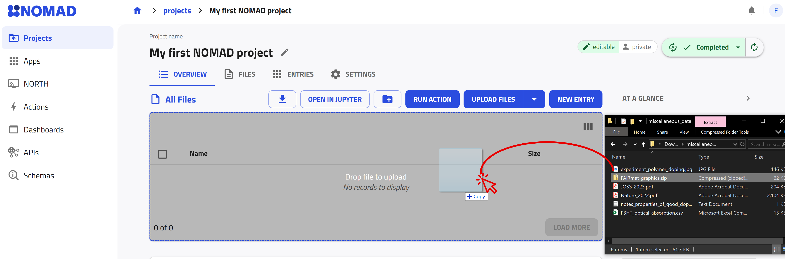

When a compressed file is uploaded to NOMAD, it will be extracted automatically and the included files will be added to your project.

**Use the file-selection dialog**

Upload the remaining files using the file-selection dialog. On the project page, click **UPLOAD FILES**, select the files from your device, and then click **Open**.

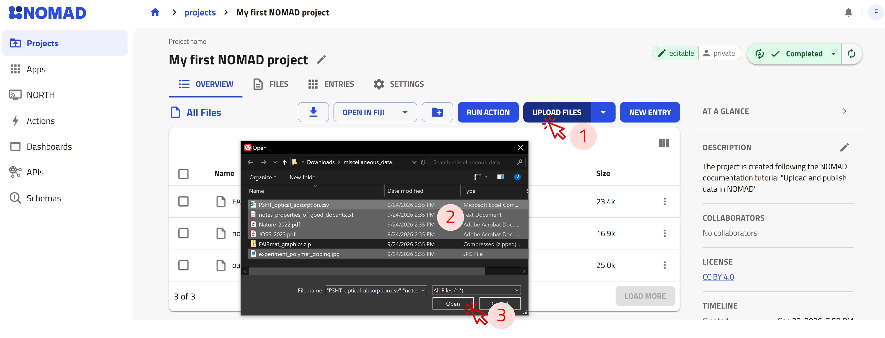

### Upload computational data

??? example "Download the example files for this exercise"
    <!-- TODO consider changing this admonition to a download button -->
    [Download example data ZIP](https://github.com/FAIRmat-NFDI/FAIRmat-tutorial-16/raw/refs/heads/main/tutorial_16_materials/part_3_files/example_files_upload/computations_data/FHI-aims.zip){:target="_blank" rel="noopener"}.

    Download the folder to your preferred directory on your local machine.

    This folder contains the input and output files of a DFT calculation for iron(III) oxide using the *FHI-aims* code.

    *FHI-aims* is an all-electron density-functional-theory package that employs numeric atom-centered basis functions. [For more information, see the FHI-aims documentation.](https://fhi-aims.org/){:target="_blank" rel="noopener"}

The calculation in this example was performed with *FHI-aims*, an electronic-structure code supported by a NOMAD parser.

NOMAD recognizes the *FHI-aims* files, extracts information from them, and organizes the resulting data according to NOMAD’s unified *metainfo* schema. NOMAD identifies the mainfile and uses the corresponding parser to generate an **entry**.

??? task "Uploading input and output files from a DFT calculation"

    **Uploading the files**

    Upload `FHI-aims.zip` using either of the methods described above: drag and drop the archive into the upload area, or select it through the **UPLOAD FILES** dialog.

    After the files are uploaded, NOMAD automatically begins processing them. It identifies supported file formats and uses the corresponding parsers to extract and structure relevant data and metadata. The specific processing steps depend on the type of data.

    Once processing is complete, NOMAD creates entries from the recognized mainfiles. The corresponding entry page includes the processed data in a structured, hierarchical format.

    **Opening and exploring an entry**

    On the project page, select the **ENTRIES** tab to view all entries generated from the processed files. Select an entry to open its entry page and explore the structured data.
    
    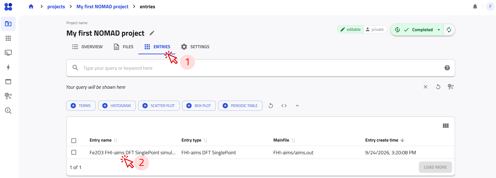

    The entry page provides three main views:

    - **OVERVIEW:** Presents a visual summary of the entry, including its core metadata and cards for the available material, property, and workflow data. The displayed cards depend on the data extracted from the uploaded files.

        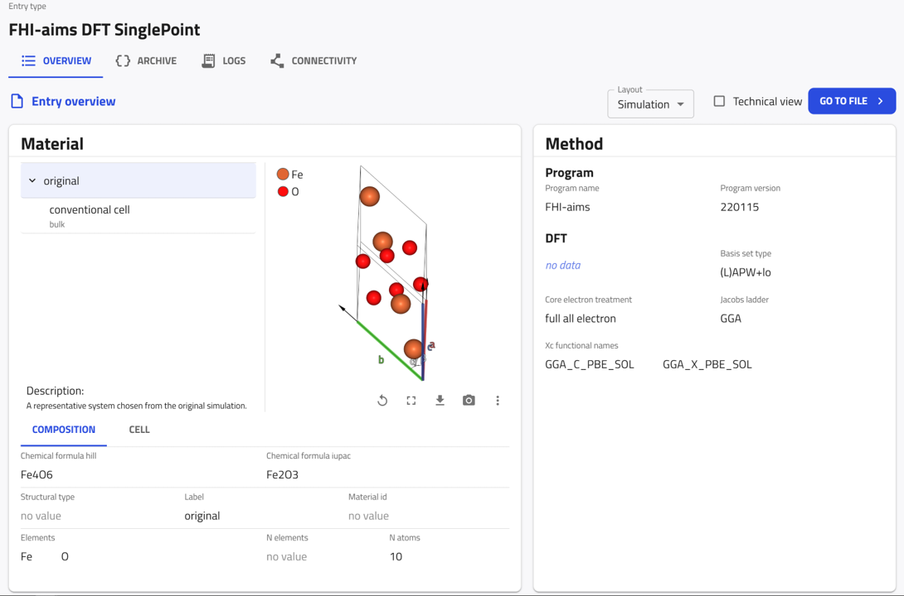

    - **ARCHIVE:** Presents all extracted data and metadata in a structured, hierarchical, and machine-processable format based on the NOMAD *metainfo* schema. Expand the sections to inspect individual quantities and their values.

        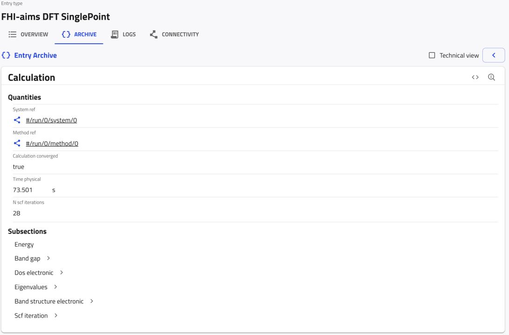

    - **CONNECTIVITY:** Visualizes the relationships between the entry and other data in NOMAD. It can show the entry’s workflow graph and connections to entries that it references or that reference it.

        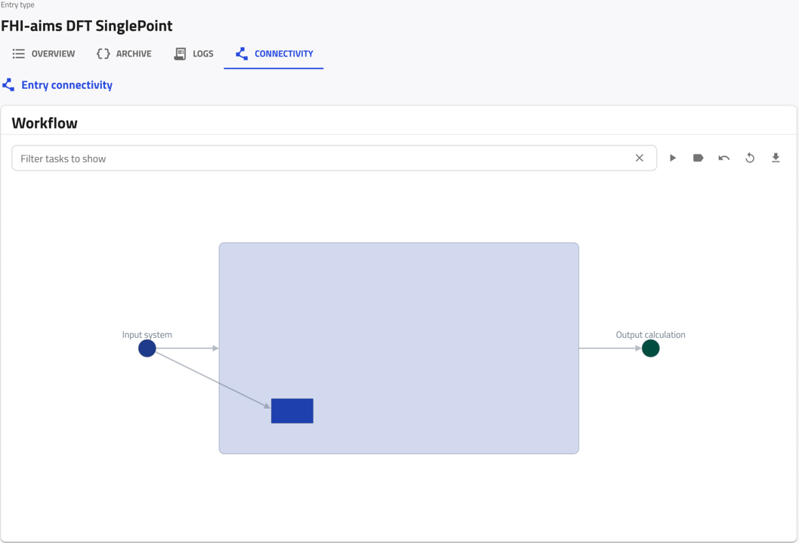

### Upload experimental data

??? example "Download the example files for this exercise"
    <!-- TODO consider changing this admonition to a download button -->
    [Download example data ZIP](https://github.com/FAIRmat-NFDI/FAIRmat-tutorial-16/raw/refs/heads/main/tutorial_16_materials/part_3_files/example_files_upload/experiments_data/xps_nexus_data.zip){:target="_blank" rel="noopener"}.

    Download the folder, then uncompress it in your preferred directory on your local machine.

    This folder contains files related to an X-ray photoelectron spectroscopy (XPS) measurement of the polymer PBTTT using a SPECS spectrometer.

    It includes the data in two formats (`.nxs` and `.xml`), in addition to an electronic lab notebook (ELN) file (`.yaml`) documenting additional details of the experiment.

    | file name             | format | description                                                      |
    |-----------------------|--------|------------------------------------------------------------------|
    | PBTTT_XPS_SPECS       | .nxs   | XPS data file in the standard NeXus file format                  |
    | PBTTT_XPS_SPECS_raw   | .xml   | XPS data in a raw file format as produced by the spectrometer    |
    | eln_data_xml          | .yaml  | An ELN file used to record additional metadata of the experiment |

NOMAD can process experimental data stored in supported NeXus formats. 

When you upload `PBTTT_XPS_SPECS.nxs`, NOMAD parses its contents and generates a structured entry.

??? task "Uploading experimental data in the `.nxs` format"

    **Uploading the file**

    Upload `PBTTT_XPS_SPECS.nxs` using either of the methods described above: drag and drop the file into the upload area, or select it through the **UPLOAD FILES** dialog.

    After the file is uploaded, NOMAD automatically begins processing it. It identifies the supported file format and uses the corresponding parser to extract and structure relevant data and metadata. The specific processing steps depend on the type of data.

    Once processing is complete, NOMAD creates an entry for the recognized file. The corresponding entry page includes the processed data in a structured, hierarchical format.

    **Opening and exploring the entry**

    On the project page, select the **ENTRIES** tab and open the entry generated from `PBTTT_XPS_SPECS.nxs`.

    The entry page provides several views for exploring the processed data:

    - **OVERVIEW:** Summarizes the processed experiment in three cards:

        - **Material** presents available information about the sample, such as its elements and chemical formula.
        - **NeXus Entry** displays general experiment metadata, including the application definition, title, and start and end times.
        - **NeXus HDF5** provides an interactive viewer for inspecting, plotting, and exporting the measurement data. In this example, it displays the XPS spectrum as counts against energy.

        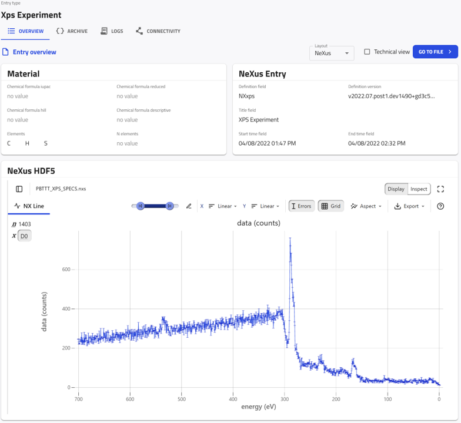

    - **ARCHIVE:** Presents the extracted data and metadata in a structured hierarchy based on the NOMAD *metainfo* schema. At the root level, it displays general information such as the experiment name, method, file details, and NeXus version. Expand subsections such as **Steps**, **Samples**, **Instruments**, and **Results** to inspect the experiment in greater detail.

        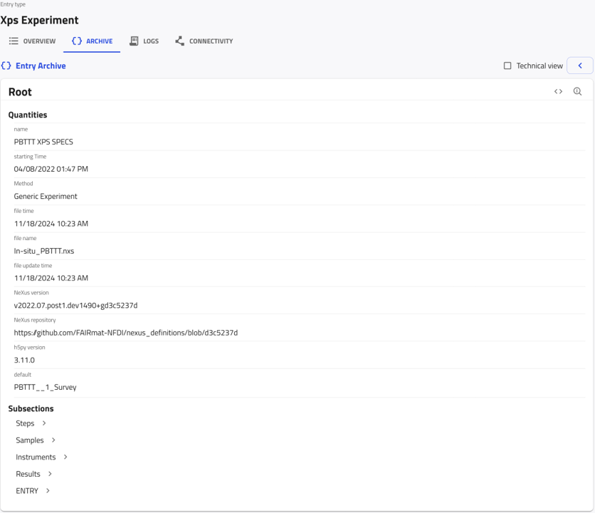
<!-- TODO: This section needs to be updated based on GUI2 and potentially moved to a separated tutorial page -->
<!-- Most scientific instruments produce data in formats other than NeXus `.nxs`. For supported raw formats, NOMAD provide the built-in *NexusDataConverter*, which converts the data into as standardize NeXus file.

??? info "NexusDataConverter readers and the NeXuS application definitions"
    **A Reader** is a program designed to interpret and extract data from a specific experimental technique or file format.

    The reader understands the structure and encoding of the particular data format and provides methods for accessing its contents in a programmatically friendly way.
    It acts as a bridge between raw experimental data and NOMAD by converting the data into the structured file format according to domain-specific application definitions.

    A list of available readers can be found [here](https://fairmat-nfdi.github.io/pynxtools/reference/plugins.html){:target="_blank" rel="noopener"}

    **A NeXus application definition** provides a structured specification of the terms and metadata required in an `.nxs` data file for a particular scientific application. These definitions outline the minimum set of terms that must be included in the data file for it to be considered valid according to the NeXus format.

    A list of NeXuS application definitions developed by FAIRmat can be found [here](https://fairmat-nfdi.github.io/nexus_definitions/){:target="_blank" rel="noopener"}

    NexusDataConverter uses **readers** to interpret the raw data files, and then structures them according to the outlines of the **application definitions**.

In the following examples, you will learn how to upload a raw file from a SPECS instrument in `.xml` format by using the *NexusDataConverter*. You will do this in two ways:

1. Uploading only the raw file.
1. Uploading both the raw file and an ELN file, enriching your data with metadata and ensuring compliance with community standards.

??? task "Uploading experimental data in the `.xml` format"

    **Step 1:** Click on the **CREATE FROM SCHEMA** button in your project page.
    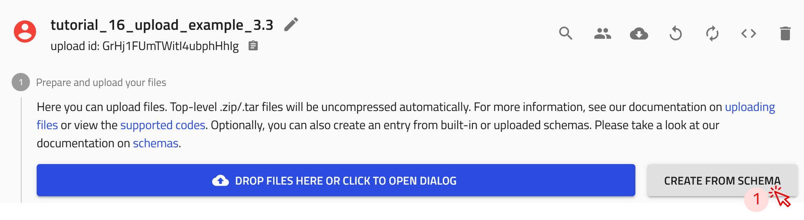

    **Step 2:** In the *create new entry from schema* window, click on the drop-down menu of the built-in schema, and select *NexusDataConverter*

    **Step 3:** Give a descriptive name for the entry.

    **Step 4:** Click on CREATE. This will take you the NexusDataConverter entry page.

    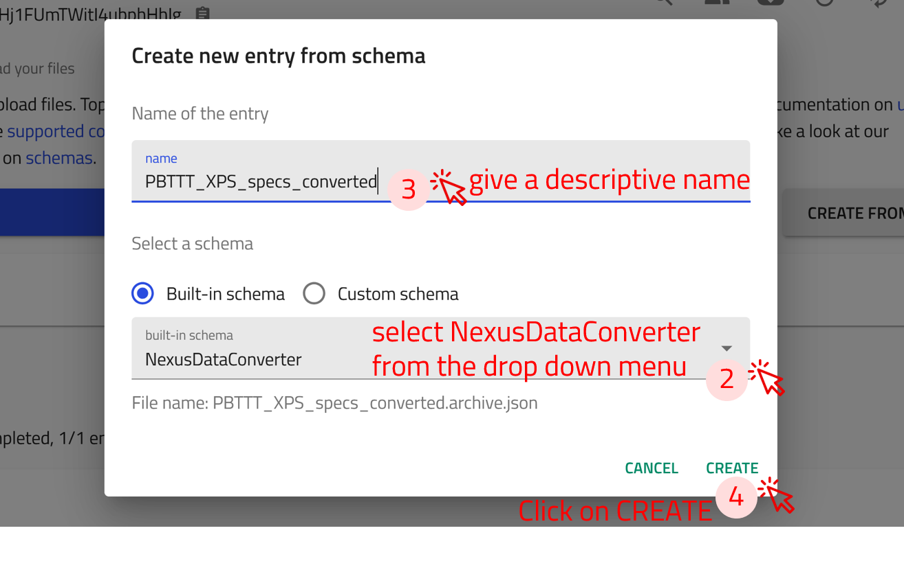

    **Step 5:** From the reader drop-down menu, choose the appropriate reader for your files. For this exercise select *xps*.

    **Step 6:** From the nxdl drop-down menu, choose the appropriate application definition for your experiment. For this exercise select *NXxps*

    **Step 7:** Upload the raw data file `PBTTT_XPS_SPECS_raw.xml`.

    **Step 8:** Give a descriptive name for the generated `.nxs` file.

    **Step 9:** Click on the save icon to start the conversion process.

    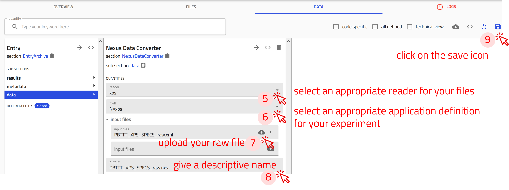

    Check the overview page of your project. There you will find two newly created entries; one for the NexusDataConverter and one for the generated `.nxs` file from your raw file.

    NOMAD still stores your `.xml` raw file in the upload directory.

    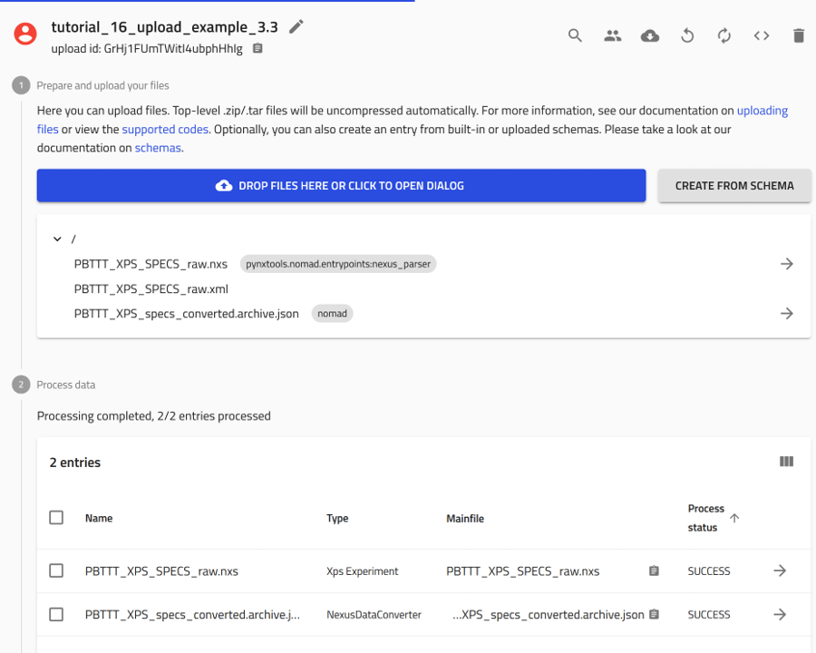

??? task "Uploading experimental data in the `.xml` format with additional ELN data"

    Often, raw files generated by instruments from various vendors lack complete metadata and essential details about the experiment.

    To address this, scientists document all experimental details in an Electronic Lab Notebook (ELN). Combining data from raw files with information from ELNs ensures that experiments are comprehensively described with rich metadata and conform to community standards.

    NOMAD’s *NexusDataConverter* allows you to merge experimental raw data files with ELN entries in `.yaml` format, producing `.nxs` files that meet community standards and ensure your data are richly-described.

    The ELN `.yaml` file can be generated by various ELN software tools or created manually using a text editor.

    For each supported experimental raw file format, FAIRmat provides a template ELN `.yaml` file containing all necessary attributes and parameters to complement the raw file’s data. These templates can be found [here](https://github.com/FAIRmat-NFDI/pynxtools-xps/tree/a2e9524ae8479ffa9cde79daf2010161d8ae75c3/examples){:target="_blank" rel="noopener"}

    While these files can be edited with any text editor, we recommend using **VS Code** for an optimized editing experience.

    **Open the `eln_data_xml.yaml` file and edit its contents**

    - Modify the start_time and end_time of your experiment.
    - Write your information in the `users` section.
    - Explore the other fields available in the ELN file.
    - Save the file.

    <video controls autoplay loop muted playsinline width="100%">
        <source src="images/example_3-3_modifying_ELN.webm" type="video/webm">
    </video>

    **Upload your data file `.xml` and your ELN data `.yaml` using NexusDataConverter**

    - **Step 1:** Click on the **CREATE FROM SCHEMA** button in your project page.

    

    - **Step 2:** In the *create new entry from schema* window, click on the drop-down menu of the built-in schema, and select *NexusDataConverter*

    - **Step 3:** Give a descriptive name for the entry.

    - **Step 4:** Click on CREATE. This will take you the NexusDataConverter entry page.

    

    - **Step 5:** From the reader drop-down menu, choose the appropriate reader for your files. For this exercise select *xps*.

    - **Step 6:** From the nxdl drop-down menu, choose the appropriate application definition for your experiment. For this exercise select *NXxps*

    - **Step 7:** Upload the raw data file `PBTTT_XPS_SPECS_raw.xml` as well as the ELN data file `eln_data_xml.yaml`.

    - **Step 8:** Give a descriptive name for the generated `.nxs` file.

    - **Step 9:** Click on the save icon to start the conversion process.

    .png)
-->
---

## Publish your project

When your project is ready, you can publish it with immediate public access or apply an embargo to restrict access to its files for a specified period. 

Publishing makes the project permanent and allows you to assign a DOI.

!!! warning "Project publication is irreversible"
    Once published, the project cannot be deleted, and its files and entries can no longer be changed.

**Use the arrow buttons ⬅️➡️ to follow the steps for publishing your project.**

    
←

    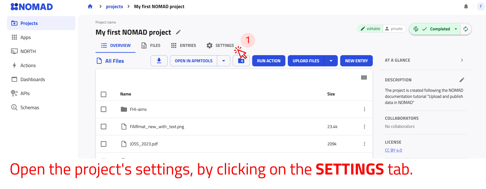
    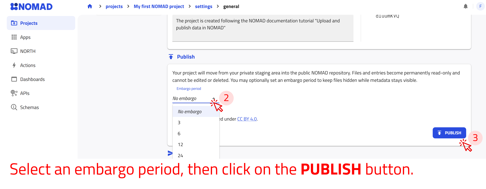
    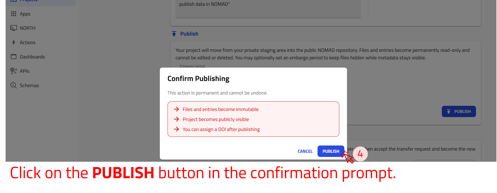
    
→

If you publish the project with an embargo, its files and entries remain accessible only to you and the users with whom you shared it. Selected metadata remain publicly visible. You can lift the embargo before its scheduled end date by selecting **LIFT EMBARGO**.

## Assign a DOI to your project

After publishing your project, you can assign it a Digital Object Identifier (DOI). The DOI provides a persistent identifier for citing and referencing the project.

!!! warning "DOI assignment is irreversible"
    Once assigned, the DOI is permanently associated with the project.

**Use the arrow buttons ⬅️➡️ below to follow the steps for assigning a DOI to your project.**

    
←

    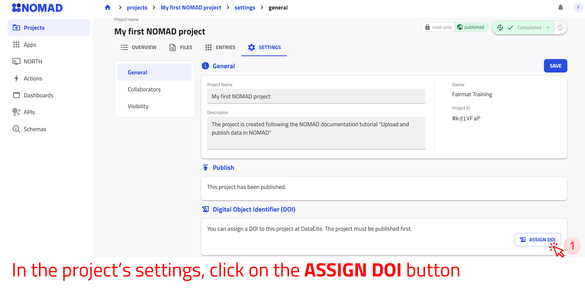
    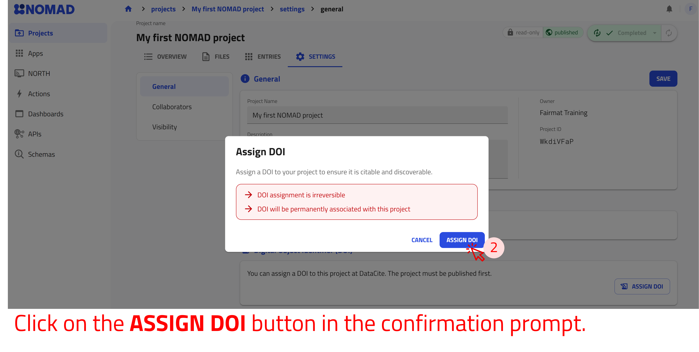
    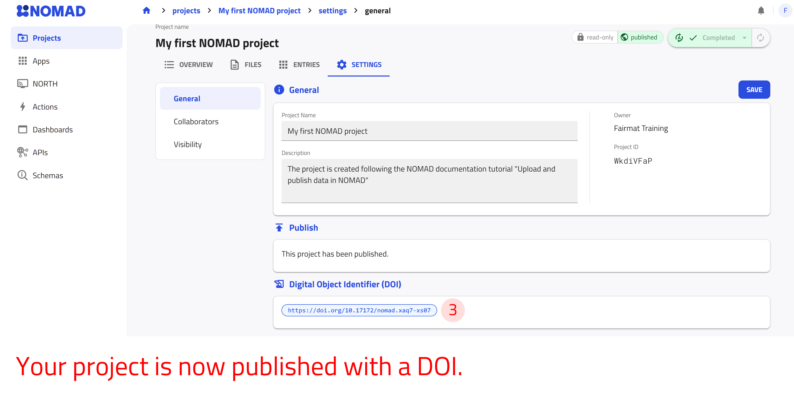
    
→

The DOI is now permanently associated with your project and is displayed under **Digital Object Identifier (DOI)** in the project settings.

<!-- TODO: Create the contents for the following two sections
### Group entries into a dataset

### Manage a dataset and assign it a DOI
-->

---
