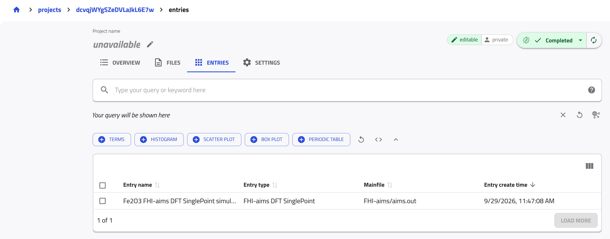

<!-- markdownlint-disable MD013 -->
<!-- Disabled MD013: long lines are needed in this tutorial -->

# Upload and publish data using the NOMAD API

<!-- TODO: Align the capitalization of "project"/"entry" with the docs-wide decision (#365 uses "Project"/"Entry", #374 uses "project"/"entry"), and add "project" to the glossary. -->

In this tutorial, we interact with the NOMAD API using Python and the [`nomad-utility-workflows`](https://fairmat-nfdi.github.io/nomad-utility-workflows/){:target="_blank" rel="noopener"} package, to programmatically perform the full workflow for uploading and publishing data. We work with example data files to create projects, inspect the generated entries, modify metadata, share the projects with collaborators, and publish them on the NOMAD test deployment. By the end of the tutorial, we will have reproduced the core project workflow available in the NOMAD GUI.

---

## What you will learn

In this tutorial, you will learn how to:

1. Authenticate with the NOMAD API using Python
2. Create projects and upload raw research data to them programmatically
3. Retrieve projects and their entries and inspect or edit their metadata
4. Share projects with collaborators and manage access permissions
5. Publish projects on the NOMAD test deployment

---

## Before you begin

This tutorial assumes basic familiarity with Python and programmatic workflows.

Before starting, make sure you have the following:

1. **NOMAD user account**  
   In order to interact with the NOMAD API, a user account is required.
   You can create an account by following the steps described in the [How-to guides > ... > Create a NOMAD account](../howto/manage/gui/account.md#create-a-nomad-account).

2. **Python environment**  
   A Python 3.11 or newer environment with permission to install external packages.  
   The examples in this tutorial are designed to be run in a Jupyter notebook.

3. **Basic Python knowledge**  
   You should be comfortable running Python code, installing packages, and working with notebooks.

4. **Example files available on your local machine**  
   This tutorial uses provided example data files for:
    - [Miscellaneous files (PDF, images, tables)](https://github.com/FAIRmat-NFDI/FAIRmat-tutorial-16/raw/refs/heads/main/tutorial_16_materials/part_3_files/example_files_upload/miscellaneous_data/miscellaneous_data.zip){:target="_blank" rel="noopener"},
    - [Computational data (DFT calculations)](https://github.com/FAIRmat-NFDI/FAIRmat-tutorial-16/raw/refs/heads/main/tutorial_16_materials/part_3_files/example_files_upload/computations_data/FHI-aims.zip){:target="_blank" rel="noopener"},
    - [Experimental data (XPS measurements)](https://github.com/FAIRmat-NFDI/FAIRmat-tutorial-16/raw/refs/heads/main/tutorial_16_materials/part_3_files/example_files_upload/experiments_data/xps_nexus_data.zip){:target="_blank" rel="noopener"}.

!!! warning
    The code snippets in this tutorial are designed to be run sequentially in a Jupyter notebook.
    Running code snippets out of order may lead to errors, e.g., due to missing imports, variables, or setup steps that were introduced earlier. For a smooth experience, it's suggested to follow the steps in order.

---

## Environment setup

In this tutorial, we will use the [NOMAD test deployment](https://nomad-lab.eu/test/){:target="_blank" rel="noopener"}. Therefore, in all code examples, we will set `url="test"` when calling the helper functions. Later, you can switch to `url="prod"` or a custom NOMAD API URL if needed. When you switch to `url="prod"`, also set `nomad_gui`, defined in [Create projects](#create-projects), to `https://nomad-lab.eu/prod/v1/gui/v2`.

We assume you are working in a Python 3.11+ environment, preferably in a dedicated virtual environment for this tutorial.

??? info "Need help creating a project folder, Python environment, and Jupyter kernel?"

    This optional section shows how to create a **project folder**, set up a **clean Python environment**, and ensure that Jupyter uses the correct kernel for this tutorial.

    ---
    **1. Create a project folder**

    Open a terminal (or PowerShell on Windows) and run:

    ```bash
    mkdir nomad-api-tutorial
    cd nomad-api-tutorial
    ```

    All files used in this tutorial (notebooks, ZIP files, and `env.txt`) should be placed in this folder.

    ---
    **2. Create a virtual Python environment**

    - Linux / macOS:
      ```bash
      python3 -m venv nomad-env
      ```

    - Windows (PowerShell):
      ```powershell
      python -m venv nomad-env
      ```

    ---
    **3. Activate the environment**

    - Linux / macOS:
      ```bash
      source nomad-env/bin/activate
      ```

    - Windows (PowerShell):
      ```powershell
      nomad-env\Scripts\Activate.ps1
      ```

    Once activated, your terminal prompt should show `(nomad-env)`.

    ---
    **4. Install Jupyter and required tools**

    ```bash
    pip install --upgrade pip
    pip install jupyterlab ipykernel
    ```

    ---
    **5. Register the environment as a Jupyter kernel**

    ```bash
    python -m ipykernel install --user --name nomad-env --display-name "Python (nomad-env)"
    ```

    This step ensures that Jupyter can use the Python environment created for this tutorial.

    ---
    **6. Start Jupyter**

    ```bash
    jupyter lab
    ```

    Open or create a notebook (`.ipynb`), then select the kernel:
    **Kernel → Change Kernel… → Python (nomad-env)**.

    ---
    **7. Verify the selected kernel**

    Run the following cell in your notebook:

    ```python
    import sys

    print(sys.executable)
    ```

    The printed path should point to `nomad-env`. If not, re-select the kernel.

Install the plugin and helper packages:

<!-- markdownlint-disable MD046 -->
```python
!pip install --upgrade pip
!pip install "nomad-utility-workflows[vis]>=0.2.0"
!pip install python-dotenv
```
<!-- markdownlint-enable MD046 -->

The `nomad-utility-workflows` provides high-level helpers for interacting with the NOMAD API and `python-dotenv` is used to load credentials from a local file, e.g., `env.txt`.

Create a file named `env.txt` in your project folder with the following content and save this file next to your notebook or script and keep it private (do not commit it to version control):

<!-- markdownlint-disable MD046 -->
```text
NOMAD_USERNAME=your_email_or_username
NOMAD_PASSWORD=your_password
```
<!-- markdownlint-enable MD046 -->

Before calling any helper functions, load `env.txt` so that the environment variables are visible to `nomad-utility-workflows`:

<!-- markdownlint-disable MD046 -->
```python
from dotenv import load_dotenv

load_dotenv('env.txt')
```
<!-- markdownlint-enable MD046 -->

??? success "Example notebook output"

    ```
    True
    ```

This makes `NOMAD_USERNAME` and `NOMAD_PASSWORD` available to the package via environment variables.

!!! warning
    `nomad-utility-workflows` reads `NOMAD_USERNAME` and `NOMAD_PASSWORD` only once, when you first import it. If you change `env.txt` afterwards, restart the kernel and run the cells again from the top.

Now you can check which user you are authenticated as, and confirm that the credentials were loaded correctly using:

<!-- markdownlint-disable MD046 -->
```python
from nomad_utility_workflows.utils.users import who_am_i

me = who_am_i(url='test')
print('Authenticated as:', me.name)
print('Username:', me.username)
print('Email:', me.email)
```
<!-- markdownlint-enable MD046 -->

??? success "Example notebook output"

    ```
    Authenticated as: FAIRmat Training
    Username: test_siamak.nakhaie
    Email: your.email@example.org
    ```

This call confirms which NOMAD account is being used.

---

## Create projects

Next, you create projects in NOMAD from the three example ZIP files.
The helper `upload_files_to_nomad` both **creates a new project** and **uploads the given ZIP file** to it in a single API call.

!!! info "Projects and uploads"
    In the NOMAD GUI, you organize your data in projects. The NOMAD API and `nomad-utility-workflows` still use the term *upload* for a project: the API endpoints retain *upload* in their paths, helper functions such as `upload_files_to_nomad` and `get_upload_by_id` work on projects, and the `upload_id` they return is the project ID.

!!! warning

    All projects in this tutorial must be created on the **[Test Deployment of NOMAD](https://nomad-lab.eu/test/){:target="_blank" rel="noopener"}**. The data there **is not persistent** and will be deleted occasionally, which ensures that you can safely test uploading and publishing without affecting public data.
    When running code snippets, always make sure that the `url` parameter is set to `test`, i.e.,
    `url="test"`.

<!-- TODO (found 2026-09-29): upload size limit on the test deployment.
`url='test'` in nomad-utility-workflows 0.3.2 points to https://nomad-lab.eu/prod/v1/test/api/v1, which currently rejects request bodies larger than 1 MiB (nginx "413 Request Entity Too Large").
Without the workaround below, `upload_files_to_nomad` fails with a JSONDecodeError for miscellaneous_data.zip (1.97 MB) and FHI-aims.zip (1.27 MB); xps_nexus_data.zip (0.23 MB) still works.
The new test API address https://nomad-lab.eu/test/backend/api/v1 and the production API accept these files.
Once the limit on the old address is lifted, or the package sets NOMAD_TEST_URL (nomad_utility_workflows/utils/core.py) to the new address, remove the workaround below: the sentence, the snippet, and the explanation after it. -->

Before the first upload, point `nomad-utility-workflows` to the current address of the test deployment:

<!-- markdownlint-disable MD046 -->
```python
from nomad_utility_workflows.utils import core

core.NOMAD_TEST_URL = 'https://nomad-lab.eu/test/backend/api/v1'
```
<!-- markdownlint-enable MD046 -->

The address that the package uses for `url='test'` by default currently rejects files larger than 1 MiB, so the uploads below would fail without this line.

### Upload miscellaneous files

As a first example, upload the miscellaneous files to the 'test' NOMAD instance:

<!-- markdownlint-disable MD046 -->
```python
import os
from nomad_utility_workflows.utils.uploads import (
    upload_files_to_nomad,
    get_upload_by_id,
)

# Base URL of the new NOMAD GUI on the test deployment,
# used below to build links to projects and entries
nomad_gui = 'https://nomad-lab.eu/test'

misc_zip_path = os.path.abspath('miscellaneous_data.zip')
misc_upload_id = upload_files_to_nomad(filename=misc_zip_path, url='test')
```
<!-- markdownlint-enable MD046 -->

In this code:

- `nomad_gui` is the base URL of the new NOMAD GUI on the test deployment; later snippets use it to build links to projects and entries.
- `os.path.abspath("miscellaneous_data.zip")` resolves the ZIP file to an absolute path.
- `upload_files_to_nomad(...)` creates a new project on the NOMAD test deployment, uploads the file to it, and returns the project's `upload_id`.

<!-- TODO: nomad-utility-workflows 0.3.2 builds classic-GUI links in `nomad_gui_url`. Once it builds new-GUI links, replace the hand-built `nomad_gui` links with `.nomad_gui_url`. -->

Let's now inspect the project and compare it with what we see in the GUI:

<!-- markdownlint-disable MD046 -->
```python
misc_upload = get_upload_by_id(upload_id=misc_upload_id, url='test')

print('Upload summary:')
print('----------------')
print('Upload ID:      ', misc_upload.upload_id)
print('Entries:        ', misc_upload.entries)
print('Published:      ', misc_upload.published)
print('Embargo:        ', misc_upload.with_embargo)
print('GUI URL:        ', f'{nomad_gui}/projects/{misc_upload.upload_id}')
```
<!-- markdownlint-enable MD046 -->

??? success "Example notebook output"

    ```
    Upload summary:
    ----------------
    Upload ID:       Ei6OG0ziSGW3t8dTpmChmg
    Entries:         0
    Published:       False
    Embargo:         False
    GUI URL:         https://nomad-lab.eu/test/projects/Ei6OG0ziSGW3t8dTpmChmg
    ```

This code does the following:

- `get_upload_by_id(...)` retrieves the project metadata as a `NomadUpload` object.
- The final `print(...)` statements show a compact summary: `upload_id`, `entries`, `published`, `with_embargo`, and a link to the project in the NOMAD GUI.

Open the printed link to see the project you just created in the NOMAD GUI. Because the project was created without a name, the GUI shows *unavailable* as its name. You will name a project later, in [Edit the project's metadata](#edit-the-projects-metadata).

<!-- TODO: `upload_files_to_nomad` cannot set a project name, although the API (POST /uploads) accepts `upload_name`. If the package adds it, name the projects at creation and remove the "unavailable" sentence. -->

### Upload computational data

You can repeat the same pattern for the DFT example (`FHI-aims.zip`) to create a separate project for simulated data and inspect its entries:

<!-- markdownlint-disable MD046 -->
```python
dft_zip_path = os.path.abspath('FHI-aims.zip')
dft_upload_id = upload_files_to_nomad(filename=dft_zip_path, url='test')

dft_upload = get_upload_by_id(upload_id=dft_upload_id, url='test')
print('GUI URL:', f'{nomad_gui}/projects/{dft_upload.upload_id}')
```
<!-- markdownlint-enable MD046 -->

??? success "Example notebook output"

    ```
    GUI URL: https://nomad-lab.eu/test/projects/dcvqjWYgSZeDVLaJkL6E7w
    ```
This snippet creates a new project for the DFT ZIP file and prints a direct GUI link where you can monitor its processing status.

To check whether entries were created, retrieve them, and print their IDs and URLs, you can type the following:

<!-- markdownlint-disable MD046 -->
```python
from nomad_utility_workflows.utils.entries import get_entries_of_upload

dft_entries = get_entries_of_upload(
    upload_id=dft_upload_id, url='test', with_authentication=True
)
for entry in dft_entries:
    print(
        entry.entry_id,
        f'{nomad_gui}/projects/{entry.upload_id}/entries/{entry.entry_id}',
    )
```
<!-- markdownlint-enable MD046 -->

This snippet retrieves all the entries (here only one entry) created from the uploaded computations data and prints each entry’s ID together with its direct GUI URL.

??? success "Example notebook output"

    ```
    kW6H8T0MGH4-0GXH7cbf7j82BBUJ https://nomad-lab.eu/test/projects/dcvqjWYgSZeDVLaJkL6E7w/entries/kW6H8T0MGH4-0GXH7cbf7j82BBUJ
    ```

!!! warning
    If NOMAD is still processing the project, the list may be empty, or the call may fail with `KeyError: 'entry_metadata'`. Wait until processing has finished and run the cell again. `get_entries_of_upload` keeps its result for up to three minutes, so an empty list may be repeated until then.

<!-- TODO: `get_entries_of_upload` raises KeyError: 'entry_metadata' for unprocessed entries and caches its result for 180 s. Simplify this warning (and the 3-minute hint in "Edit the project's metadata") once the package handles both. -->

You can also inspect the same project in the NOMAD GUI using the link printed earlier. On the project page, the **ENTRIES** tab lists the entry created from the FHI-aims files.

<!-- markdownlint-disable MD033 -->
<div style="text-align: center;">
    
</div>
<!-- markdownlint-enable MD033 -->

### Upload experimental data

The steps are similar to those you followed for the computations data.

??? example "Exercise: Upload XPS data and print the entry URL"

    Upload the file `xps_nexus_data.zip` to the NOMAD **test** deployment and print the GUI URL of the entry created in that project.

??? success "Solution"

    Here is a ready-to-paste snippet for your Jupyter notebook:
    ```python
    import os
    import time
    from nomad_utility_workflows.utils.uploads import (
        upload_files_to_nomad,
        get_upload_by_id,
    )
    from nomad_utility_workflows.utils.entries import get_entries_of_upload

    nomad_gui = 'https://nomad-lab.eu/test'

    xps_zip_path = os.path.abspath('xps_nexus_data.zip')
    xps_upload_id = upload_files_to_nomad(filename=xps_zip_path, url='test')

    xps_upload = get_upload_by_id(xps_upload_id, url='test')
    print('Upload GUI URL:', f'{nomad_gui}/projects/{xps_upload.upload_id}')

    # wait until NOMAD has finished processing the project
    while get_upload_by_id(xps_upload_id, url='test').process_running:
        time.sleep(5)

    xps_entries = get_entries_of_upload(
        upload_id=xps_upload_id, url='test', with_authentication=True
    )
    for entry in xps_entries:
        print(
            entry.entry_id,
            f'{nomad_gui}/projects/{entry.upload_id}/entries/{entry.entry_id}',
        )
    ```
    **Example notebook output**

    ```
    Upload GUI URL: https://nomad-lab.eu/test/projects/VOZJDQx5RkOKKeJI7_Zl0Q
    YcbAvycR3b5VEiwtQiOHFQ28xw6W https://nomad-lab.eu/test/projects/VOZJDQx5RkOKKeJI7_Zl0Q/entries/YcbAvycR3b5VEiwtQiOHFQ28xw6W
    ```

### Inspect a project

After creating a project, e.g., the DFT project, it is important to check whether NOMAD has finished processing it and whether any errors occurred.

<!-- markdownlint-disable MD046 -->
```python
dft_upload = get_upload_by_id(upload_id=dft_upload_id, url='test')

print('Upload status:')
print('--------------')
print('Upload ID:      ', dft_upload.upload_id)
print('Process status: ', dft_upload.process_status)
print('Errors:         ', dft_upload.errors)
print('Warnings:       ', dft_upload.warnings)
print('Entries:        ', dft_upload.entries)
print('Published:      ', dft_upload.published)
print('Open in GUI:    ', f'{nomad_gui}/projects/{dft_upload.upload_id}')
```
<!-- markdownlint-enable MD046 -->

??? success "Example notebook output"

    ```
    Upload status:
    --------------
    Upload ID:       dcvqjWYgSZeDVLaJkL6E7w
    Process status:  SUCCESS
    Errors:          []
    Warnings:        []
    Entries:         1
    Published:       False
    Open in GUI:     https://nomad-lab.eu/test/projects/dcvqjWYgSZeDVLaJkL6E7w
    ```
This snippet:

- Retrieves the latest state of your DFT project from the NOMAD API, using `dft_upload_id`
- Shows the processing status and any errors or warnings.
- Tells you how many entries were created.
- Provides a direct link to inspect the project in the NOMAD GUI.

Once the project has been processed successfully, you can list all entries that were created from the uploaded files.

<!-- markdownlint-disable MD046 -->
```python
from nomad_utility_workflows.utils.entries import get_entries_of_upload

dft_entries = get_entries_of_upload(
    upload_id=dft_upload_id,
    url='test',
    with_authentication=True,
)

print(f'Found {len(dft_entries)} entries in the DFT upload:\n')
for entry in dft_entries:
    print(
        f'- entry_id: {entry.entry_id}\n'
        f'  name: {entry.entry_name}\n'
        f'  parser: {entry.parser_name}\n'
        f'  published: {entry.published}\n'
        f'  GUI URL: {nomad_gui}/projects/{entry.upload_id}/entries/{entry.entry_id}\n'
    )
```
<!-- markdownlint-enable MD046 -->

??? success "Example notebook output"

    ```
    Found 1 entries in the DFT upload:

    - entry_id: kW6H8T0MGH4-0GXH7cbf7j82BBUJ
      name: Fe2O3 FHI-aims DFT SinglePoint simulation
      parser: electronicparsers:fhiaims_parser_entry_point
      published: False
      GUI URL: https://nomad-lab.eu/test/projects/dcvqjWYgSZeDVLaJkL6E7w/entries/kW6H8T0MGH4-0GXH7cbf7j82BBUJ

    ```

This code:

- Retrieves all entries belonging to the DFT project.
- Prints a compact summary for each entry, including ID, name, parser, and publication status.
- Provides a GUI link for each entry so you can open it directly in NOMAD.

---

## Share and publish projects

After your project has been created and processed, you can modify its metadata to prepare it for sharing or publication.
In the examples below, we use `dft_upload_id` to refer to the DFT project, but the same pattern applies to any other project.

### Edit the project's metadata

You can update the project's **name** as well as the **entry-level metadata** (such as comment and references) for all entries contained in the project. The function `edit_upload_metadata` applies metadata changes to **every entry in the project**.

<!-- markdownlint-disable MD046 -->
```python
from nomad_utility_workflows.utils.uploads import edit_upload_metadata, get_upload_by_id
from nomad_utility_workflows.utils.entries import get_entries_of_upload

metadata_update = {
    'upload_name': 'NOMAD Tutorial, Prepare DFT example for sharing using API',
    'comment': 'DFT upload created as part of the NOMAD API tutorial using nomad-utility-workflows.',
    'references': ['https://doi.org/xx.xxxx/example-doi'],
}

# Apply the metadata update
edit_upload_metadata(
    upload_id=dft_upload_id,
    url='test',
    upload_metadata=metadata_update,
    timeout_in_sec=60,
)
```
<!-- markdownlint-enable MD046 -->

??? success "Example notebook output"

    ```
    {'upload_id': 'dcvqjWYgSZeDVLaJkL6E7w',
     'data': {'process_running': False,
      'current_process': '_edit_metadata',
      'process_status': 'SUCCESS',
      'last_status_message': 'Process completed successfully',
      'errors': [],
      'warnings': [],
      'complete_time': '2026-09-29T10:09:43.994000Z',
      'upload_id': 'dcvqjWYgSZeDVLaJkL6E7w',
      'upload_name': 'NOMAD Tutorial, Prepare DFT example for sharing using API',
      'upload_create_time': '2026-09-29T09:47:05.108000Z',
      'main_author': 'f250f5ab-b05c-4bad-9939-5f4883c7a694',
      'coauthors': [],
      'coauthor_groups': [],
      'reviewers': [],
      'reviewer_groups': [],
      'writers': ['f250f5ab-b05c-4bad-9939-5f4883c7a694'],
      'writer_groups': [],
      'viewers': ['f250f5ab-b05c-4bad-9939-5f4883c7a694'],
      'viewer_groups': [],
      'published': False,
      'published_to': [],
      'with_embargo': False,
      'embargo_length': 0,
      'license': 'CC BY 4.0',
      'entries': 1,
      'upload_files_server_path': '/nomad/test/fs/staging/d/dcvqjWYgSZeDVLaJkL6E7w'}}
    ```
This code updates the project name and applies the comment and references to all entries in the project. `timeout_in_sec=60` lets the helper wait up to 60 seconds for the server's answer; the default of 10 seconds can be too short when NOMAD is busy.

!!! warning
    Running the next snippet before NOMAD finishes processing the entries may make it *look* as if the entries metadata is not updated. Wait up to 3 minutes and retry to ensure the snippet is executed only after NOMAD processing has completed.

To inspect it programmatically try:

<!-- markdownlint-disable MD046 -->
```python
# Upload-level metadata (only the name appears here)
updated_upload = get_upload_by_id(dft_upload_id, url='test')
print('Upload name (upload-level):', updated_upload.upload_name)

# Entry-level metadata (comment and references live here)
entries = get_entries_of_upload(
    upload_id=dft_upload_id, url='test', with_authentication=True
)
for entry in entries:
    print('\nEntry ID:', entry.entry_id)
    print('Entry comment:', entry.comment)
    print('Entry references:', entry.references)
```
<!-- markdownlint-enable MD046 -->

??? success "Example notebook output"

    ```
    Upload name (upload-level): NOMAD Tutorial, Prepare DFT example for sharing using API

    Entry ID: kW6H8T0MGH4-0GXH7cbf7j82BBUJ
    Entry comment: DFT upload created as part of the NOMAD API tutorial using nomad-utility-workflows.
    Entry references: ['https://doi.org/xx.xxxx/example-doi']
    ```

Retrieving the entries again confirms that the metadata was updated correctly at the entry level.

In the GUI, the new project name is shown on the project page and under **SETTINGS** > **General**.

### Share your project

If you wish, you can collaborate on this project by sharing it with selected NOMAD users of your choice. To do this, you first need to locate their NOMAD user account (their `user_id`). Once you have their `user_id`, you can assign them as a **coauthor** (write access) or a **reviewer** (read-only access).

Let’s start by searching for the user you want to share your project with. Replace `SearchSurname` in the snippet below with the name of that NOMAD user.

<!-- markdownlint-disable MD046 -->
``` python
from nomad_utility_workflows.utils.users import search_users_by_name

candidates = search_users_by_name('SearchSurname', url='test')

for user in candidates:
    print(
        f"Found the user '{user.name}' (username '{user.username}') "
        f"with user_id='{user.user_id}'"
    )
```
<!-- markdownlint-enable MD046 -->

??? success "Example notebook output"

    ```
    Found the user 'Siamak Nakhaie' (username 'siamak.nakhaie') with user_id='13b845c3-e48d-4234-8c51-4f88c6897ac8'
    Found the user 'Siamak Nakhaie' (username 'siamak.nakhaie@physik.hu-berlin.de') with user_id='ebb26223-0cec-4d81-98f5-3b25db945b54'
    ```

If several users have the same name, use the username to pick the right one.

Once the user appears in the output, copy their `user_id`. In the next step, paste this `user_id` into the appropriate list and comment out all lines related to the role you do not want to assign.

<!-- markdownlint-disable MD046 -->
```python
from nomad_utility_workflows.utils.uploads import edit_upload_metadata

coauthor_ids = ['paste-user-id-here']  # write access
reviewer_ids = ['paste-user-id-here']  # read-only access

edit_upload_metadata(
    upload_id=dft_upload_id,
    url='test',
    upload_metadata={
        'coauthors': coauthor_ids,  # comment out if not needed
        'reviewers': reviewer_ids,  # comment out if not needed
    },
    timeout_in_sec=60,
)

print('Access updated.')
```
<!-- markdownlint-enable MD046 -->

??? success "Example notebook output"

    ```
    Access updated.
    ```
If you wish, you can verify this on the project page under **SETTINGS** > **Collaborators**.

### Set an embargo period

If you plan to publish your project to NOMAD but want to delay when it becomes visible to everyone, you can set an embargo period. The example below applies an embargo of three months.

<!-- markdownlint-disable MD046 -->
```python
edit_upload_metadata(
    upload_id=dft_upload_id,
    url='test',
    upload_metadata={'embargo_length': 3},
    timeout_in_sec=60,
)

upload_with_embargo = get_upload_by_id(dft_upload_id, url='test')
print('With embargo:', upload_with_embargo.with_embargo)
print('Embargo length:', upload_with_embargo.embargo_length)
```
<!-- markdownlint-enable MD046 -->

??? success "Example notebook output"

    ```
    With embargo: True
    Embargo length: 3.0
    ```

### Publish your project

You can now publish your project on the NOMAD **test** deployment:

!!! warning
    Publishing data on the production server requires that you have the **rights to the data** and are **eligible to release them under the CC BY 4.0 license**, and this action is **irreversible**.
    For this tutorial, we use the test deployment. Please make sure that `url="test"` is set before triggering any publication action.

<!-- markdownlint-disable MD046 -->
```python
from nomad_utility_workflows.utils.uploads import publish_upload
from pprint import pprint

response = publish_upload(upload_id=dft_upload_id, url='test', timeout_in_sec=60)
pprint(response)
```
<!-- markdownlint-enable MD046 -->

??? success "Example notebook output"

    ```
    {'data': {'coauthor_groups': [],
              'coauthors': ['ebb26223-0cec-4d81-98f5-3b25db945b54'],
              'complete_time': '2026-09-29T11:18:29.488000Z',
              'current_process': '_publish_upload',
              'embargo_length': 3,
              'entries': 1,
              'errors': [],
              'last_status_message': 'Process completed successfully',
              'license': 'CC BY 4.0',
              'main_author': 'f250f5ab-b05c-4bad-9939-5f4883c7a694',
              'process_running': True,
              'process_status': 'PENDING',
              'published': False,
              'published_to': [],
              'reviewer_groups': [],
              'reviewers': [],
              'upload_create_time': '2026-09-29T09:47:05.108000Z',
              'upload_files_server_path': '/nomad/test/fs/staging/d/dcvqjWYgSZeDVLaJkL6E7w',
              'upload_id': 'dcvqjWYgSZeDVLaJkL6E7w',
              'upload_name': 'NOMAD Tutorial, Prepare DFT example for sharing '
                             'using API',
              'viewer_groups': [],
              'viewers': ['f250f5ab-b05c-4bad-9939-5f4883c7a694',
                          'ebb26223-0cec-4d81-98f5-3b25db945b54'],
              'warnings': [],
              'with_embargo': True,
              'writer_groups': [],
              'writers': ['f250f5ab-b05c-4bad-9939-5f4883c7a694',
                          'ebb26223-0cec-4d81-98f5-3b25db945b54']},
     'upload_id': 'dcvqjWYgSZeDVLaJkL6E7w'}
    ```

This code triggers the publication action for the DFT project and prints the server response confirming the operation.

<!-- TODO: Decide whether to add a section on assigning a DOI to the published project via the API (/uploads/{upload_id}/action/assign-doi), mirroring "Assign a DOI to your project" in upload_publish.md -->
